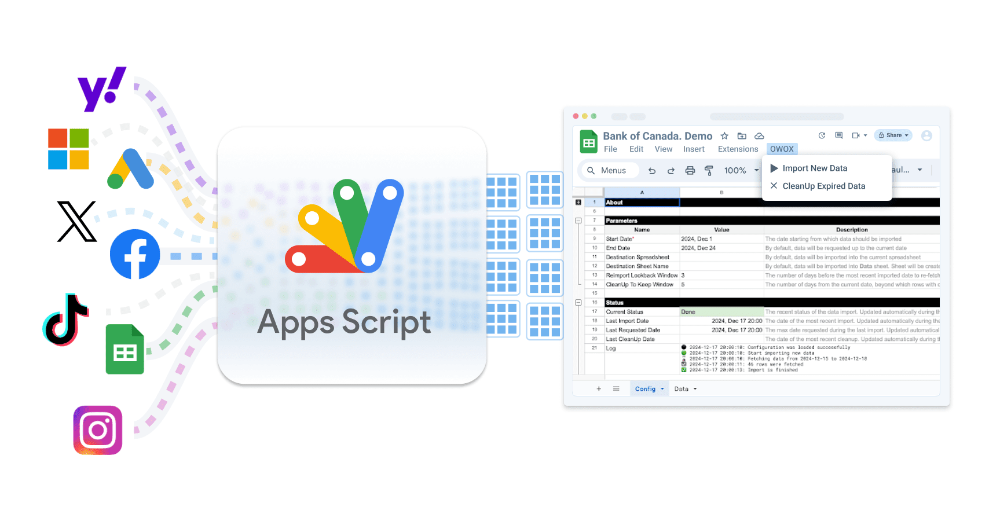

# Why
At OWOX, we believe everyone should have easy access to data.
Obtaining data ownership to make it easily accessible in spreadsheets shouldn’t cost a fortune for small and medium businesses or agencies. That’s why we’ve open-sourced connectors for Google Apps Script. With just a few clicks and no coding required, you can set up automated data imports into your spreadsheets. Despite the known limitations of Apps Script, it offers several significant advantages:
-**Privacy-Friendly**: Being open-source, no credentials need to be shared with third-party products.
-**Customizable**: Scheduling and data schemas can be adjusted at any time.
-**Streamlined Tech Stack**: Eliminates the need to expand your tech stack with additional supported or paid products.
-**Free**: Distributed under the ELv2 license, it allows free use for internal organizational services or providing paid services to clients, as long as it is not used to build a competing product.
-**Serverless**: neither Google Cloud nor computing resources are required

# Getting Started
All you need to do is copy the Google Sheets Template Connector for your desired data source and add your credentials (optional). For instance, you can start with the [Bank of Canada currency exchange rates](https://docs.google.com/spreadsheets/d/1yHHAUhH9OeFoIULGDmWUSAkfVmjb8eY4XeHzbYvu14s/edit?gid=1242480076) import, which doesn't require credentials.

