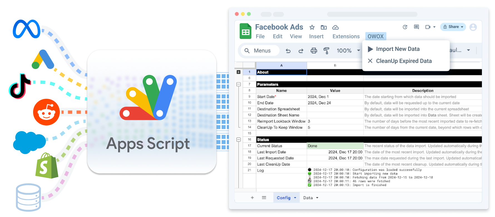

## Why
We believe that everyone should have easy access to data. That’s why we are introducing open-source data connectors to empower every business to become data owners by importing their data into Spreadsheets or data warehouses.
Although there are many great SaaS and open-source products available, we see the need for a solution that offers a free cloud version and doesn’t require data engineers for maintenance.

## What
With just a few clicks and no coding, you can easily set up automated data imports into your spreadsheets and earn the following benefits:
- **Security-Friendly**: Being open-source, no credentials need to be shared with third-party products.
- **Unlimited Customization**: Scheduling and data schemas can be adjusted at any time.
- **Streamlined Tech Stack**: Connectors can be developed and customized via Apps Script. Google Sheets is more than enough to run your own data pipelines
- **Free**: Distributed under the ELv2 license, it allows free use for internal organizational services or providing paid services to clients, as long as it is not used to build a competing product.
- **Serverless**: neither Google Cloud nor computing resources are required to run it

#### Data Sources
| Name | Status | Links
| ------------ | ------ | ----
| Facebook Ads | 🟢 Public | [Google Drive](https://drive.google.com/drive/u/0/folders/1_x556pta5lKtKbTltIrPEDkNqAn78jM4), [Source Code](https://github.com/OWOX/owox-data-marts/tree/main/src/Integrations/FacebookMarketing), [Readme](https://github.com/OWOX/owox-data-marts/blob/main/src/Integrations/FacebookMarketing/README.md) 
| Open Exchange Rates | 🟢 Public | [Google Drive](https://drive.google.com/drive/u/0/folders/1akutchS-Txr5PwToMzHrikTXd_GTs-84), [Source Code](https://github.com/OWOX/owox-data-marts/tree/main/src/Integrations/OpenExchangeRates), [Readme](https://github.com/OWOX/owox-data-marts/blob/main/src/Integrations/OpenExchangeRates/README.md)
| Bank of Canada | 🟢 Public | [Google Drive](https://drive.google.com/drive/u/0/folders/18c9OHHmdZs-evtU1bWd6pIqdXjnANRmv), [Source Code](https://github.com/OWOX/owox-data-marts/tree/main/src/Integrations/BankOfCanada), [Readme](https://github.com/OWOX/owox-data-marts/blob/main/src/Integrations/BankOfCanada/README.md)
| LinkedIn Ads & LinkedIn Pages | 🟢 Public | [Google Drive](https://drive.google.com/drive/folders/1anKRhqJpSWEoeDZvJtrNLgfsGfgSBtIm), [Source Code](https://github.com/OWOX/owox-data-marts/tree/main/src/Integrations/LinkedIn), [Readme](https://github.com/OWOX/owox-data-marts/tree/main/src/Integrations/LinkedIn/README.md)
| TikTok Ads | 🟢 Public | [Google Drive](https://drive.google.com/drive/folders/1zYBdx4Lm496mrCmwSNG3t82weWZRJb0o), [Source Code](https://github.com/OWOX/owox-data-marts/tree/main/src/Integrations/TikTokAds), [Readme](https://github.com/OWOX/owox-data-marts/blob/main/src/Integrations/TikTokAds/README.md)
| X Ads (former Twitter Ads) | 🟢 Public | [Google Drive](https://drive.google.com/drive/folders/16PMllaU704wrjHH45MlOBjQWZdxNhxZN), [Source Code](https://github.com/OWOX/owox-data-marts/tree/main/src/Integrations/XAds), [Readme](https://github.com/OWOX/owox-data-marts/tree/main/src/Integrations/XAds/README.md)
| Criteo Ads | 🟡 In Development | [Branch](https://github.com/OWOX/owox-data-marts/tree/criteo-alpha), [Discussion](https://github.com/OWOX/owox-data-marts/discussions/54), [Readme](https://github.com/OWOX/owox-data-marts/blob/main/src/Integrations/CriteoAds/README.md)
| Bing Ads | 🟡 In Development | [Branch](https://github.com/OWOX/owox-data-marts/tree/bing-ads-attempt-1), [Discussion](https://github.com/OWOX/owox-data-marts/tree/bing-ads-attempt-1)
| Reddit Ads | 🟡 In Development | [Branch](https://github.com/OWOX/owox-data-marts/tree/reddit_connector_v0.1), [Discussion](https://github.com/OWOX/owox-data-marts/discussions/2), [Readme](https://github.com/OWOX/owox-data-marts/blob/main/src/Integrations/RedditAds/README.md) 
| Hotline | ⚪️ In Discussion | [Discussion](https://github.com/OWOX/owox-data-marts/discussions/55)
| Shopify Ads | ⚪️ In Discussion | [Discussion](https://github.com/OWOX/owox-data-marts/discussions/63)
| Google Business Profile | ⚪️ In Discussion | [Discussion](https://github.com/OWOX/owox-data-marts/discussions/61)

#### Data Storages
| Name | Status | Links
| ------------ | ------ | ----
| Google Sheets | 🟢 Public  | [Issues](https://github.com/OWOX/owox-data-marts/issues?q=is%3Aissue%20state%3Aopen%20label%3AGoogleSheets)
| Google BigQuery | 🟢 Public | [Issues](https://github.com/OWOX/owox-data-marts/issues?q=state%3Aopen%20%20label%3AGoogleBigQuery)

If you find an integration missing, you can share your use case and request it [here](https://github.com/OWOX/owox-data-marts/discussions)

## How
**To create your data import**, make a copy of the Google Sheets template for [existing integrations](https://github.com/OWOX/owox-data-marts/tree/main/src/Integrations). If you experience any issues, feel free to post them [here](https://github.com/OWOX/owox-data-marts/issues).

**To contribute to existing integrations or create a new one**, please visit the [contributors' guide](https://github.com/OWOX/owox-data-marts/blob/main/CONTRIBUTING.md). All you need to get started are basic knowledge of Apps Script and a GitHub login. No software installation is required on your computer.

**To become a part of the Core team**, please start by submitting a pull request to the Core part of the product. Understanding TypeScript, Git, and software development is required.

**To get support**, please [visit Q&A](https://github.com/OWOX/owox-data-marts/discussions/categories/q-a) first. If you want to report a bug, please [open an issue](https://github.com/OWOX/owox-data-marts/issues).