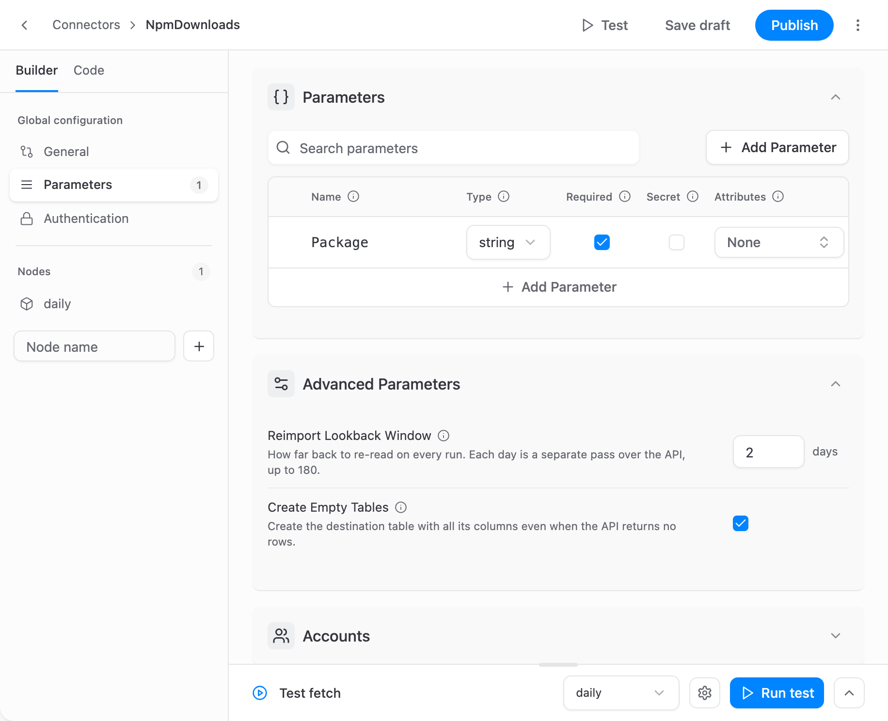
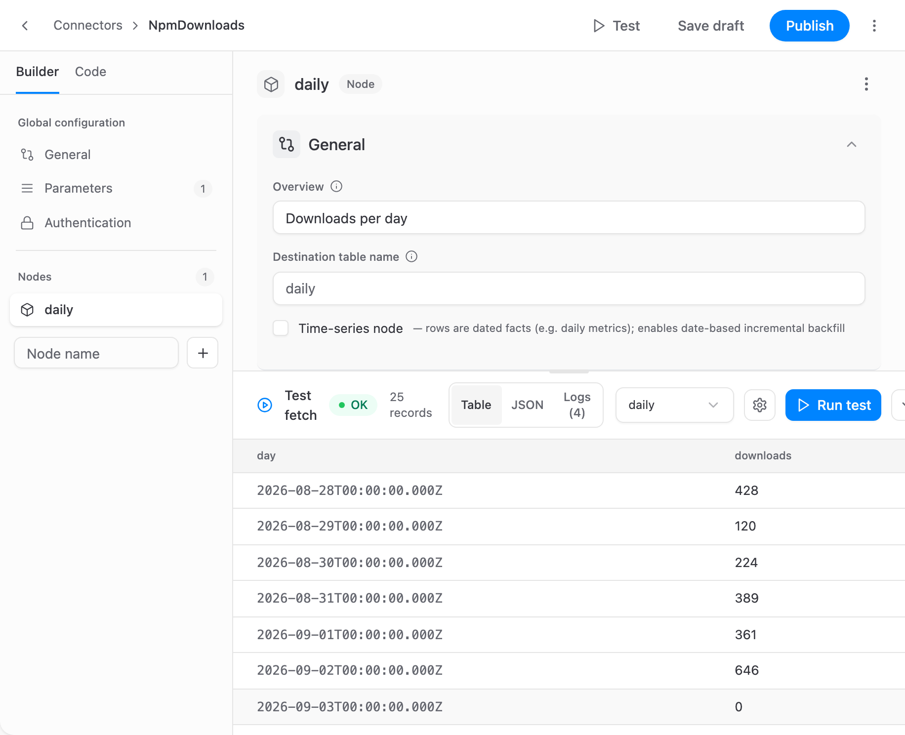
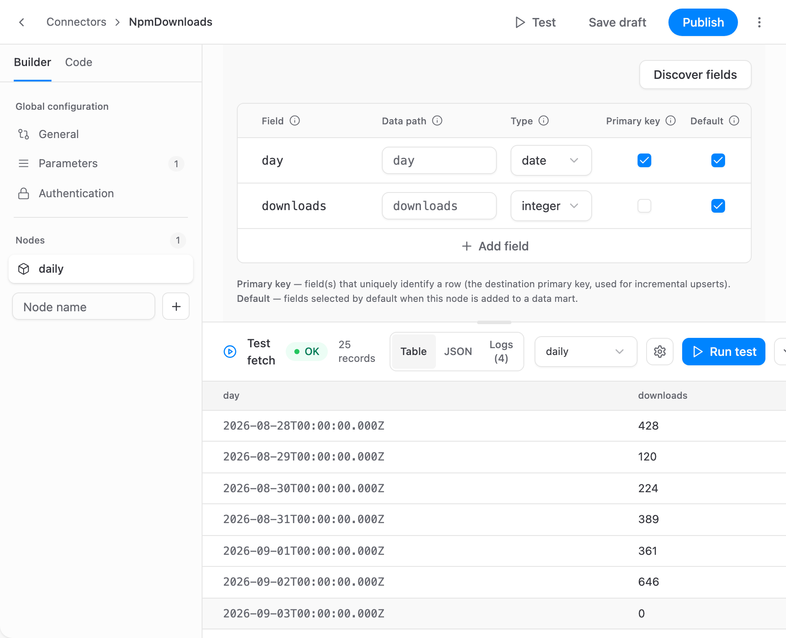

# Connector Builder

The Connector Builder creates a connector for any HTTP API that has no ready-made OWOX connector, without writing code. You describe the requests in a form, and the builder stores them as a manifest — the JSON format described in the [Connector Manifest Reference](manifest-reference.md). Once you publish the connector, it appears in every Data Mart of the project next to the built-in connectors.

Project Admins and Data Owners can build and edit connectors. Anyone who sets up a connector-based Data Mart can use a published one. See [Roles and Permissions](../project/roles-and-permissions.md).

> Credentials never go into the connector itself. Declare a **Secret** parameter for an API key or a token: whoever sets up a Data Mart enters its value there, and you enter a value only to run a test.

The steps below use the public npm downloads API as an example: a connector that loads the daily downloads of an npm package.

## Open the builder

- Go to **Connectors** in the main menu and click **New connector**. To change a connector, open the menu in its row and choose **Open in builder**.
- Or start from a Data Mart: in the connector setup, click **+ Create custom connector** under **Custom Connectors**.

The left column holds the **Builder** / **Code** switch, the global configuration (**General**, **Parameters**, **Authentication**) and the list of **Nodes**. The top bar holds **Test**, the version badge, **Save draft**, **Publish** and the **⋮** menu.

## Step 1: Describe the connector

In **General**, fill in:

| Field           | What it is                                                                                                                                                                            |
| --------------- | ------------------------------------------------------------------------------------------------------------------------------------------------------------------------------------- |
| **Name**        | The internal identifier, e.g. `NpmDownloads`: letters, digits and underscores, starting with a letter. Data Marts refer to the connector by this name, so it cannot be changed later. |
| **Title**       | The name people see in the connector list, e.g. `npm downloads`.                                                                                                                      |
| **Base URL**    | The address every request starts from, without a trailing slash, e.g. `https://api.npmjs.org`.                                                                                        |
| **Docs URL**    | A link to the API's documentation, for whoever edits the connector next.                                                                                                              |
| **Description** | What the connector loads. People see it when they pick the connector.                                                                                                                 |

**Advanced settings** limits how many requests the connector sends per time window, which keeps a run under the API's quota. Leave it empty if the API has no such limit.

## Step 2: Add parameters

A parameter holds a value that differs from one Data Mart to another: an account ID, a package name, an API key. Whoever sets up the connector in a Data Mart fills the parameters in there.

In **Parameters**, click **Add Parameter** and set:

- **Name** — how requests refer to the value, e.g. `Package` becomes `{{ parameters.Package }}`.
- **Type** — `string`, `number`, `boolean` or `date`.
- **Required** — a run cannot start without a value.
- **Secret** — the value is masked in the UI and in API responses, and stored apart from the Data Mart's definition; it is not encrypted. Use it for API keys and tokens.
- **Label**, **Default** and **Description** — what the setup form shows.
- **Attributes** — **Manual backfill** lets a one-off backfill run override the value, **Hide in config form** hides the field, **Pinned** moves it to the top of the form, and **Advanced** puts it under the collapsed advanced settings.

**Advanced Parameters** sets the defaults of the two parameters every connector has: how many days a run reloads, and whether a run creates the table when the API returns no data. **Accounts** runs the connector once for each account in a list — see [Multi-account fan-out](manifest-reference.md#multi-account-fan-out).

## Step 3: Set up authentication

In **Authentication**, choose how the API authorizes requests: **None**, **API Key**, **Basic**, **Bearer**, **Token Exchange**, **OAuth2** or **Selective**. Point the credential fields at your Secret parameters, e.g. set the **Bearer** format to `Bearer {{ parameters.Token }}`. Each type is described in [Authentication](manifest-reference.md#authentication).

The npm downloads API is public, so the example keeps **None**.

## Step 4: Add a node

A node is one stream of data: one endpoint, loaded into one table. Under **Nodes**, type a node name, e.g. `daily`, and click **+**.

In the node, fill in:

- **General** — **Overview** is shown when people pick this node in a Data Mart. **Destination table name** defaults to the node name. **Time-series node** marks rows as dated facts, such as daily metrics, and enables date-based incremental backfill.
- **Request** — the **HTTP Method** (`GET` or `POST`), the **Path** appended to the base URL, the **Query parameters**, and a **Body (JSON)** for `POST`. All of them can use parameters, e.g. the path `/downloads/range/last-month/{{ parameters.Package }}`.
- **Record path** — where the records are in the response, e.g. `downloads`. Leave it empty if the response itself is the array of records. **Response format** is JSON, CSV or JSONL.

The collapsed sections cover what some APIs need: **Incremental** (fetch by date window), **Pagination**, **Transformations**, **Partition** (run the node once for each record of a parent list, or for each value in a list), **Record filter** and **Error handling**. For an API that builds a report in the background, switch the **Retriever** to **Async**. The [Connector Manifest Reference](manifest-reference.md#contents) explains each of them.

A date window ends today. For an API that reports only completed days and refuses a window that ends today, set **Skip the last days** under **Incremental**, e.g. `1` to end the window yesterday. The left-out days are imported by a later run. See [APIs that report only completed days](manifest-reference.md#apis-that-report-only-completed-days).

The node's **⋮** menu renames, clones or deletes it. Data Marts refer to a node by its name, so once you publish, a Data Mart that used the old name fails its runs until its fields are chosen again.

## Step 5: Test on live data

Click **Test** in the top bar, then the gear icon to open **Test settings**. Choose the **Node**, enter the parameter values, e.g. the package `owox`, set a **Max rows** limit, and click **Run test**. The test uses the connector as it is in the editor, unsaved changes included.

The result opens as a **Table**, as raw **JSON**, or as the run's **Logs**. If the test fails, the error and the **Logs** show what went wrong.

The builder remembers test values in this browser for the next test. Values of Secret parameters, and of parameters the authentication uses, are never saved.

## Step 6: Define the fields

In the node's **Fields**, click **Discover fields**. The builder reads the first record of the node's last test and adds its fields with suggested types. Fields you already defined keep their settings. Field names become column names, so they may contain only letters, digits and underscores: a key such as `created-at` is added as the field `created_at`, with the key as its **Data path**. Each value inside a nested object becomes a field of its own in the same way: `stats.clicks` is added as `stats_clicks`, with `stats.clicks` as its **Data path**. An array stays one field.

Then check each field:

- **Type** — `string`, `integer`, `number`, `boolean`, `date`, `datetime` or `object`. A date the API sends as text is discovered as `string`; set it to `date`, like `day` in the example.
- **Data path** — where the value is in the record, e.g. `stats.clicks`. Empty means the same as the field name.
- **Primary key** — the fields that identify a row, e.g. `day`. Later runs update these rows instead of adding duplicates. Every node needs one before you can publish.
- **Default** — the fields selected when someone adds this node to a Data Mart.

## Step 7: Save and publish

**Save draft** keeps your work without making it available. Data Marts never run a draft, and a connector that has never been published appears in the connector list with a **Publish to use** badge.

**Publish** checks the manifest, saves it as a new version and makes that version active. The version badge in the top bar shows the result, e.g. `v1 · published`. The title, description and docs URL shown in the connector list change when you publish, not when you save a draft.

## Versions

Each **Publish** adds a version. Click the version badge to open **Version history**:

- Click a version to open it in the editor.
- Click **Make active** next to a published version to make Data Marts run it, e.g. to roll back a change.

A Data Mart follows the active version by default, so a new version takes effect on its next run. To keep a Data Mart on one version, click the version control on its **Input Source** card (it reads, e.g., **Following active · v2**) and pin a version. A pinned version stays until you change it, and the control shows **update available** when a newer version is active.

A Data Mart that follows the active version runs it with its own credentials. So a member with the Data Owner role can publish a version, or make one active, only with edit access to every such Data Mart; the refusal names the Data Marts they are missing. Project Admins can always do both.

## Edit the connector as JSON

Switch to **Code** to see the whole connector as one JSON manifest. The builder and the code show the same connector, so a change in one appears in the other. Code also covers what the form does not, such as extra request `headers`. While the JSON has an error, the connector cannot be saved or published.

- **Import JSON** on the **Code** tab, or **⋮** → **Import JSON…**, replaces the connector with a manifest from a `.json` file. A connector that already exists keeps its name.
- **⋮** → **Export JSON** downloads the manifest, e.g. to keep a copy or to move the connector to another project.

To build a connector with an AI assistant, give it the [authoring guide for AI assistants](https://docs.owox.com/docs/connectors/manifest-reference.llms.txt) and the API's documentation. Import the manifest it writes, then test and publish it as above. Never give the assistant your credentials.

## Use the connector in a Data Mart

In the connector setup of a Data Mart, published custom connectors are listed under **Custom Connectors**, below the built-in ones. From there, the setup is the same as for any connector: fill in the parameters, choose the node and its fields, and set the target table. See [Connector-based Data Mart](../getting-started/setup-guide/connector-data-mart.md).

## Delete a connector

In the builder, choose **⋮** → **Delete connector**, or choose **Delete** in the connector's row on the **Connectors** page. A connector can be deleted only when no Data Mart uses it. After that, its name is free for a new connector.

## Related Links

- [Custom Connectors →](custom-connectors.md)
- [Connector Manifest Reference →](manifest-reference.md)
- [Connector-based Data Mart →](../getting-started/setup-guide/connector-data-mart.md)
- [Roles and Permissions →](../project/roles-and-permissions.md)
