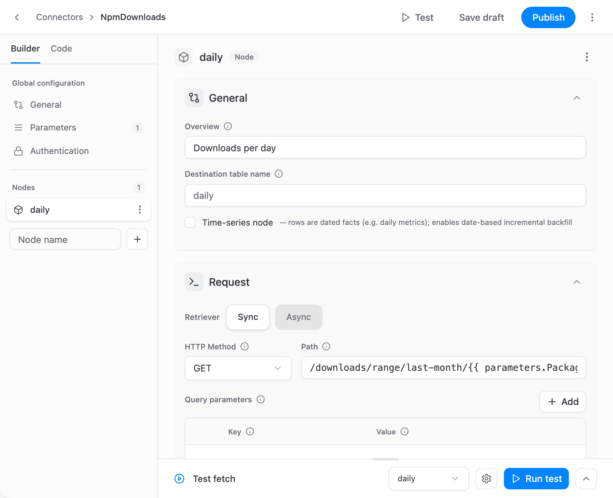

# Custom Connectors

A custom connector loads data from an HTTP API into your storage without any code. Instead of a program, it is a description of the API — a JSON document called a manifest: where to send requests, how to authorize them, how to page through the results, and which fields to keep. The OWOX connector engine reads the manifest and does the work.

Your team can build a custom connector for any API that has no built-in OWOX connector. Once published, it is used in Data Marts like any other connector: it runs on a schedule or manually, supports backfills, and loads rows into the Data Mart's table.

## When to use one

A custom connector fits when:

- the data you need comes from an API that has no built-in OWOX connector;
- the API is served over HTTPS and answers in JSON, CSV or JSONL;
- you want the data in your storage on a schedule, as a [connector-based Data Mart](../getting-started/setup-guide/connector-data-mart.md).

Some APIs need logic a manifest cannot express — for example, an API that answers in XML or signs every request with a computed signature. Such a connector has to be written in JavaScript; see [Creating a Connector](../../packages/connectors/CREATING_CONNECTOR.md).

## How it works

A manifest has three main parts:

- **Parameters** — the values that change from one Data Mart to another, such as an account ID, a date range or an API key. They are filled in when the connector is set up in a Data Mart.
- **Authentication** — how the API authorizes requests. Keys and tokens come from Secret parameters, never from the manifest itself.
- **Nodes** — the data streams. Each node is one request to the API, the place in the response where the records are, and the output fields with their types. A node becomes one table in your storage.

On every run, for each node, the engine sends the request and pages through the results, keeps the records that pass the node's filter, applies its transformations, and casts every field to its declared type. The rows then go to the Data Mart's table the same way as for any other connector. The [Connector Manifest Reference](manifest-reference.md#how-the-engine-turns-responses-into-rows) describes each stage in detail.

The engine handles what most APIs need:

- Authentication with an API key, Basic auth, a Bearer token, a token exchange, OAuth2 (`refresh_token` and `client_credentials`), or a choice between several of them.
- Pagination by offset, page number or cursor.
- Incremental loading by date window, day by day or as one range, with backfills.
- Child requests made once for each record of a parent list, such as each account's campaigns, or once for each value in a list.
- Several accounts in one run.
- Asynchronous report APIs: create a job, wait for it, download the result.
- Record filters, transformations (add, remove, lower-case or flatten fields), retries on errors, and a limit on requests per time window.

## How to create one

All three ways end in the [Connector Builder](connector-builder.md), where the connector is tested on live data and published:

- **Fill in a form.** The Connector Builder walks you through the parameters, authentication, requests and fields, and suggests the fields from a test response.
- **Write the JSON.** Write the manifest by hand with the [Connector Manifest Reference](manifest-reference.md), then paste it into the builder's **Code** tab or import the file.
- **Ask an AI assistant.** Give it the [authoring guide for AI assistants](https://docs.owox.com/docs/connectors/manifest-reference.llms.txt) and the API's documentation, then import the manifest it writes.

## Versions

A connector is a draft until you publish it, and Data Marts cannot use a draft. Each **Publish** saves a new version and makes it the active one.

A Data Mart follows the active version by default, so a newly published version takes effect on its next run. A Data Mart can also stay pinned to one version while the connector changes. In the builder, you can make an earlier published version active again to roll back a change.

To keep a copy of a connector or move it to another project, export its manifest as JSON and import it there.

## Who can use them

A custom connector belongs to a project, and every Data Mart in the project can use it.

- Project Admins and Technical Users create, edit, publish and delete connectors.
- Anyone who sets up a connector-based Data Mart can choose a published connector under **Custom Connectors** in the connector setup.

See [Roles and Permissions](../project/roles-and-permissions.md).

## Credentials and network access

Credentials should never be part of a manifest. The engine does not stop one from being typed into a header, a template or a parameter default, and one that is stays in the manifest: **Export JSON** downloads it as it is, and anyone who can edit the connector can read it. A key or a token goes into a Secret parameter instead: its value is masked in the UI and in API responses and stored apart from the Data Mart's definition (it is not encrypted), and it is entered only on the Data Mart page, or in the builder to run a test.

A custom connector sends requests only over HTTPS, only to the hosts named in its manifest — the base URL and the authentication URLs. The one exception is the download link that an asynchronous report API returns, which may point to any public HTTPS address. A custom connector never connects to private or local network addresses, so an API inside your own network cannot be reached this way.

## Related Links

- [Connector Builder →](connector-builder.md)
- [Connector Manifest Reference →](manifest-reference.md)
- [Connector-based Data Mart →](../getting-started/setup-guide/connector-data-mart.md)
