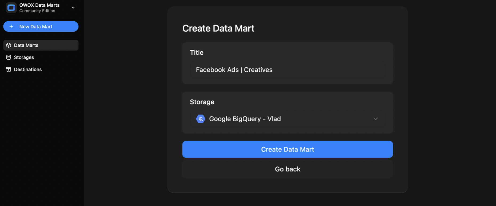
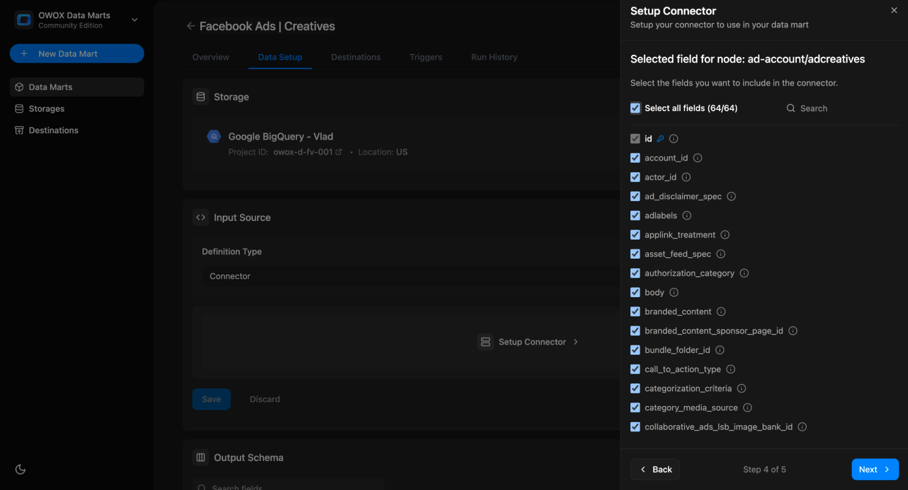
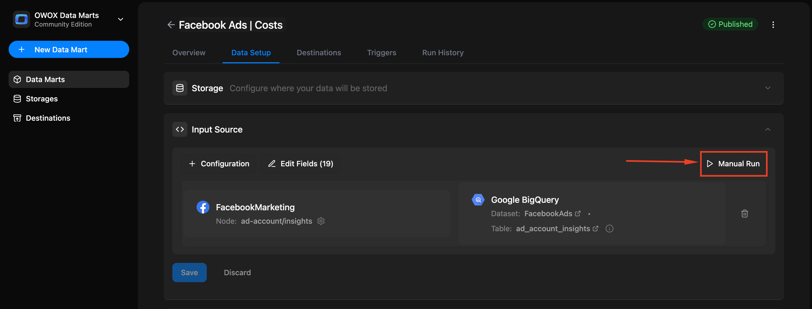
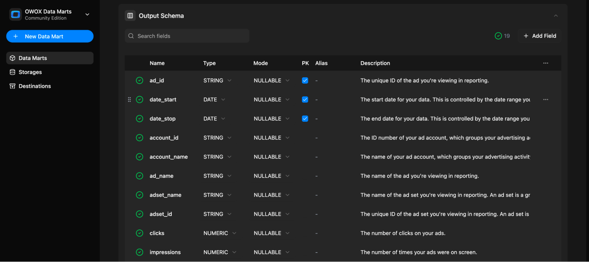

# Connector-based Data Mart

Use a connector-based Data Mart when you want to collect data directly from a platform API like Facebook Ads, TikTok Ads, LinkedIn Ads or other available data sources (or your own custom connector) into any of the supported Data Storages.

You’ll need a data storage available for the data mart setup. Here is [how to add a data storage](../../storages/manage-storages.md)

## Step 1: Choose the platform

Click **+ New Data Mart**.

Give it a friendly Title, e.g., `Facebook Ads | Creatives`.

Select the **Data Storage** from the list.

Click **Create Data Mart**.

In the **Input Source** panel, select **Definition Type – Connector**. Click **Setup Connector**.

Select the platform you want to connect to (e.g., [Facebook Ads](../../packages/connectors/src/Sources/FacebookMarketing/README.md), [TikTok Ads](../../packages/connectors/src/Sources/TikTokAds/README.md)) from the list of [available connectors](../../packages/connectors/src/Sources) and click **Next** (or add a custom connector code below).

## Step 2: Configure parameters

Each connector has a set of required parameters. The most common ones include:

| Parameter               | Description                                               |
|------------------------|-----------------------------------------------------------|
| `account_id`           | ID of the ad account or business you're pulling data from |
| `start_date`           | Start date for the data import                            |
| `end_date`             | End date for the data import                              |
| `reimport_lookback_window` | How many days of data to re-import during each run        |
| `max_fetching_days`    | Max days per API call to avoid rate limits                |
| `cleanup_to_keep_window` | How many days of data to keep before automatic cleanup     |

📌 Some connectors may have additional parameters — see their setup guides.

## Step 3: Add Access Credentials

Each connector requires authentication. Here is how you can obtain the required credentials for each of the ad platforms:

- [Facebook Ads](../../packages/connectors/src/Sources/FacebookMarketing/CREDENTIALS.md)
- [TikTok Ads](../../packages/connectors/src/Sources/TikTokAds/CREDENTIALS.md)
- [Linkedin Ads](../../packages/connectors/src/Sources/LinkedIn/CREDENTIALS.md)
- [X Ads](../../packages/connectors/src/Sources/XAds/CREDENTIALS.md)
- [Bing Ads](../../packages/connectors/src/Sources/BingAds/CREDENTIALS.md)
- [Reddit Ads](../../packages/connectors/src/Sources/RedditAds/CREDENTIALS.md)
- [Criteo Ads](../../packages/connectors/src/Sources/CriteoAds/CREDENTIALS.md)
- [Open Exchange Rates](../../packages/connectors/src/Sources/OpenExchangeRates/CREDENTIALS.md)
- [Other platforms](../../packages/connectors/src/Sources)

Use the **credentials screen** to manage access per platform.

## Step 4: Customize export schema

Once the connector and parameters are set, click **Next** to select the node you want to import in this data mart.

Each connector includes one or more data nodes. For example, Facebook Ads has nodes like:

- `ad_accounts`
- `ad_accounts/insights`
- `ad_accounts/campaigns`

👉 **Create a separate Data Mart for each node** you want to pull data from.

Next, click **Select all** or select just the fields you want to store in your data warehouse.

## Step 5: Set up the target in your storage

Enter **dataset name** for your data storage (e.g., dataset name for BigQuery) where the connector can load the data. The dataset will be created automatically if it doesn't exist.

The **table name** will be created automatically based on the selected node name, for example:  
`ad_account_adcreatives`

Don’t forget to:

- Click **Save** in the Data Setup tab  
- **Publish** the data mart  
- **Run** the Data Mart manually for the first time  

After the first run, you’ll see that the **Output schema was generated automatically**.

Each field includes:

- Name
- Data type
- Join key metadata
- Description

Next, you can add **business-friendly names** to improve usability later in BI tools as aliases.

> 💡 Tip: Add a description to the Data Mart itself so you always know what that is all about.

Also you can check the **Run History** tab for logs and results

## Step 6: Set Triggers (Optional but Recommended)

You can automate the connector by setting a trigger to run it on a schedule.

1. Go to the **Triggers** tab and click **+ Add Trigger**
2. Choose **Trigger Type**: `Connector Run`
3. Set schedule:

   - **Daily** → choose time & timezone  
   - **Weekly** → select days of the week, time & timezone  
   - **Monthly** → select dates, time & timezone  
   - **Interval** → e.g., every 15 minutes

## What’s Next?

- Create reports using this Data Mart  
- Add a destination (Google Sheets, Looker Studio, etc.)  
- Explore the data in the Output Schema tab  
- Share it with business users so they can build reports

## Related Links

- [Schedule Connector to Run Automatically →](connector-triggers.md)
- [Adding a Report Destination →](../../destinations/manage-destinations.md)
- [Scheduling Reports Updates →](report-triggers.md)
- [Create SQL-Based Data Mart →](sql-data-mart.md)
- [Create Table-Based Data Mart →](table-data-mart.md)
- [Create View-Based Data Mart →](view-data-mart.md)
- [Create Pattern-Based Data Mart →](pattern-data-mart.md)
