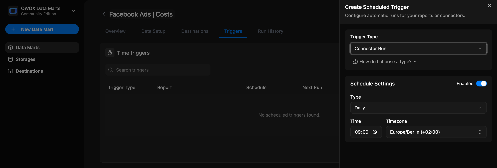

# Connector Trigger

Use this trigger type when you want to automatically import fresh data from a platform API on a regular schedule and update the [connector-based data marts](connector-data-mart.md).

## When to Use

Set up a `Connector Run` trigger if:

- You're using a [Connector-Based Data Mart](connector-data-mart.md)
- You want to refresh data ingestion into your warehouse automatically, without manual runs
- You want to control how frequently data is re-imported

## How to configure

1. Go to the **Triggers** tab of your Data Mart  
2. Click **+ Add Trigger**  
3. Select **Trigger Type** → `Connector Run`  
4. Choose the schedule type:
   - **Daily** → Set time of day and time zone
   - **Weekly** → Pick days of the week, time, and time zone
   - **Monthly** → Choose dates, time, and time zone
   - **Interval** → e.g. every 15 minutes  
5. Click **Save**

You can return anytime to update, pause, or delete the trigger.  
You can also add **multiple triggers** for the same Data Mart to refresh multiple reports.

## 🔗 Related Links

- [Create SQL-Based Data Mart →](sql-data-mart.md)  
- [Add a Destination →](../../destinations/manage-destinations.md)  
- [Report Triggers →](report-triggers.md)
