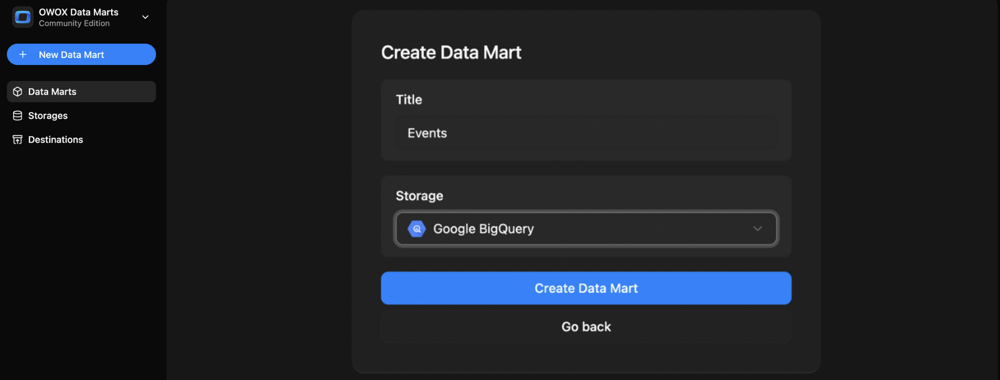
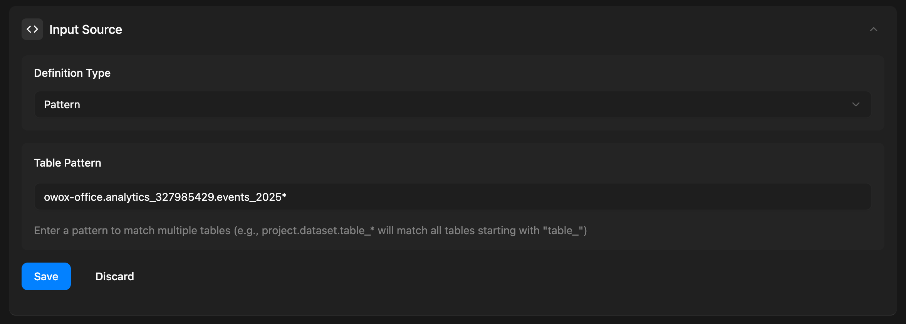
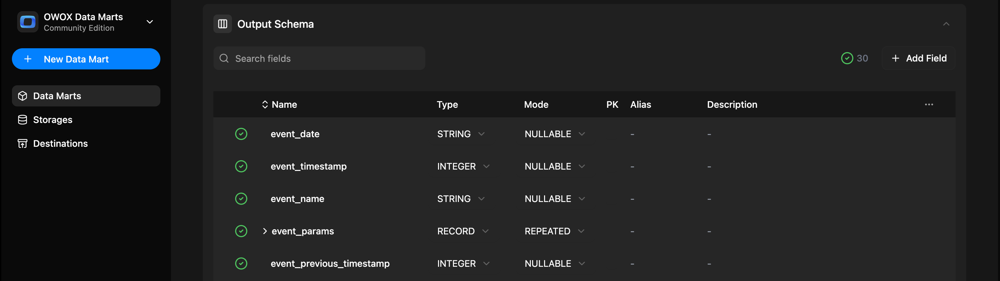

# Pattern-based Data Mart

Use this option when your data is spread across multiple similarly named tables, such as daily partitions (e.g., `events_20250731`, `events_20250801`, etc.).  
A pattern-based Data Mart lets you query all of these tables as a unified dataset using a wildcard — without manually listing each one.

Note: You need a data storage available for the data mart setup. Here is [how to add a data storage](../../storages/manage-storages.md)

## Patterns Examples

This is commonly used with:

- GA4 BigQuery export tables → `events_*`
- GA4 export for 2025 → `events_2025*`
- Time-based tables by date or month → e.g. `ads_202507*`, `clicks_202503*`
- Any system that creates one table per day

## Step 1: Create a New Data Mart

- Click **+ New Data Mart**
- Give it a descriptive title, e.g. `Events`
- Select your **Data Storage** (BigQuery or Athena)
- Click **Create Data Mart**

## Step 2: Enter Pattern Details

In the **Input Source** section:

- Set **Definition Type** to `Pattern`
- Enter a wildcard pattern to match multiple tables, such as:  
  `project.dataset.table_*` → will match all tables starting with `table_`

Click **Save**

Once saved, the **Output Schema** will be generated automatically with the:

- Field names
- Data types

You can now:

- Add **aliases** (business-friendly names)
- Write **descriptions** for each field
- Add a **description** to the Data Mart itself
- Specify **join keys**

Then click **Publish Data Mart**

## Step 3: Add a Destination

You can export the results to:

- **Google Sheets** → Set up destination, choose refresh schedule, and filters
- **Looker Studio** (coming soon)
- **OData** for Excel, Power BI, Tableau (coming soon)

Each destination will reuse the same Data Mart — no need to duplicate logic. You can share the same logic across multiple tools.

To do this:

1. Under the **Destinations** section, click **+ Add report**
2. Give your report a name, e.g., `Website Visitors`
3. Select a destination
4. Create a new Google Sheets document (or use an existing one) and share it (Edit permissions) with your **Google Sheets Service Account**
5. Add a link to your document (and specify the tab) and click **Create new report**

You can now:

- Run report  
- Edit report  
- Open document  
- Delete report

## Step 4: Set Triggers

You can automate updates by setting a [Trigger](report-triggers.md) to refresh the data on a schedule.

Go to the **Triggers** tab → Click **+ Add Trigger**

- Choose **Trigger Type**: `Report Run`
- Set schedule:
  - **Daily** → Choose time and timezone
  - **Weekly** → Select days of the week, time, and timezone
  - **Monthly** → Select dates, time, and timezone
  - **Interval** → e.g., every 15 minutes
- Click **Create trigger**

You can also open the **Run History** tab to view execution logs, status, and timestamps.

## Related Pages

- [Scheduling Reports Updates →](report-triggers.md)
- [Adding More Report Destinations →](../../destinations/manage-destinations.md)
- [Create Connector-Based Data Mart →](connector-data-mart.md)
- [Create SQL-Based Data Mart →](sql-data-mart.md)
- [Create Table-Based Data Mart →](table-data-mart.md)
- [Create View-Based Data Mart →](view-data-mart.md)
