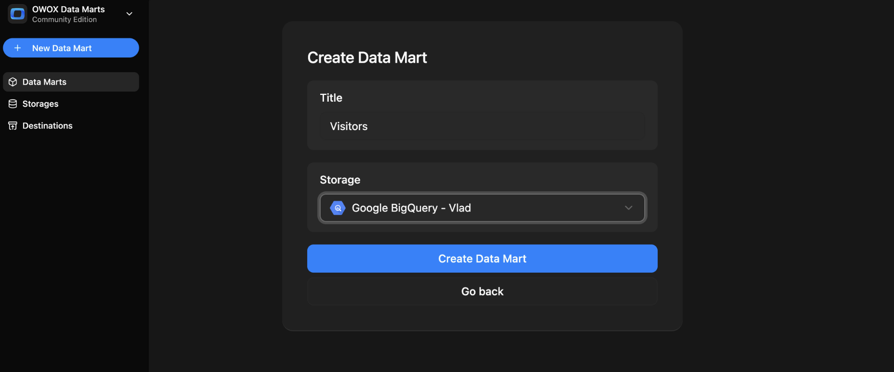
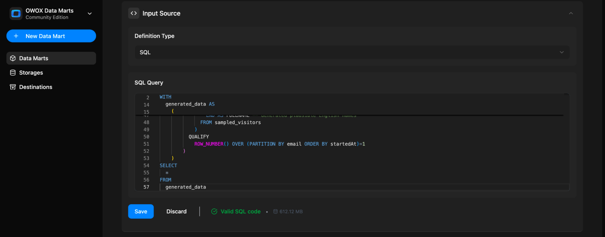
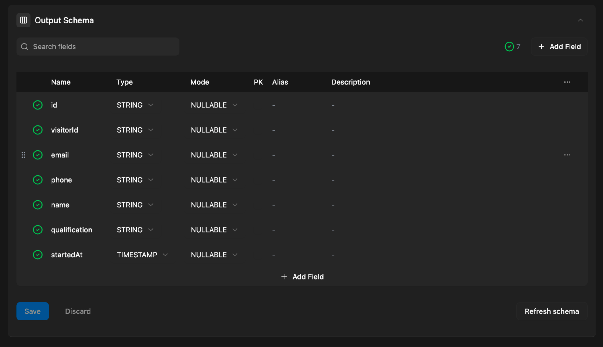
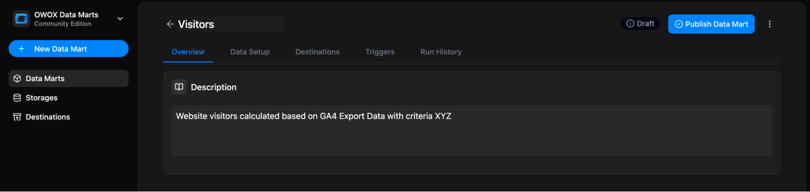
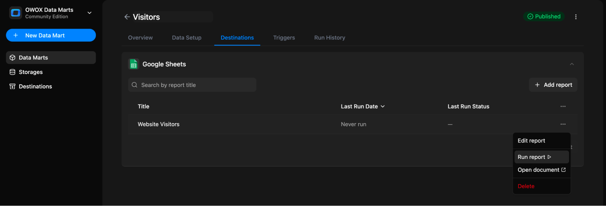

# SQL-based Data Mart

Use this option when you want to define a Data Mart based on a SQL query written manually — using your existing data warehouse tables, joins, and logic.

Note: You need a data storage available for the data mart setup. Here is [how to add a data storage](../../storages/manage-storages.md)

## Step 1: Create a New Data Mart

- Click **+ New Data Mart**
- Give it a descriptive title (e.g., `Visitors`)
- Select your **Data Storage** (Google BigQuery or AWS Athena)
- Click **Create Data Mart**

## Step 2: Choose Definition Type – SQL

In the **Input Source** section, set the **Definition Type** to `SQL Query`.

You’ll now see a SQL editor where you can write or paste your query.

Write a new query or paste an existing one.  
Wait until it’s validated, then click **Save** (and **Publish Data Mart**).

> ✅ **Tip:** Keep your query focused on one specific business question. This helps with reusability and semantic clarity.

You can reference any **table or view** available in your storage.

## Step 3: Define Output Schema

Once the query is saved, the **Output Schema** will be generated automatically.  OWOX will attempt to auto-detect:

- Column names
- Data types

You can:

- Mark **primary keys**
- Add **aliases** (business-friendly column names)
- Add **descriptions** for each field

> 💡 These descriptions improve usability when the data is reused in BI tools or shared with business users.

## Step 4: Add a Description (Optional but Recommended)

Use the **Overview** tab to describe:

- What the Data Mart is about
- What business question it answers
- Any context that might help other users

## Step 5: Add Reports

First, make sure your project has a Destination. If it has none, create one under **Destinations** in the left sidebar — see [Adding a New Destination](../../destinations/manage-destinations.md#adding-a-new-destination). You can also click **Connect Google Sheets** on the Data Mart's empty **Destinations** tab.

Open the **Destinations** tab of your Data Mart.

In your Destination's block, click **+ New Report**.

Then fill in the report form:

1. Give your report a name, e.g. `Website Visitors`
2. Select a destination
3. In **Document Link with Sheet ID (GID)**, paste a link to an existing tab. Or click **+ New Sheet** to create a spreadsheet
4. For an existing spreadsheet, share it with the email shown under **Share document with**, and give it **Editor** access
5. Click **Create & Run report**. To save without running, open the dropdown next to the button and select **Create new report**

You can now:

- Run the report  
- Edit the report  
- Open the document  
- Delete the report

## Step 6: Set Triggers

You can automate the query by setting a **Trigger** to refresh the data on a schedule.

- Go to the **Triggers** tab → Click **+ Add Trigger**
- Choose **Trigger Type**: `Report Run`
- Set schedule:
  - **Daily** → choose time & timezone
  - **Weekly** → select days of the week, time & timezone
  - **Monthly** → select dates, time & timezone
  - **Interval** → e.g., every 15 minutes
- Click **Create trigger**

## Related Links

- [Scheduling reports updates →](report-triggers.md)
- [Adding more report destinations →](../../destinations/manage-destinations.md)
