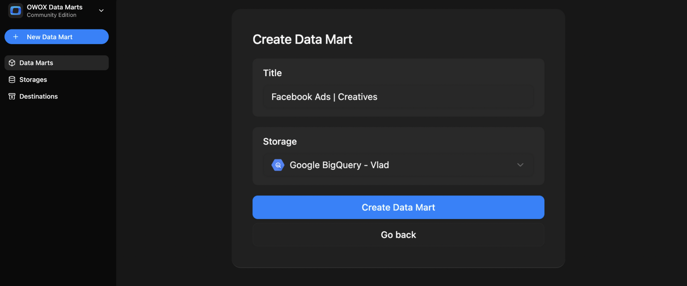
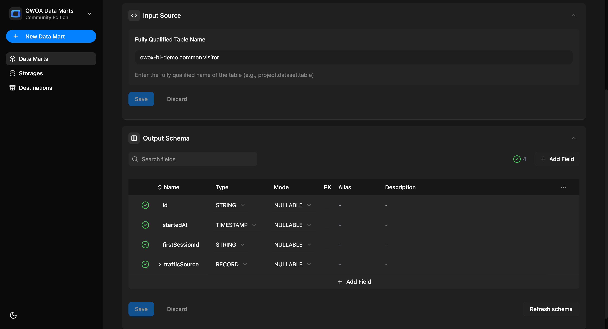
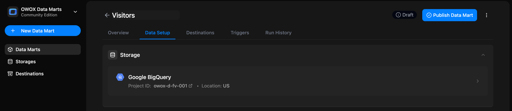
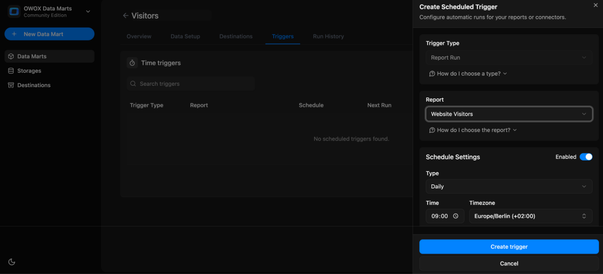

# View-based Data Mart

Use this option when you want to define a Data Mart that directly references a view that already exists in your data warehouse.
This is useful when your logic is already encapsulated in a warehouse view and doesn’t require rewriting or copy-pasting SQL inside the Data Mart.

Note: You’ll need a data storage available for the data mart setup. Here is [how to add a data storage](../../storages/manage-storages.md)

## Step 1: Create a New Data Mart

- Click **+ New Data Mart**
- Give it a clear title, e.g., `Visitors`
- Select your **Data Storage** (BigQuery or Athena)
- Click **Create Data Mart**

## Step 2: Enter View Details

In the **Input Source** panel:

- Set **Definition Type** to `View`
- Add the **View Name** in the format:  
  `projectId.datasetId.viewName` (for BigQuery)
  `catalog.schema.viewName` (for AWS Athena)

Click **Save**

Once saved, the **Output Schema** will be generated automatically with:

- Field names
- Data types

You can then:

- Add **aliases** (business-friendly names)
- Write **descriptions** for each field
- Add a **description** to the Data Mart itself
- Specify **join keys**

Click **Publish Data Mart**

## Step 3: Add a Destination

You can export the results to:

- **Google Sheets** → Set up destination, choose refresh schedule, and filters
- **Data Studio**
- **OData** for Excel, Power BI, Tableau (coming soon)

Each destination will reuse the same Data Mart — no need to duplicate logic. You can share the same logic across multiple tools.

To do this:

First, make sure your project has a Destination. If it has none, create one under **Destinations** in the left sidebar — see [Adding a New Destination](../../destinations/manage-destinations.md#adding-a-new-destination). You can also click **Connect Google Sheets** on the Data Mart's empty **Destinations** tab.

Open the **Destinations** tab of your Data Mart.

In your Destination's block, click **+ New Report**.

Then fill in the report form:

1. Give your report a name, e.g. `Website Visitors`
2. Select a destination
3. In **Document Link with Sheet ID (GID)**, paste a link to an existing tab. Or click **+ New Sheet** to create a spreadsheet
4. For an existing spreadsheet, share it with the email shown under **Share document with**, and give it **Editor** access
5. Click **Create & Run report**. To save without running, open the dropdown next to the button and select **Create new report**

You can now:

- Run report  
- Edit report  
- Open document  
- Delete report

## Step 4: Set Triggers

You can automate updates by setting a [Trigger](report-triggers.md) to refresh the data on a schedule.

Go to the **Triggers** tab → Click **+ Add Trigger**

- Choose **Trigger Type**: `Report Run`
- Set schedule:
  - **Daily** → Choose time and timezone
  - **Weekly** → Select days of the week, time, and timezone
  - **Monthly** → Select dates, time, and timezone
  - **Interval** → e.g., every 15 minutes
- Click **Create trigger**

You can also open the **Run History** tab to view execution logs, status, and timestamps.

## Related Pages

- [Scheduling Reports Updates →](report-triggers.md)
- [Adding More Report Destinations →](../../destinations/manage-destinations.md)
- [Create Connector-Based Data Mart →](connector-data-mart.md)
- [Create SQL-Based Data Mart →](sql-data-mart.md)
- [Create Table-Based Data Mart →](table-data-mart.md)
- [Create Pattern-Based Data Mart →](pattern-data-mart.md)
