# Lint-staged Workflow for OWOX Data Marts

## Overview

OWOX Data Marts uses **distributed lint-staged configurations** following [official best practices](https://github.com/okonet/lint-staged#how-to-use-lint-staged-in-a-multi-package-monorepo) for multi-package monorepos.

## 🔄 Workflow Diagram

```mermaid
sequenceDiagram
    participant Dev as Developer
    participant Git as Git Hook
    participant LS as lint-staged
    participant Config as .lintstagedrc.json
    participant ESL as ESLint
    participant Prettier as Prettier

    Dev->>Git: git commit -m "..."
    Git->>LS: Trigger pre-commit hook
    LS->>LS: Detect staged files

    Note over LS,Config: Automatic config discovery
    LS->>Config: Find nearest .lintstagedrc.json
    Config-->>LS: Return configuration rules

    LS->>ESL: Run ESLint validation
    ESL-->>LS: Return results

    alt ESLint has errors
        LS->>Dev: ❌ Commit blocked
        Note right of Dev: Fix errors manually
        Dev->>Dev: git add fixes
        Dev->>Git: git commit (retry)
    else ESLint passes
        LS->>Prettier: Format files
        Prettier-->>LS: Files formatted
        LS->>Git: ✅ Continue commit
        Git->>Dev: 🎉 Commit successful
    end
```



## 🏗️ Architecture

### Configuration Discovery

lint-staged automatically finds the nearest configuration file to each staged file:

```
📁 project-root/
├── .lintstagedrc.json          # Root config (fallback)
├── 📁 apps/
│   ├── 📁 backend/
│   │   ├── .lintstagedrc.json  # Backend-specific rules
│   │   └── src/app.module.ts   # → Uses backend config
│   └── 📁 web/
│       ├── .lintstagedrc.json  # Frontend-specific rules
│       └── src/App.tsx         # → Uses web config
└── 📁 packages/
    ├── 📁 ui/
    │   ├── .lintstagedrc.json  # UI-specific rules
    │   └── src/button.tsx      # → Uses UI config
    └── README.md               # → Uses root config
```

### How It Works

1. **File Detection**: Git detects staged files
2. **Config Discovery**: lint-staged finds nearest `.lintstagedrc.json` for each file
3. **Workspace Isolation**: Each workspace runs with its own rules
4. **Tool Execution**: ESLint validates → Prettier formats (if validation passes)
5. **Commit Control**: Commit blocked if any errors found

## 📋 Configuration Examples

### Backend TypeScript (`apps/backend/.lintstagedrc.json`)

```json
{
  "*.{ts,tsx}": [
    "eslint --config ./eslint.config.mjs",
    "prettier --config ./prettier.config.mjs --write"
  ],
  "*.json": ["prettier --config ./prettier.config.mjs --write"],
  "*.md": ["prettier --config ./prettier.config.mjs --write"]
}
```

### Frontend React (`apps/web/.lintstagedrc.json`)

```json
{
  "*.{ts,tsx,js,jsx}": [
    "eslint --config ./eslint.config.js",
    "prettier --config ./prettier.config.js --write"
  ],
  "*.json": ["prettier --config ./prettier.config.js --write"],
  "*.{css,scss}": ["prettier --config ./prettier.config.js --write"]
}
```

### Root Fallback (`.lintstagedrc.json`)

```json
{
  "*.json": "prettier --write",
  "*.{yml,yaml}": "prettier --write"
}
```

## 🛠️ Setup

The setup is handled automatically by the `tools/setup-husky.js` script:

```bash
# Manual setup (if needed)
npm run setup:husky

# Automatic setup (runs on npm install)
npm install  # → triggers postinstall → setup:husky
```

### What the setup does:

1. **Initializes Husky**: Creates `.husky/` directory
2. **Creates pre-commit hook**: Runs `npm run pre-commit`
3. **Makes hook executable**: Sets proper permissions

## 🚫 Bypassing Pre-commit Hooks

Sometimes you need to commit without running lint-staged:

### Temporary Bypass (Single Commit)

```bash
# Emergency commit (skip all hooks)
git commit --no-verify -m "Emergency hotfix"

# Alternative short form
git commit -n -m "Emergency hotfix"
```

### Temporary Disable (Multiple Commits)

```bash
# Disable pre-commit hook
mv .husky/pre-commit .husky/pre-commit.disabled

# Make your commits
git commit -m "WIP: Large refactoring"
git commit -m "WIP: Continue refactoring"

# Re-enable hook
mv .husky/pre-commit.disabled .husky/pre-commit
```

## 🐛 Troubleshooting

### Common Issues

#### 1. Hooks Not Running

```bash
# Check if hooks are executable
ls -la .husky/pre-commit

# Fix permissions (Unix/macOS)
chmod +x .husky/pre-commit

# Reinstall hooks
npm run setup:husky
```

#### 2. ESLint Configuration Not Found

```bash
✖ ESLint couldn't find a configuration file.

# Solution: Ensure workspace has eslint.config.js/mjs
ls apps/backend/eslint.config.mjs
ls apps/web/eslint.config.js
```

#### 3. Prettier Configuration Issues

```bash
✖ Prettier configuration not found

# Solution: Ensure workspace has prettier.config.js/mjs
ls apps/backend/prettier.config.mjs
ls apps/web/prettier.config.js
```

### Debug Mode

```bash
# Run lint-staged with debug output
DEBUG=lint-staged* npm run pre-commit

# Check what files would be processed
npx lint-staged --dry-run
```

## 🎯 Best Practices

### ✅ Recommended Workflow

1. **Write code** with ESLint IDE integration
2. **Stage changes**: `git add .`
3. **Commit**: `git commit -m "descriptive message"`
4. **If blocked**: Fix errors and retry

### ✅ Fixing ESLint Errors

```bash
# See what's wrong
npm run lint

# Auto-fix simple issues
npm run lint:fix

# Format after fixing
npm run format

# Stage fixes and retry
git add . && git commit
```

### ❌ Anti-patterns

- Don't blindly use `--no-verify` to skip hooks
- Don't disable ESLint rules without team discussion
- Don't commit with `lint:fix` without reviewing changes

## 📚 Adding New Workspaces

To add lint-staged to a new workspace:

1. **Create configuration file**:

   ```bash
   # packages/new-package/.lintstagedrc.json
   {
     "*.{ts,tsx}": ["eslint --config ./eslint.config.js", "prettier --write"],
     "*.json": ["prettier --write"]
   }
   ```

2. **Test the configuration**:

   ```bash
   cd packages/new-package
   echo "test" > test.ts
   git add test.ts
   git commit -m "test"  # Should use new config automatically
   ```

3. **No additional setup needed** - lint-staged discovers configs automatically!

## 🔗 External Resources

- [Official lint-staged documentation](https://github.com/okonet/lint-staged)
- [Monorepo best practices](https://github.com/okonet/lint-staged#how-to-use-lint-staged-in-a-multi-package-monorepo)
- [Husky documentation](https://typicode.github.io/husky/)
- [ESLint configuration](https://eslint.org/docs/user-guide/configuring/)
- [Prettier configuration](https://prettier.io/docs/en/configuration.html)
