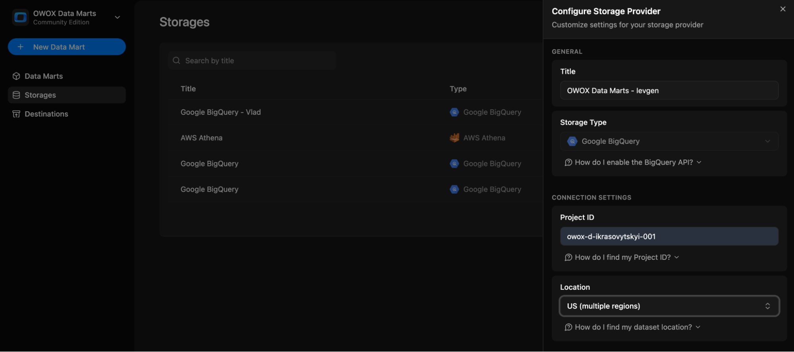

# Google BigQuery

## 1. Go to the Storages Page

In the OWOX Data Marts web application, navigate to **Storages** from the main navigation pane and click **+ New Storage**.

## 2. Choose Storage Type

Click **Google BigQuery** to create a new **Storage** configuration.
> ☝️ Upon selecting the **+ New Storage** button and specifying the desired storage type, a Storage entry is created.
> You can create **Data Mart** entities and model a data structure for your project prior to configuring the **Storage**.  
> Note that **Data Mart** cannot be validated or published until the associated **Storage** is fully configured.

## 3. Add title

Give the storage configuration a clear **title**, eg `OWOX Data Marts – Your Name`.

## 4. Set General Settings and Connection Details

### Enter Project ID

- Go to the [Google Cloud Console](https://console.cloud.google.com/)
- Click the project selector dropdown at the top
- Find your project and copy the **Project ID**

NOTE: BigQuery usage costs will be applied to this project.  

### Select location

- Choose a data location (e.g., `US`, `EU`) from the dropdown menu

### Add a Service Account JSON

To get the JSON key, you'll need to create or use an existing service account in Google Cloud.

> ✅ **Best Practice:** Always use a dedicated service account with least-privilege access for security and auditability.

#### How to obtain the service account key

- Go to the [Service Accounts page](https://console.cloud.google.com/iam-admin/serviceaccounts)
- Navigate to **IAM & Admin → Service Accounts**
- Create a new account or choose an existing one
- Assign the roles:
  - `BigQuery Data Editor`
  - `BigQuery Job User`
- Go to the **Keys** tab, click **Add key → Create new key**
- Choose **JSON**, click **Create**, and download the file
- Copy the contents of the JSON file and paste it into the **Service Account JSON** field

### Enable BigQuery API

- Open the [BigQuery API Library page](https://console.cloud.google.com/apis/library/bigquery.googleapis.com)
- Ensure the correct Google Cloud project is selected
- If the API isn’t enabled, click **Enable**
- If already enabled, you’ll see the API dashboard

### 5. Finalize Setup

Review your entries and click **Save** to add the **Storage configuration**, or **Cancel** to exit without saving.
