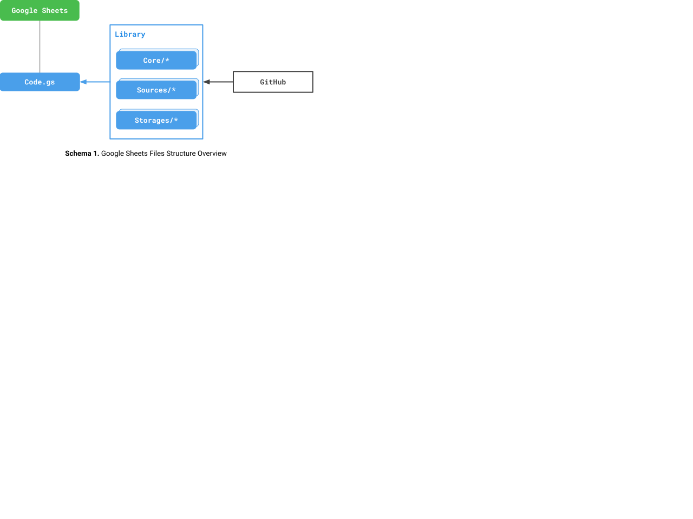
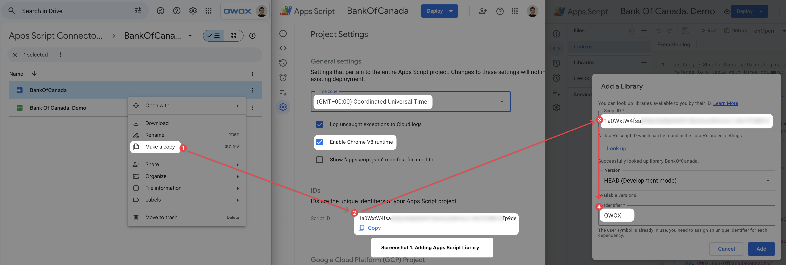
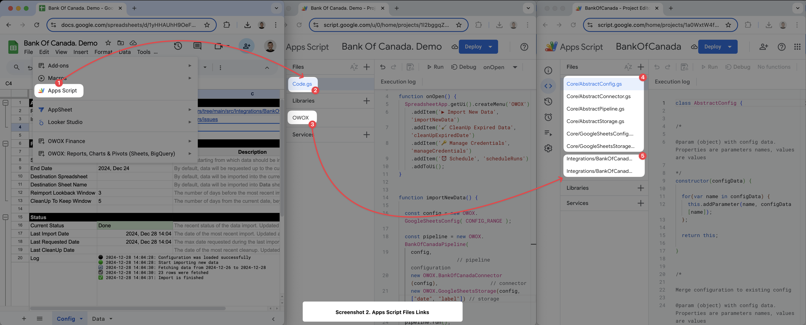

There are thousands of different data sources, with their APIs constantly changing, making it impossible to develop integrations for all possible use cases.
Therefore, the goal of this guide is to provide clear and understandable steps to adjust existing integrations and develop new ones.

## Google Sheets Files Structure 
The Google Sheets document contains the configuration in the Config sheet, control options in the menu, and an attached Apps Script `Code.gs`. The purpose of this document is to provide a user interface for Google Sheets users and to make relevant calls to library's objects. Feel free to make a copy of the Google Sheets document and modify `Code.gs` as needed.

To make the integration work, you need to connect the appropriate library to `Code.gs`. Google Sheets templates for specific data sources already have the required library connected. If you create a blank Google Sheets document, you will need to connect a library to `Code.gs` manually.

Library files connected to templates are updated automaticaly based on Github repository. So to make your own changes you need to make a library copy first.

> ℹ️ **Note:** It is highly recommended that you use the UTC time zone only to avoid unexpected data discrepancies. V8 runtime is a mandatory requirement, not an option.

Library contatins two types of files: 
- `Core/*` — Core scripts, which are the same for all integrations, are primarily written in TypeScript (at least, it will be soon!)
- `Integrations/*` — Data source-specific files are primarily written in Apps Script. You may need to modify them to suit your custom requirements.

## Creating a New Integation

To create integration with a new data source, do the following:
1. Make a copy of Google Sheets and Apps Script documents from [this folder](https://drive.google.com/drive/u/0/folders/1Yy2QOb0B6-DcKaowmjH3jxtdi8q2KtoU)
2. Replace the library added to Google Sheets with the new Apps Script created from the template
3. Replace `YOUR_DATA_SOURCE` in source code with the name of the data source you are creating the integration with
4. Create methods code according to the integration requirements. Please refer to the UML section for detailed information.
5. Create a new folder integration based on [template](../../tree/main/packages/connectors/src/Templates/PublicEndPoint). Replace **scriptId** in `.claspignore` file and **Templates/*** in `.clasp.json`
6. [Add all relevant files](https://docs.github.com/en/repositories/working-with-files/managing-files/adding-a-file-to-a-repository) to the created folder. You can also do this from a web browser
## UML

### Pipeline
`Pipeline` is responsible for data transfer orchestrations. There are three parameters required to create a `Pipeline`: `Config`, `Connector`, and `Storage`.  
For most data sources, it is enough to override the `startImportProcess()` method.

It must be an instance of `AbstractPipeline`

### Connector
`Connector` is responsible for fetching data from the Data Source. This object has a `fetchData()` method, which is required for data source-specific implementation.
It must be an instance of `AbstractConnector`

### Storage
`Storage` is responsible for adding new data and updating existing data in storage. Currently, only Google Sheets is supported as a data storage option.

It must be an instance of `AbstractStorage`

## Legal
To clarify the intellectual property license granted with Contributions from any person or entity, we must have on file a signed Contributor License Agreement ("CLA") from each Contributor, indicating agreement with the license terms.

This agreement is for your protection as a Contributor as well as the protection of us and the users of owox-data-marts. It does not change your rights to use your own Contributions for any other purpose.

For more details, please review the full [OWOX CLA](https://cla-assistant.io/OWOX/js-data-connectors).

Pull Request authors must sign [OWOX CLA](https://cla-assistant.io/OWOX/js-data-connectors). It will show up in an automated comment after you create a PR.

If you cannot or do not want to sign this CLA (e.g., your employment contract for your employer may not allow this), **you should not submit a PR**. Instead, please open an issue, and someone else can do the work.

## Questions
Got a questions? Ask community [here](../../discussions/categories/q-a)
