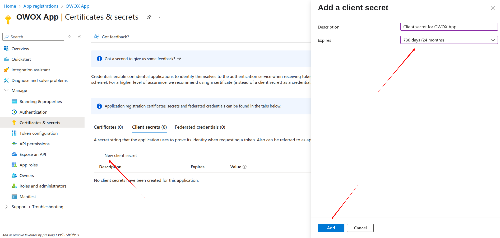
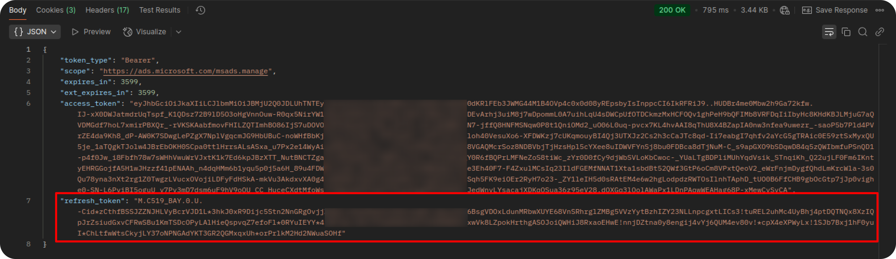

## How to obtain the credentials for the Bing Ads source

During this process, you will obtain the following credentials required for the Bing Ads source:

- **Account ID**  
- **Customer ID**  
- **Developer Token**  
- **Client ID**  
- **Client Secret**  
- **Refresh Token**

1. If you haven't already, [sign up for Microsoft Azure](https://azure.microsoft.com/) and log in to the [Azure Portal](https://portal.azure.com/).

2. In the Azure Portal, search for and open the **App registrations** service. 

3. Click **New registration** and fill in the form:

   - **Name**: Choose a name for your app.
   - **Supported account types**:  
     Select:  
     *Accounts in any organizational directory (Any Microsoft Entra ID tenant - Multitenant) and personal Microsoft accounts (e.g., Skype, Xbox)*
   - **Redirect URI**:  
     - Platform: *Web*  
     - URI: `http://localhost:8080`
  
   Click the **Register** button.

4. In your registered app, go to **Client credentials** -> **Add a certificate or secret**.

5. Click **New client secret**.
3. Provide a description (e.g., *Client secret for OWOX App*), choose the maximum expiration period (*730 days*), and click **Add**.

> ⚠️ **Important:** Copy and securely save the **client secret value**. You won't be able to see it again later.

At this point, you have:
- **Client ID**
- **Client Secret**
- **Redirect URI**: `http://localhost:8080`

Go to [https://ads.microsoft.com/](https://ads.microsoft.com/) and log in to your Bing Ads account. The **URL** of your account contains the **Account ID** and **Customer ID**. Copy both values.

7. In the Bing Ads interface, go to **Settings → Developer Settings**.

8. Click **Request Token**, and copy the generated **Developer Token**.

9. Great! Create a URL by replacing `CLIENTID` with your **Client ID**:
`https://login.microsoftonline.com/common/oauth2/v2.0/authorize?client_id=CLIENTID&response_type=code&redirect_uri=http://localhost:8080&scope=https://ads.microsoft.com/msads.manage offline_access`

Open the URL in your browser. Log in and authorize the app by clicking **Accept**. After authorization, you will be redirected to:  
`http://localhost:8080/?code=YOUR_CODE`  

Copy the `code` value from the URL.

> Example:  
> If the redirect URL is:  
> `http://localhost:8080/?code=M.C519_BAY.2.U.0a895e39-774a-e677-b4bb-8589ce3e0beb`  
>Your **Authorization Code** is:  
>`M.C519_BAY.2.U.0a895e39-774a-e677-b4bb-8589ce3e0beb`

10. Exchange this code for a refresh token by making a GET request to 
`https://login.microsoftonline.com/common/oauth2/v2.0/token` 
with the following parameters (as form data or in the body of the request):
- `client_id` = `YOUR_CLIENT_ID`  
- `client_secret` = `YOUR_CLIENT_SECRET`  
- `grant_type` = `authorization_code`  
- `code` = `YOUR_AUTHORIZATION_CODE`  
- `redirect_uri` = `http://localhost:8080`  
- `scope` = `https://ads.microsoft.com/msads.manage offline_access`

After a successful request, you will receive a **Refresh Token** in the response. Store it securely — this token will be used to authenticate API requests.

You now have all the required credentials to use the Bing Ads source.