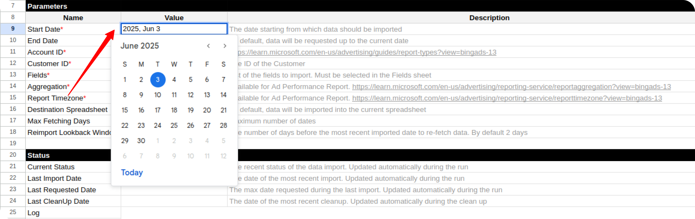
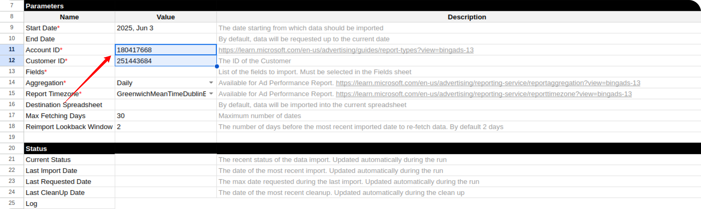
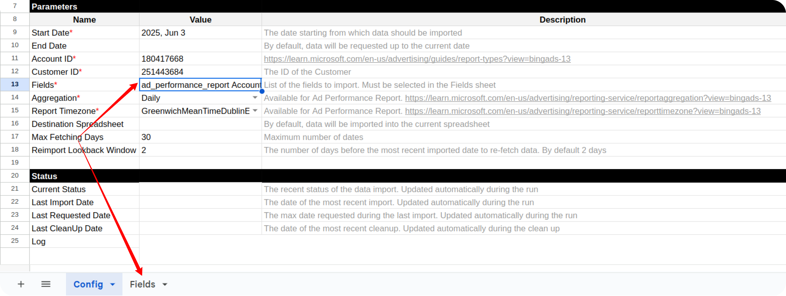
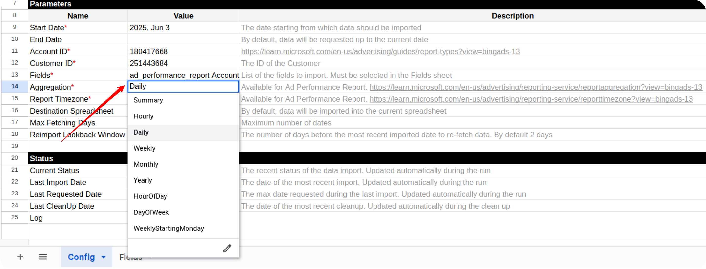
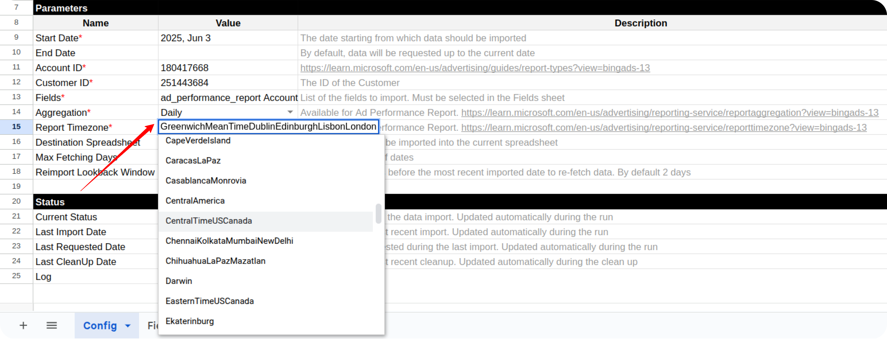
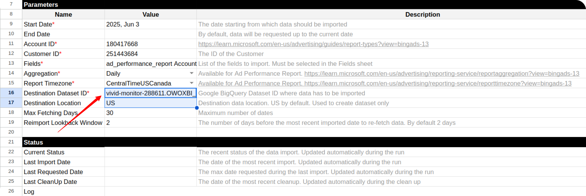
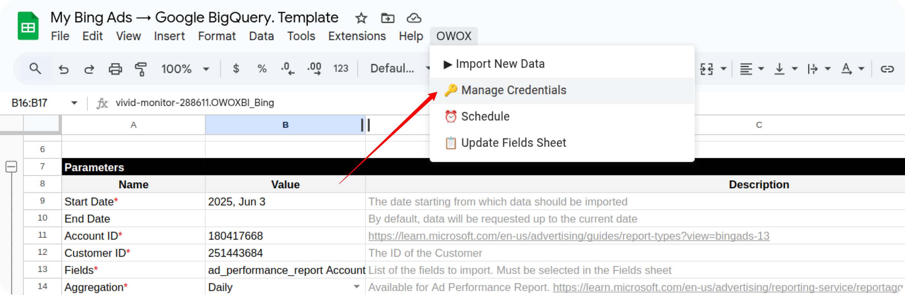
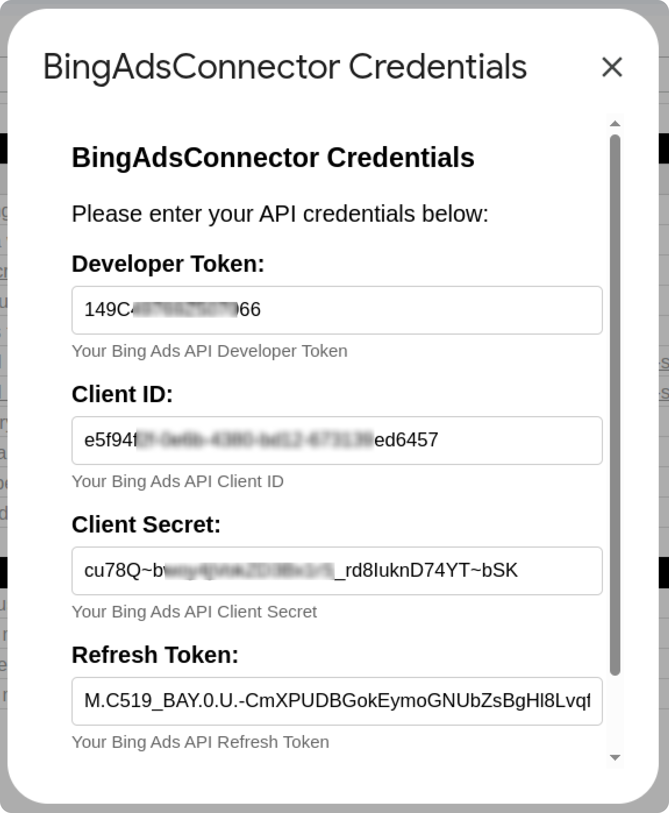
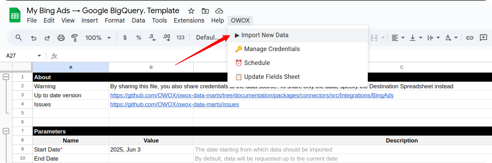

## How to Import Data from the Bing Ads Source

To begin importing data from Bing Ads, start by making a copy of one of the following templates:

- [**Bing Ads → Google Sheets. Template**](https://docs.google.com/spreadsheets/d/1OTLrSl1bMDC6IS8eKDYPEOx_LBZZI7kPePh2eTEeiEc/copy)
- [**Bing Ads → Google BigQuery. Template**](https://docs.google.com/spreadsheets/d/1uETkcB5Pq8oN3fed9eNxxdyaycLYJ7ZxRibU1CzuCdA/copy)

Fill in the required information:
- **Start Date**
- **Account ID**
- **Customer ID**
- **Fields**
- **Aggregation**
- **Report Timezone**
- **Destination Dataset ID** (for **Google BigQuery** template)
- **Destination Location** (for **Google BigQuery** template)

The import will begin from the selected **Start Date**.  
> ⚠️ **Note:** Using a long date range may cause the import to fail due to the high volume of data.

You can find your **Account ID** and **Customer ID** in the URL of your Bing Ads account. Go to [https://ads.microsoft.com/](https://ads.microsoft.com/) and log in to your Bing Ads account. The **URL** of your account contains the **Account ID** and **Customer ID**. 

Copy and paste both values.

To include fields, go to the **Fields** tab and check the boxes next to the fields you want to include.

Choose the Report Aggregation Value. Please, refer to the [Microsoft Ads help center](https://learn.microsoft.com/en-us/advertising/reporting-service/reportaggregation?view=bingads-13) to learn more. 

Choose the Report Time Zone. This field Ddefines possible values for the time zone that you want the Reporting service to use for the selected date range.

If you're using the **Google BigQuery** template, also provide:

- **Destination Dataset ID** in the format: `projectid.datasetid`
- **Destination Location**

> ℹ️ If the specified dataset doesn't exist, it will be created automatically.

Open the menu: **OWOX → Manage Credentials**

Enter your credentials obtained by following this guide: [**How to obtain the credentials for the Bing Ads connector**](CREDENTIALS.md)

Once your credentials are saved, go to: **OWOX → Import New Data**

The import process is complete when the Log data displays **"Import is finished"**. 

Access Your Data:

- In the **Google Sheets** template, the data will appear in new tabs labeled with the corresponding data types.  

- In the **Google BigQuery** template, the data will be written to the dataset specified earlier.

To import more data:

1. Select the additional fields you need in the **Fields** tab.
2. Go to **OWOX → Import New Data** again.

If you encounter any issues:

1. Check the "Logs" sheet for specific error messages
2. Please [visit Q&A](https://github.com/OWOX/owox-data-marts/discussions/categories/q-a) first
3. If you want to report a bug, please [open an issue](https://github.com/OWOX/owox-data-marts/issues)
4. Join the [discussion forum](https://github.com/OWOX/owox-data-marts/discussions) to ask questions or propose improvements 