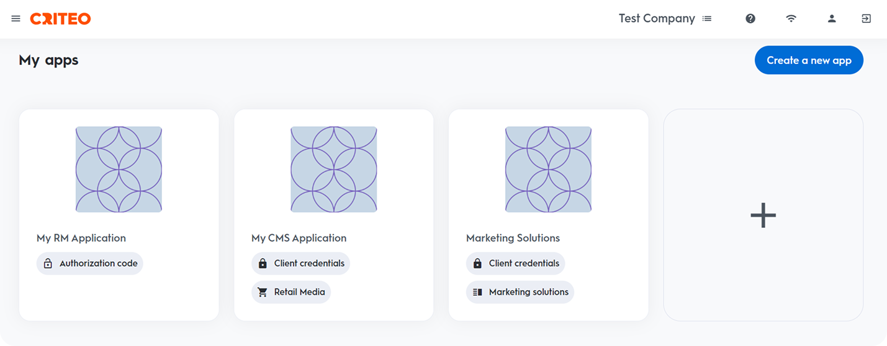
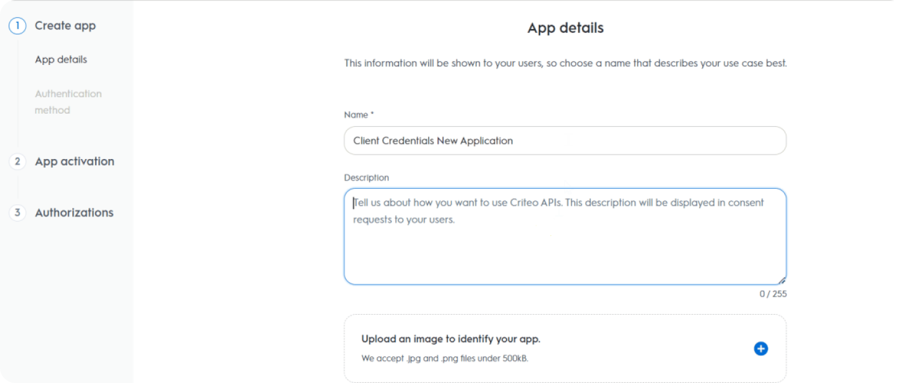
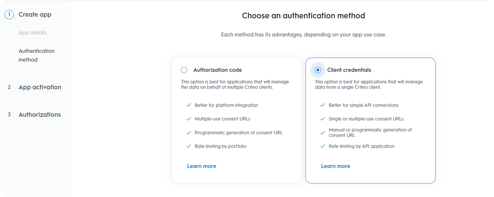
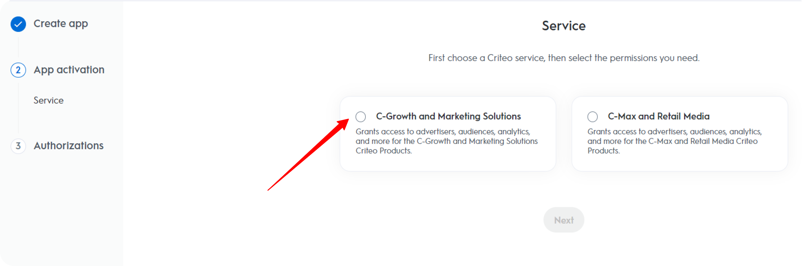
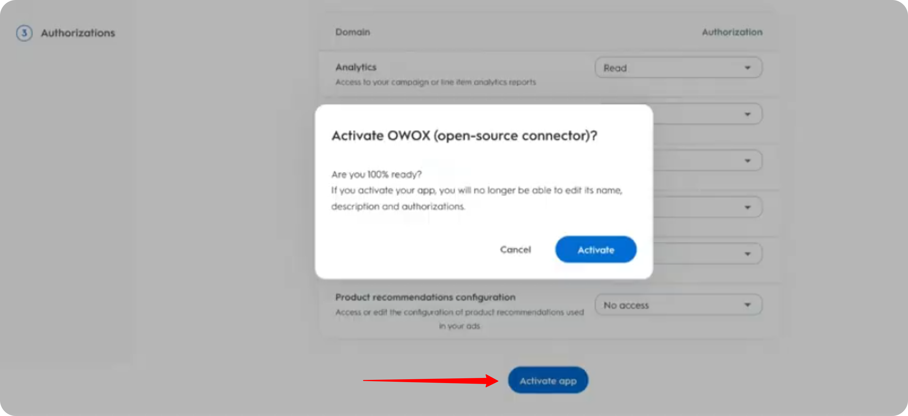
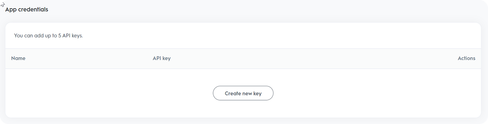

# How to obtain the credentials for the Criteo source

To connect to the Criteo API, follow the steps below to create an app and generate the necessary credentials.

Go to [https://partners.criteo.com](https://partners.criteo.com) and log in with your Criteo account.

Create a new app by clicking the ➕ icon in the **My Apps** section or by pressing the **Create a new app** button.  

Enter a descriptive **Application Name** (e.g., `OWOX (open source connector)`).  
> 📌 It's recommended to use a clearly identifiable name to simplify future troubleshooting.

Optionally, add a description. Click **Next**.

Select **Client Credentials** as the authentication method.  

Under **Service**, choose **C-Growth and marketing solutions**.  

Choose the necessary **permissions** for your app:

- **Analytics — Read**
- **Campaigns — Read**
- **Creatives — Read**

These are the minimum required permissions for data access.

> ⚠️ **Note:** After completing this step, you will no longer be able to edit the app name, description, image, or scope.

Click **Activate app** to proceed.  

Click **Create new key** to generate your `client_id` and `client_secret`.  
This will download a `.txt` file containing your credentials.

> 🔐 Make sure to store the keys in a secure location — they will be needed for API authentication.  

Click **Generate new URL**, then click the **Copy** icon next to the **Consent URL** field.  

Paste the copied **Consent URL** into your browser and follow the prompt to grant access to your application.

---

Once access is granted, you now have all the necessary credentials (`client_id`, `client_secret`, and app authorization) to use the **Criteo Ads connector**.
