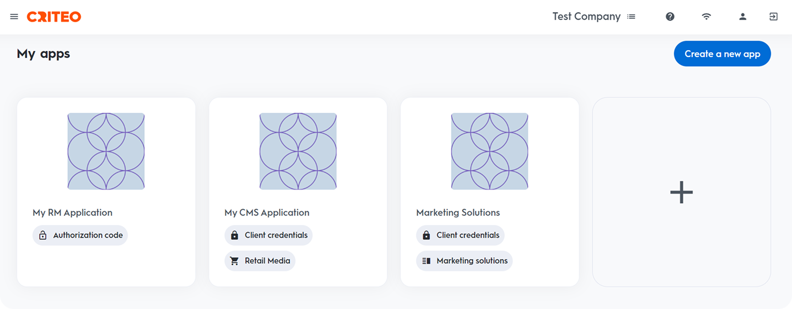
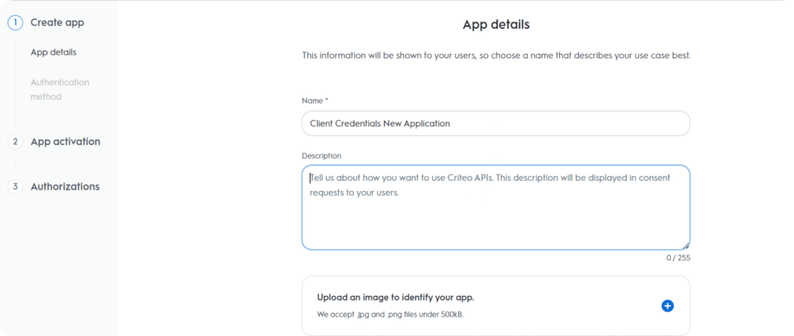
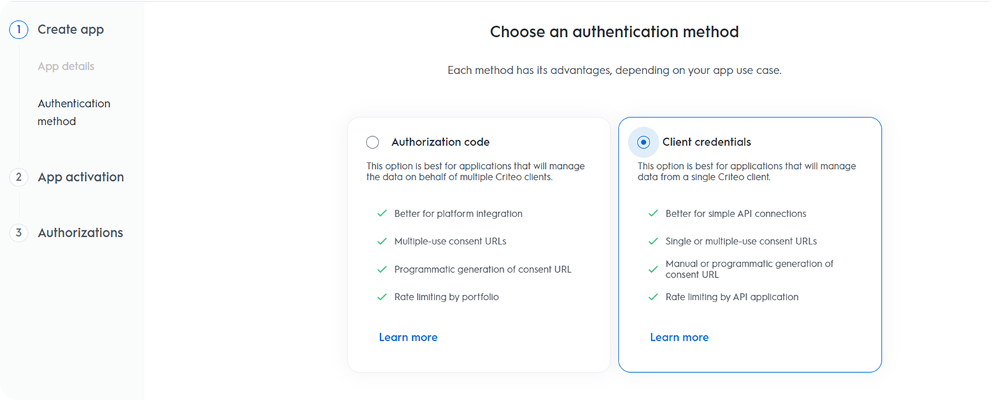
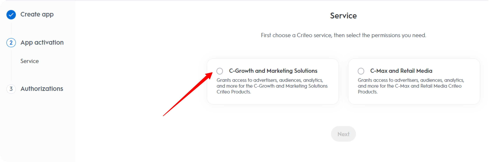
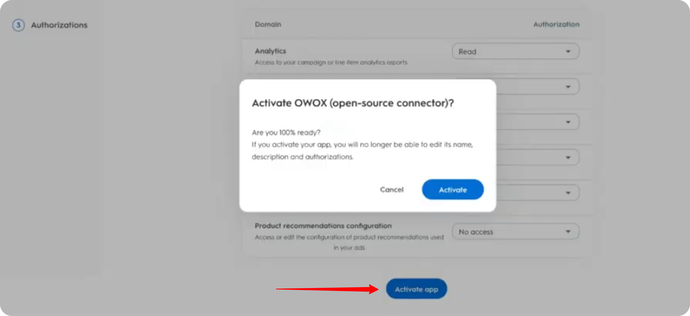
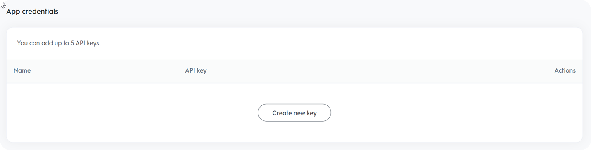
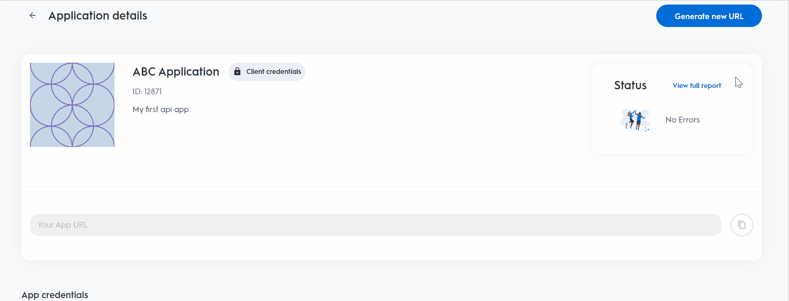

# How to obtain the credentials for the Criteo source

To connect to the Criteo API, follow the steps below to create an app and generate the necessary credentials.

Go to [https://partners.criteo.com](https://partners.criteo.com) and log in with your Criteo account.

Create a new app by clicking the ➕ icon in the **My Apps** section or by pressing the **Create a new app** button.  



Enter a descriptive **Application Name** (e.g., `OWOX Data Marts`).  
> 📌 It's recommended to use a clearly identifiable name to simplify future troubleshooting.

Optionally, add a description. Click **Next**.



Select **Client Credentials** as the authentication method.  



Under **Service**, choose **C-Growth and marketing solutions**.  



Choose the necessary **permissions** for your app:

- **Analytics — Read**
- **Campaigns — Read**
- **Creatives — Read**

These are the minimum required permissions for data access.

> ⚠️ **Note:** After completing this step, you will no longer be able to edit the app name, description, image, or scope.

Click **Activate app** to proceed.  



Click **Create new key** to generate your `client_id` and `client_secret`.  
This will download a `.txt` file containing your credentials.

> 🔐 Make sure to store the keys in a secure location — they will be needed for API authentication.  



Click **Generate new URL**, then click the **Copy** icon next to the **Consent URL** field.  



Paste the copied **Consent URL** into your browser and follow the prompt to grant access to your application.

> ⚠️ **The consent defines which advertisers your app can access.** The connector will only be able to report on advertisers that were shared with the app on the consent screen. Make sure that:
>
> - the Criteo user who opens the Consent URL **has access to every advertiser** you plan to import, and
> - **all of those advertisers are selected** on the consent screen (not just one).
>
> If no single user has access to all advertisers (e.g., they are split across portfolios), several users can each open the same Consent URL and share their part — consents from different users **add up** on the same app.

---

Once access is granted, you now have all the necessary credentials (`client_id`, `client_secret`, and app authorization) to use it as described in the [Getting Started guide](GETTING_STARTED.md).

## Troubleshooting Credential Setup

Use this section for authentication and permission errors from the Criteo API.

### Error: `insufficient-advertisers-permissions` (HTTP 403, "You do not have the rights to report on these advertisers")

**Cause:** Your `client_id` and `client_secret` are valid, but the app's **consent does not cover** one or more of the Advertiser IDs configured in the connector. This typically happens after credentials were rotated or re-issued: the consent step was re-done by a user who has access to only some of the advertisers, only some advertisers were selected on the consent screen, or the consent was granted to a **different app** than the one whose `client_id` is used by the connector.

**Solution:**

1. Check which advertisers your app can actually access. Get an access token (note `--data-urlencode` — client secrets often contain `+` and other special characters that break plain `-d`):

   ```bash
   curl -s -X POST https://api.criteo.com/oauth2/token \
     -H "Content-Type: application/x-www-form-urlencoded" \
     --data-urlencode "grant_type=client_credentials" \
     --data-urlencode "client_id=YOUR_CLIENT_ID" \
     --data-urlencode "client_secret=YOUR_CLIENT_SECRET"
   ```

   Then list the advertisers the app has been granted access to:

   ```bash
   curl -s https://api.criteo.com/2026-01/advertisers/me \
     -H "Authorization: Bearer ACCESS_TOKEN"
   ```

2. Compare the returned list with the **Advertiser IDs** configured in the connector. Every ID missing from the response lacks consent and will fail the import.
3. In [partners.criteo.com](https://partners.criteo.com), open the app whose `client_id` the connector uses (verify the ID character by character), click **Generate new URL**, and have the missing advertisers shared with the app via the Consent URL — by a user (or several users) who actually has access to them.
4. Re-run the first two steps to confirm all configured Advertiser IDs now appear in the response, then re-run the connector.

### Error: `invalid_client` ("The client authentication failed, the provided client_id doesn't exist or the client_secret is invalid")

**Cause:** The `client_id` and `client_secret` do not form a valid pair. Most often the secret was copied from a **different app** (e.g., a new app was created during credential rotation while the connector still uses the old `client_id`), or the secret was copied with a typo or truncated.

**Solution:** Take both values from the **same key file** (the `.txt` downloaded when you clicked **Create new key**) of the app that has the consent, and update the connector configuration with that pair.

> 📌 If you are testing with `curl` and get `invalid_client` even though the pair is correct, make sure the secret is URL-encoded (use `--data-urlencode` as shown above): a literal `+` inside `-d` is decoded as a space and corrupts the secret.

### Error: `authorization-token-expired` (HTTP 401)

**Cause:** Criteo access tokens are short-lived (about 15 minutes).

**Solution:** No action needed — the connector requests a fresh token automatically and retries the request. If you see this error while testing manually, simply request a new token.

## Troubleshooting and Support

If you encounter any issues:

1. Please [visit Q&A](https://github.com/OWOX/owox-data-marts/discussions/categories/q-a) first
2. If you want to report a bug, please [open an issue](https://github.com/OWOX/owox-data-marts/issues)
3. Join the [discussion forum](https://github.com/OWOX/owox-data-marts/discussions) to ask questions or propose improvements
