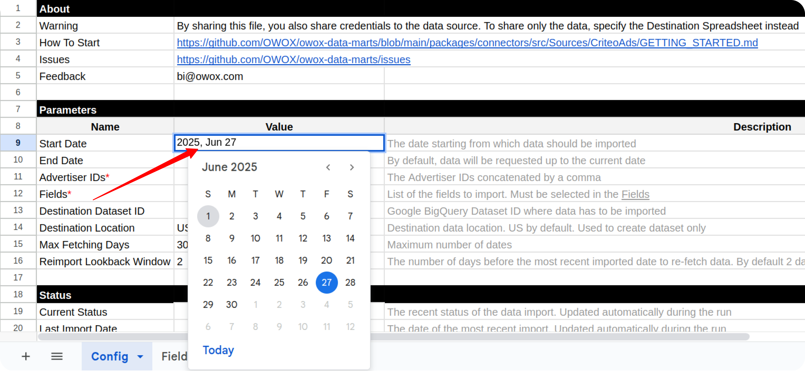
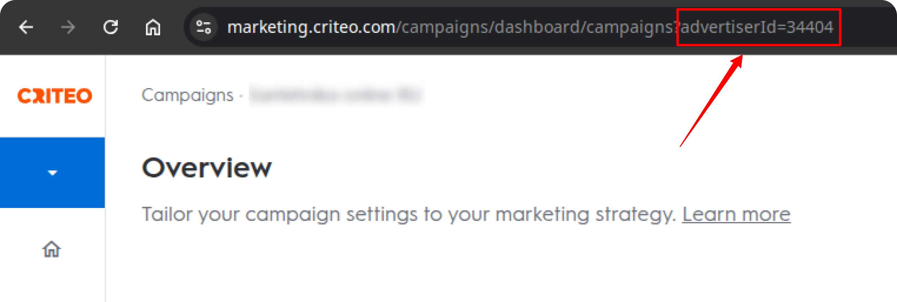
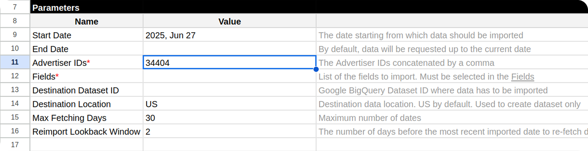
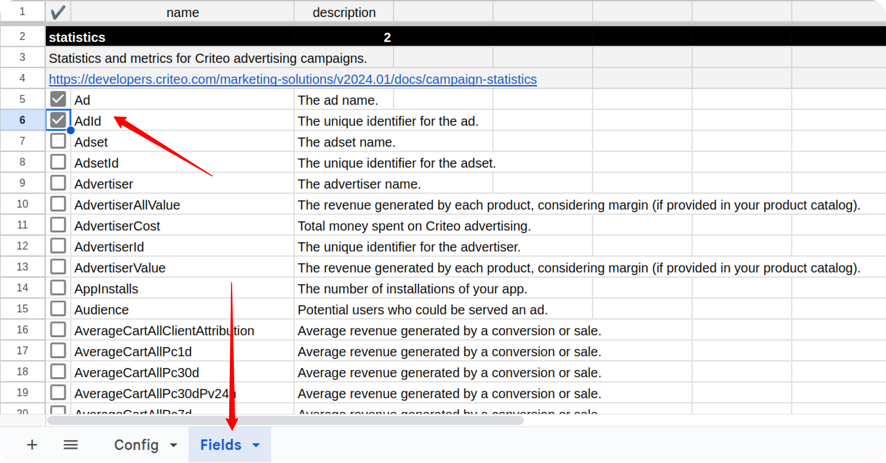
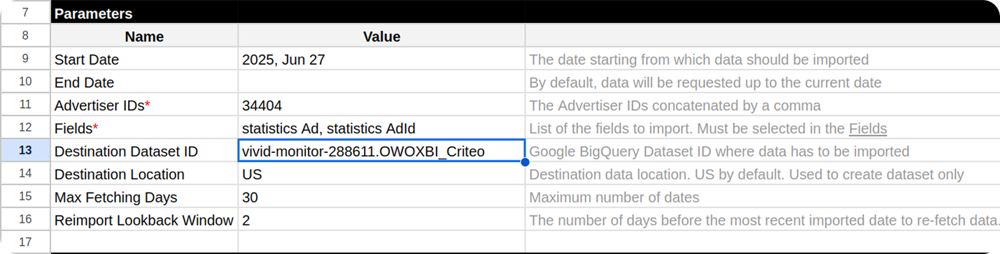
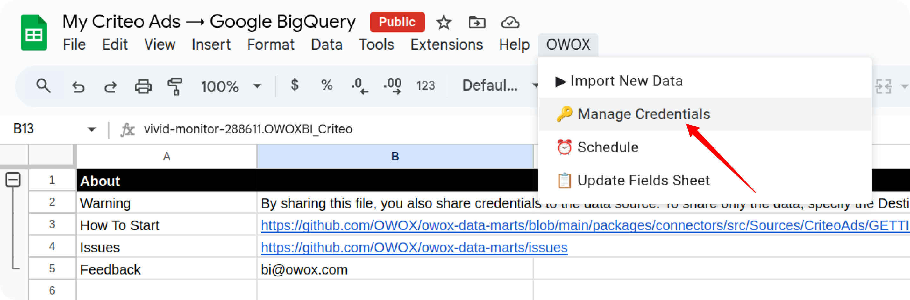
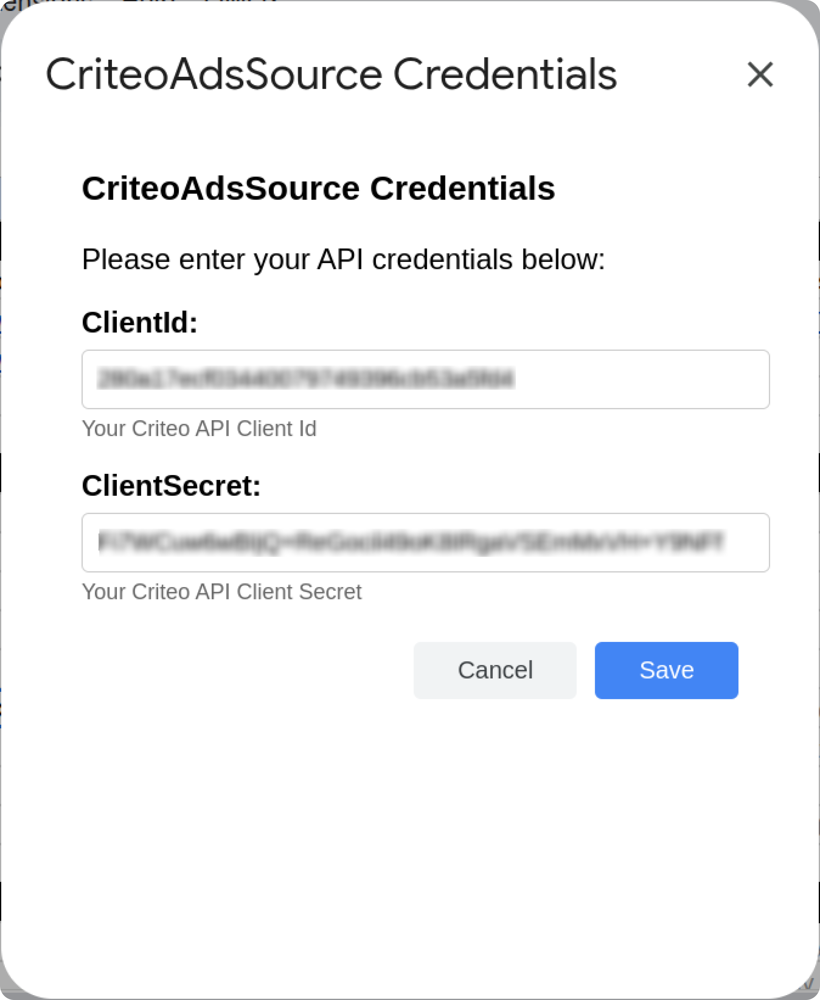
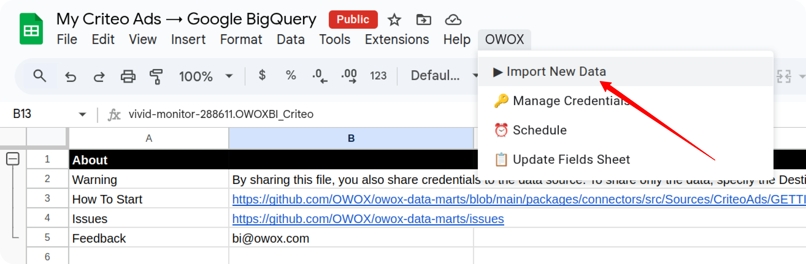
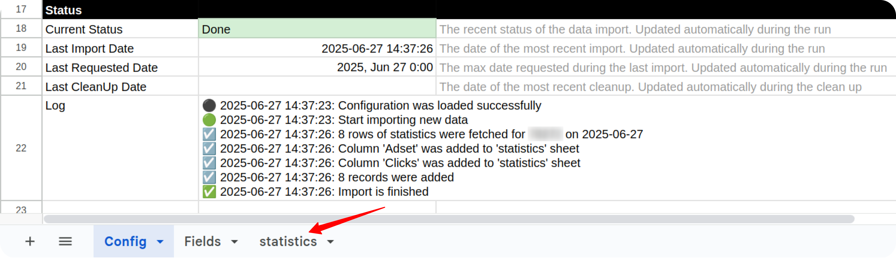
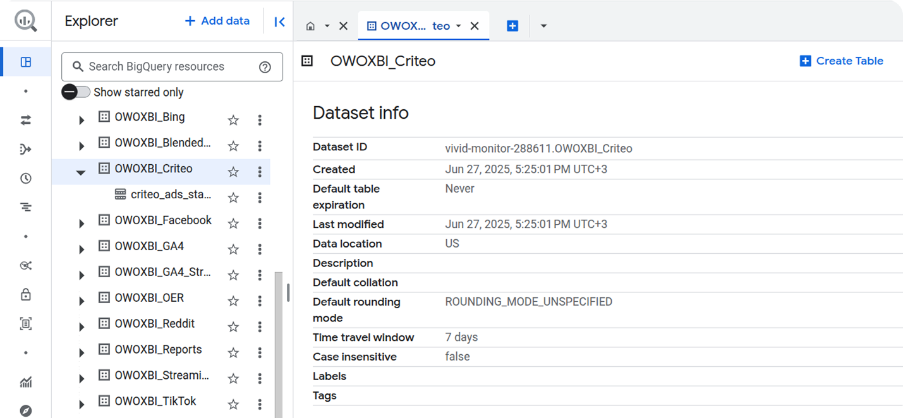

## How to Import Data from the Criteo Ads Source

To start importing data from Criteo Ads, make a copy of one of the following templates:

- [**Criteo Ads → Google Sheets. Template**](https://docs.google.com/spreadsheets/d/1bJRlgl4vwgfjTZ7yuE8oJ2s4yCF6mEIU5LG8u9BTpZc/copy)
- [**Criteo Ads → Google BigQuery. Template**](https://docs.google.com/spreadsheets/d/13jfyXIBp6DF8TY4kGg5l0ZaYz2eTf3RT4IAfMwfR3Y4/copy)

Fill in the required information:
- **Start date**
- **Advertiser IDs**
- **Fields**
- **Destination Dataset ID** (applicable only for the **Google BigQuery** template)
- **Destination Location** (applicable only for the **Google BigQuery** template)

The import will begin from the selected **Start Date**.  
> ⚠️ **Note:** Choosing a long date range may result in import failure due to high data volume.

You can find your **Advertiser ID** on the homepage of your [Criteo Ads account](https://marketing.criteo.com/):

Copy and paste the ID into the appropriate field in the spreadsheet:

To include fields, go to the **Fields** tab and check the boxes next to the ones you need.

If you are using the **Google BigQuery** template, you must also specify:

* **Destination Dataset ID** in the format: `projectid.datasetid`
* **Destination Location** (e.g., `US`, `EU`)

> ℹ️ **Important:** If the specified BigQuery dataset does not already exist in your Google Cloud project, it will be automatically created during the import process.

Open the menu: **OWOX → Manage Credentials**

Enter your credentials obtained as described in this guide: [**Get Your Credentials**](CREDENTIALS.md)

Click **Save**. Once credentials are saved, go to:
**OWOX → Import New Data**

The import process is complete when the Log data displays **"Import is finished"**. 

- In the **Google Sheets** template, the data will be available in a new tab **statistics**.

- In the **Google BigQuery** template, the data will be written to the dataset specified earlier.

To include more fields later, check the appropriate boxes in the **Fields** tab and click:  
**OWOX → Import New Data**

> ⚠️ **Important:** To change the date range:
> 1. Clear existing data in the **Status** columns
> 2. Update the **Start Date** and/or **End Date**
> 3. Run **OWOX → Import New Data** again

If you encounter any issues:

1. Check the "Logs" sheet for specific error messages
2. Please [visit Q&A](https://github.com/OWOX/owox-data-marts/discussions/categories/q-a) first
3. If you want to report a bug, please [open an issue](https://github.com/OWOX/owox-data-marts/issues)
4. Join the [discussion forum](https://github.com/OWOX/owox-data-marts/discussions) to ask questions or propose improvements 