# How to obtain the access token for the Facebook Ads source

To connect to the Facebook Ads API and begin importing data into Google Sheets or BigQuery, follow the steps below.

## Step 1: Sign In to the Meta for Developers Portal

Visit the [Meta for Developers](https://developers.facebook.com/) site and log in with your Facebook account.

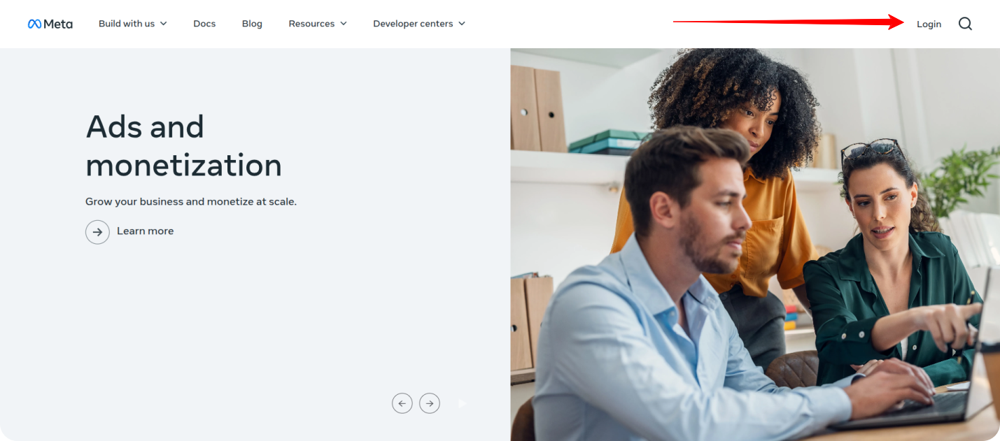

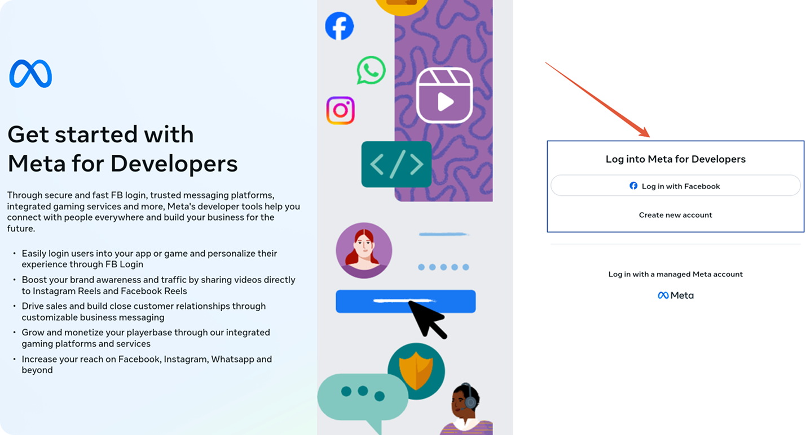

## Step 2: Create a New App

Navigate to **My Apps** and click the **Create App** button.

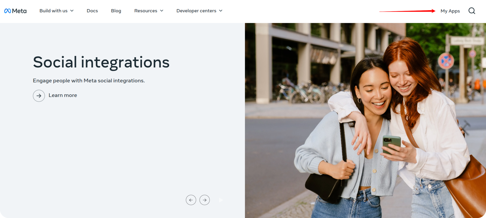

Enter the **App Name** in the provided field.

Select **Other** as the use case.  

Select **Business** as the app type and click **Next**.  

Choose the appropriate **Business Portfolio**, then click the **Create App** button.  

## Step 3: Complete Business Verification

Navigate to **App Settings → Basic**, and initiate the **Business Verification** process.

If prompted, connect your app to a business portfolio.

Click **Start Business Verification**.  

On the next page, locate the **Business Verification** section and click the button to proceed with the verification process.  

Fill in the form with accurate **contact** and **organizational** information about your business.

> 📌 Make sure your submission meets [Meta's verification requirements](https://business.facebook.com/business/help/159334372093366).

After submitting the form, the review process may take up to **2 business days**.  

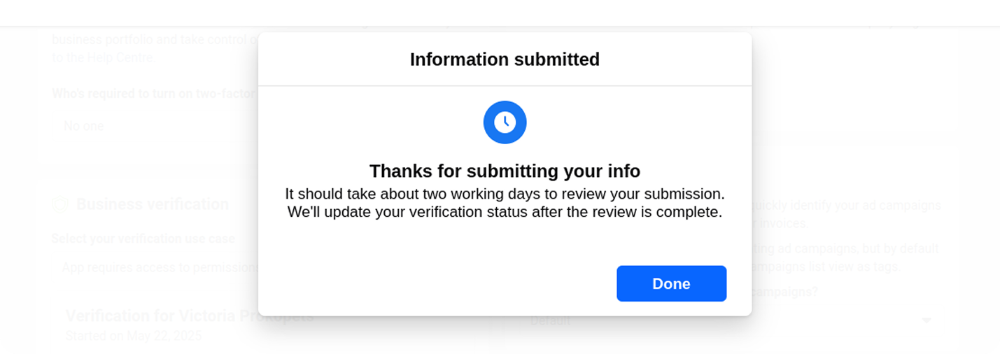

## Step 4: Set Up Marketing API

Once your business is successfully verified, return to the [Developers Portal](https://developers.facebook.com/).  
In your app dashboard, locate **Marketing API** and click **Set Up**.  

## Step 5: Grant API Permissions

Grant the required token permissions:

- `ads_read`  
- `read_insights`  

   These permissions authorize your app to access advertising data from your Facebook account.  

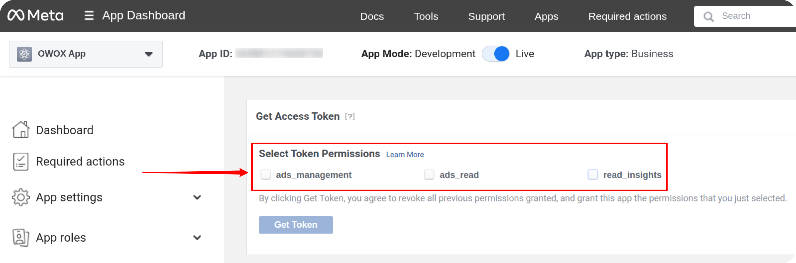

## Step 6: Generate and Save the Access Token

Click the **Get Token** button.

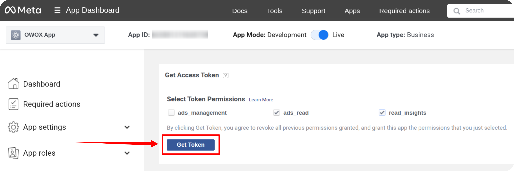

Copy and securely save the generated access token.  
    If needed, you can regenerate it later by navigating to **Marketing API > Tools**.

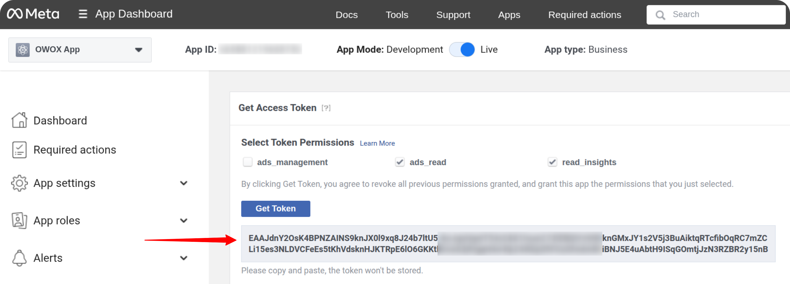

## Step 7: Use the Access Token

Once you have the access token, you can begin using it as described in the [Getting Started guide](GETTING_STARTED.md).

If you encounter API limit errors or see the message: **"Ad account owner has NOT granted ads_management or ads_read permission"**, it likely means your app is still operating with Standard Access.
To resolve this, you’ll need to:

1. Switch your app to **Live Mode**
2. Request **Advanced Access** for the following permissions:

- `ads_read`
- **Ads Management Standard Access**

## Step 8: Request Advanced Access for Ads Management

1. Go to the **App Review → Permissions and Features** tab.
2. Locate **Ads Management Standard Access**.
3. If the access level is set to **Standard Access**, click **Request Advanced Access**.

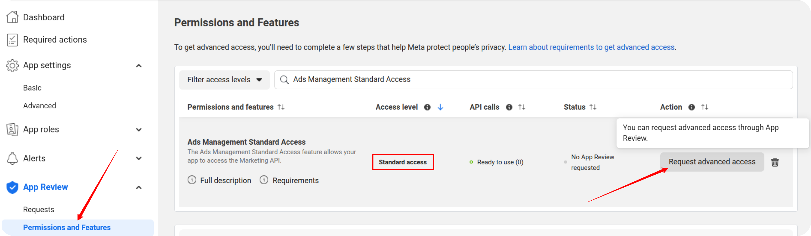

Click the **Next** button.

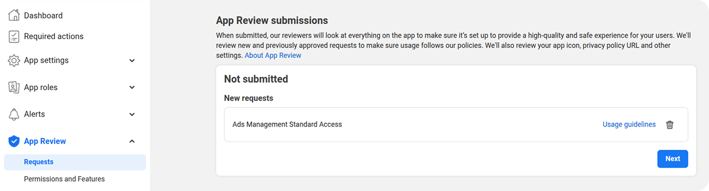

On the next screen, click **Go to Verification** and complete the required fields.

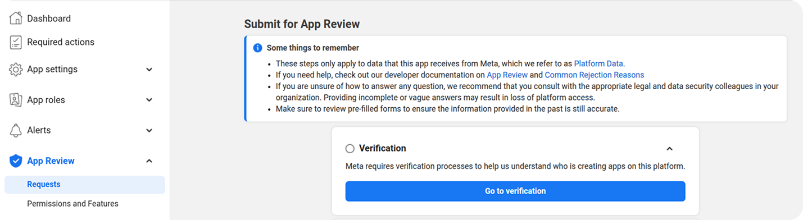

Describe in detail how your application will use Ads Management functionality.

**Example:**

> _We are requesting Advanced Access to the Facebook API to support our internal data analytics operations. Our application's core function is to retrieve high-volume advertising cost and performance data from our company's ad accounts for detailed ROI analysis and financial reconciliation._
>
> _Standard API limits would significantly restrict our ability to collect the comprehensive historical and daily data essential for this process. Advanced Access is required to ensure a continuous and reliable data flow for our analytical models._
>
> _Our technical workflow utilizes the OWOX Data Mart connector to retrieve this information from the Facebook API. The data is then loaded directly into our Google BigQuery (GBQ) data warehouse, where it is used for internal analysis only. This application operates exclusively with our proprietary data._

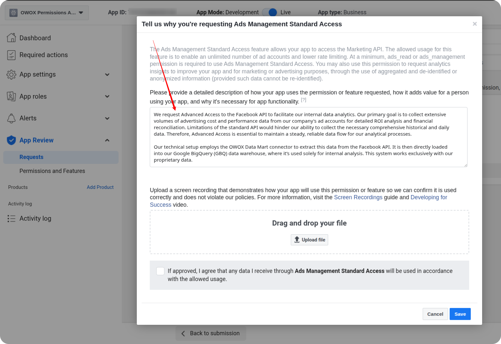

Record a short video showing the full connection process:

- Generating the token
- Pasting it into Google Sheets
- Displaying the error message in the **Log** sheet (if relevant)

Drag and drop the video file into the form.

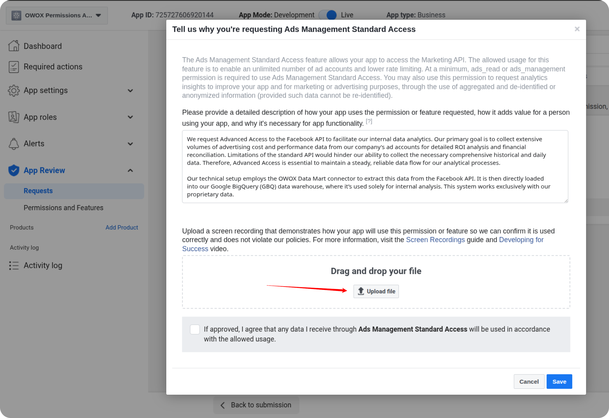

In the question  
  **"Do you have data processors or service providers, including your own companies, that will have access to the Platform Data that you obtain from Meta?"**  
  → Select **No**

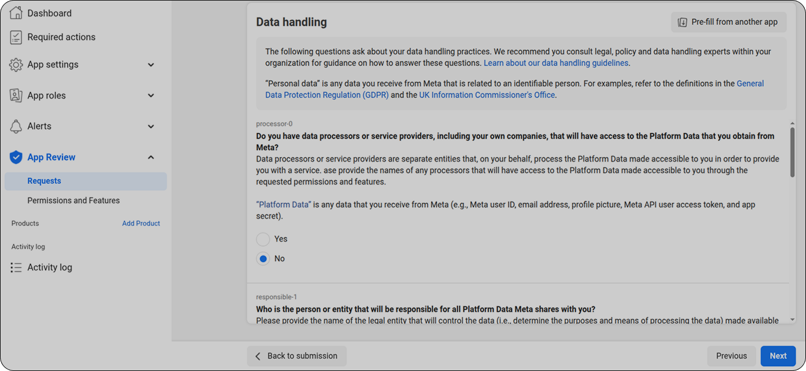

Enter your **Company Name** and **Country of Operation**.

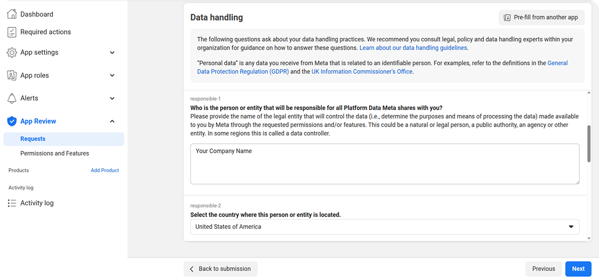

For the question  
  **"Have you provided the personal data or personal information of users to public authorities in response to national security requests in the past 12 months?"**  
  → Select **No**

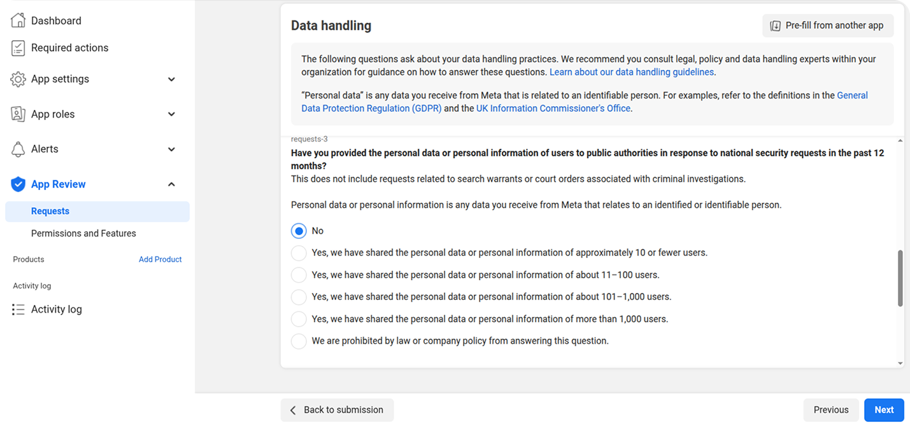

Answer the next data-related questions according to your organization’s internal policies.

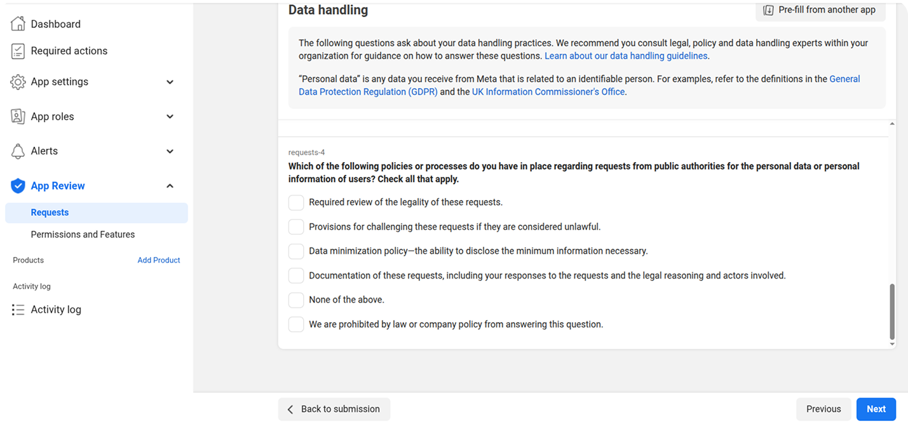

After completing all required fields, click the **Submit for Review** button.

Meta will review your request, and you will be notified once it’s approved.

## Step 9: Verify API Permissions and App Status

To ensure your Facebook app is properly configured for the Ads API, complete the following checks:

Navigate to the **Marketing API → Settings** tab and confirm that the **Ads API Access Level** is set to **Standard**.

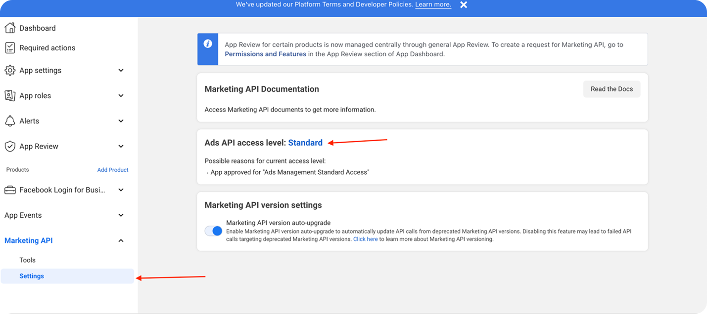

Go to **App Review → Permissions and Features**.

- Locate the `ads_read` permission and ensure it has either **Standard Access** or **Advanced Access**.  
  Both access types are supported.

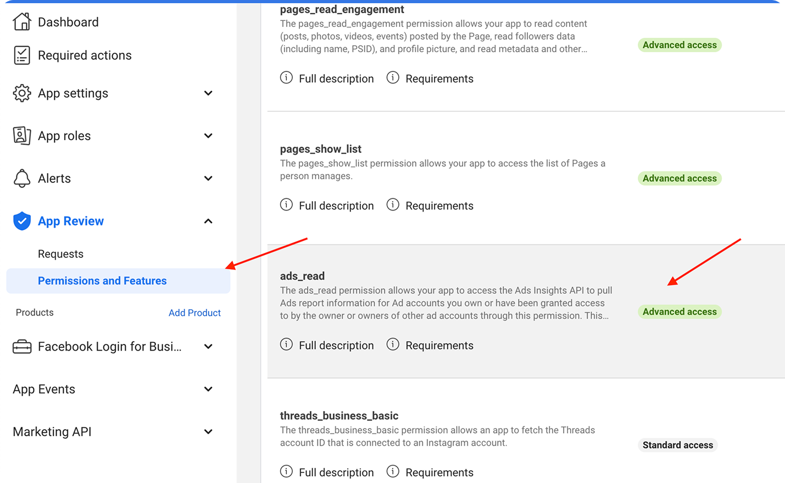

- Scroll to **Ads Management Standard Access** and confirm that it is set to **Advanced Access**.

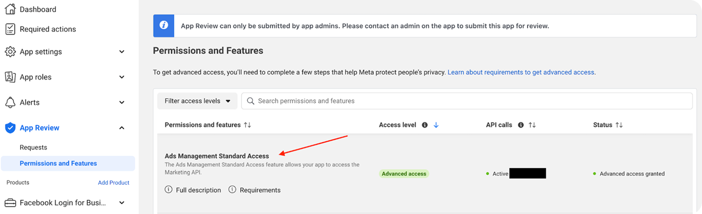

Ensure that your app is set to **Live** mode (not in Development mode).  
Only live apps can be used for real API calls.

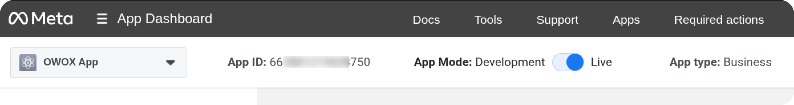

## Troubleshooting and Support

If you encounter any issues:

1. Check the "Logs" sheet for specific error messages
2. Please [visit Q&A](https://github.com/OWOX/owox-data-marts/discussions/categories/q-a) first
3. If you want to report a bug, please [open an issue](https://github.com/OWOX/owox-data-marts/issues)
4. Join the [discussion forum](https://github.com/OWOX/owox-data-marts/discussions) to ask questions or propose improvements
