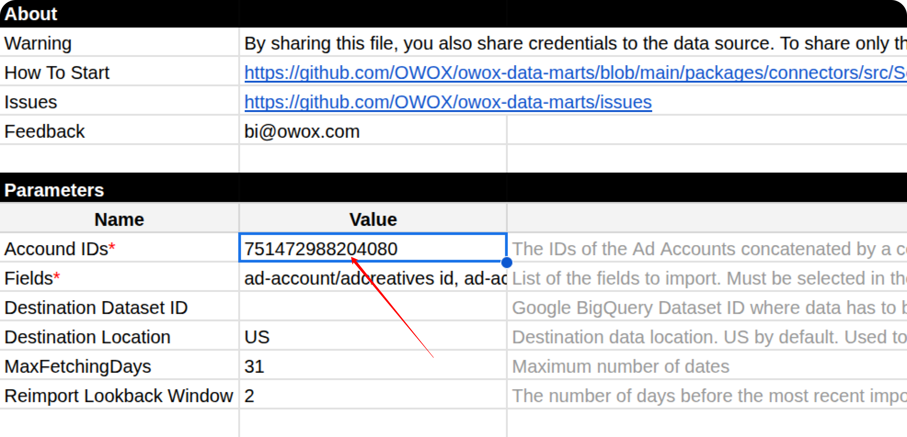
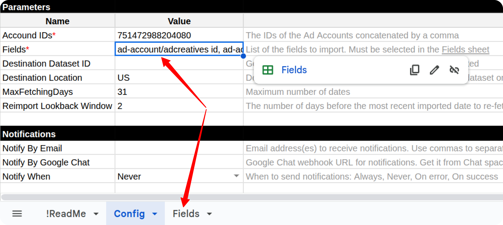
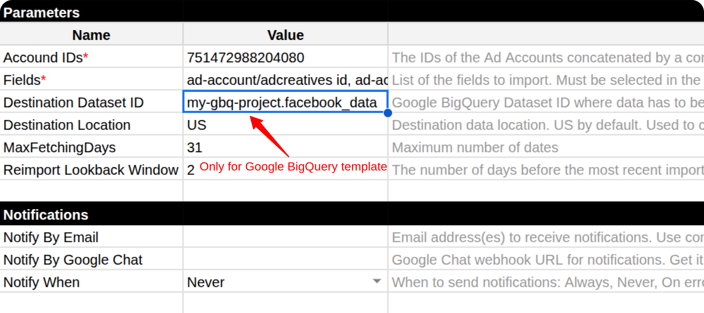
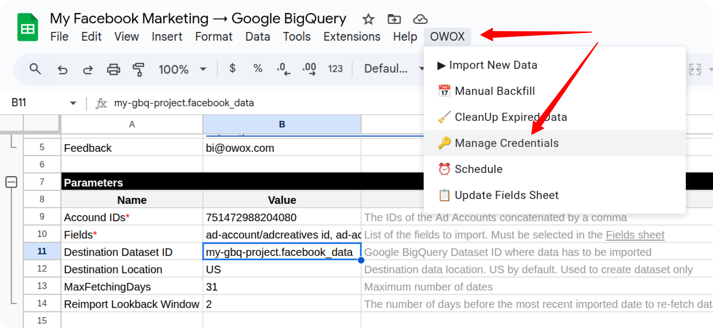
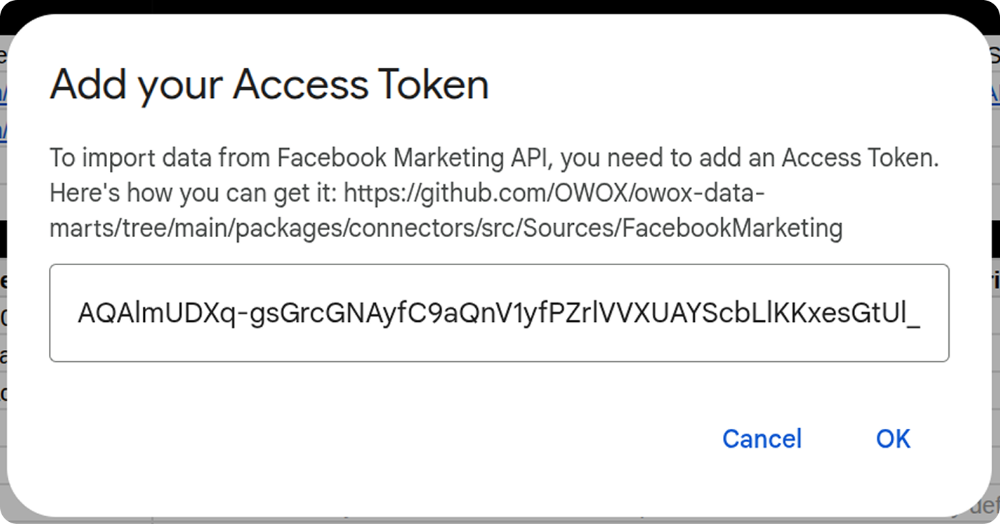
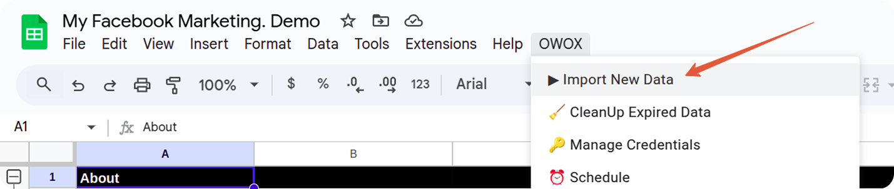

# How to Import Data from the Facebook Ads Source

To begin importing data from Facebook Ads, start by making a copy of one of the following templates:

- [**Facebook Marketing → Google Sheets. Template**](https://docs.google.com/spreadsheets/d/1OgpGMnQqUpS23rmOyA2gTVO2FK48oPS7tJGBp9NYJy4/copy)
- [**Facebook Marketing → Google BigQuery. Template**](https://docs.google.com/spreadsheets/d/1XJPrB89Zn-tEnfxtgzM974Vnfj8P4T8kgwXQfPkn6vU/copy)

Fill in the required information:

- **Start Date**
- **Account IDs**
- **Fields**
- **Destination Dataset ID** (for **Google BigQuery** template)
- **Destination Location** (for **Google BigQuery** template)

The import will begin from the selected **Start Date**.  
> ⚠️ **Note:** Using a long date range may cause the import to fail due to the high volume of data.

You can find your **Account ID** on the **Account Overview** page in [Meta Ads Manager](https://adsmanager.facebook.com/adsmanager/manage/accounts).  

Copy and paste the ID into the spreadsheet:  

Some fields are pre-filled by default.  
To include additional fields, go to the **Fields** tab and check the boxes next to the fields you want to include.

If you're using the **Google BigQuery** template, also provide:

- **Destination Dataset ID** in the format: `projectid.datasetid`
- **Destination Location**

> ℹ️ If the specified dataset doesn't exist, it will be created automatically.

Open the menu: **OWOX → Manage Credentials**

Enter your credentials obtained by following this guide: [**How to obtain the access token for the Facebook connector**](CREDENTIALS.md)

Once your credentials are saved, go to: **OWOX → Import New Data**

The import process is complete when the Log data displays **"Import is finished"**.

Access Your Data:

- In the **Google Sheets** template, the data will appear in new tabs labeled with the corresponding data types (e.g., *ad-account*, *ad-campaign*).  

- In the **Google BigQuery** template, the data will be written to the dataset specified earlier.

To import more data:

1. Select the additional fields you need in the **Fields** tab.
2. Go to **OWOX → Import New Data** again.

If you encounter any issues:

1. Check the "Logs" sheet for specific error messages
2. Please [visit Q&A](https://github.com/OWOX/owox-data-marts/discussions/categories/q-a) first
3. If you want to report a bug, please [open an issue](https://github.com/OWOX/owox-data-marts/issues)
4. Join the [discussion forum](https://github.com/OWOX/owox-data-marts/discussions) to ask questions or propose improvements
