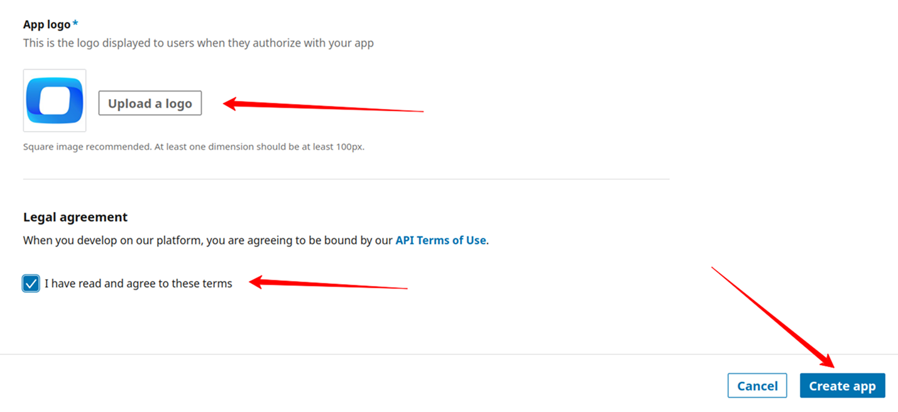
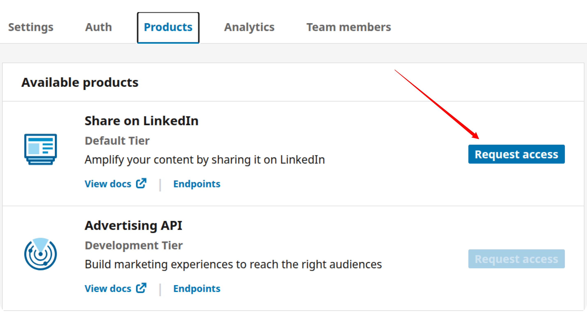
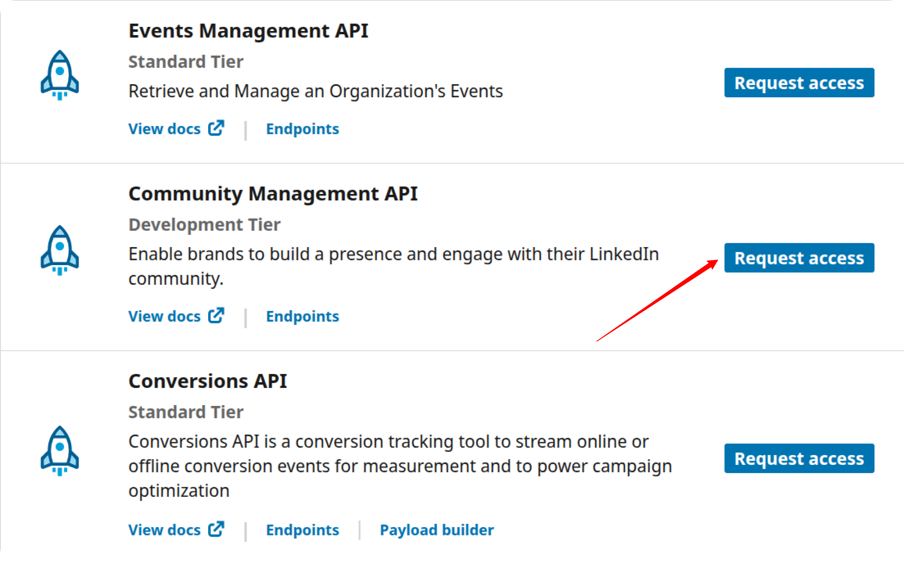

# How to obtain the Access Token for Linkedin Pages Sources

To connect to LinkedIn Pages through the API, you need to create an app, request access to the API, and generate an access token. Follow the steps below to complete the process.

## Step 1: Create a LinkedIn App

Visit the [LinkedIn Developer portal](https://developer.linkedin.com/ ).

Click the **Create App** button.

Enter your **App Name** and paste the link to your company's LinkedIn page into the **LinkedIn Page** field.  

 

Upload your app logo, check the box to accept the legal agreement, and click the **Create App** button.  

 

## Step 2: Verify the App

Go to the **Settings** tab and click the **Verify** button. The administrator of your LinkedIn company page must then verify the app to grant it access to company data.  

 

 

 Please, ensure that the app is verified:

 

## Step 3: Request Access to the API

Once your app is verified, navigate to the **Products** tab in the LinkedIn Developer Portal and request access to the necessary APIs.

If you need access to **LinkedIn Page** data: to work with organic content and page analytics — such as posts, followers, reactions, comments, shares, and engagement metrics — request access to both:

- **Share on LinkedIn**
- **Community Management API**

  

> ⏳ Approval may take up to **24 hours**. You will receive a confirmation email once your request is approved.

When access is granted, the **Share on LinkedIn** and **Community Management API** will appear under the **Added Products** section on the Products page.

## Step 4: Generate an Access Token

Navigate to the **Auth** tab of your LinkedIn app and click **OAuth 2.0 tools** on the right-hand side of the page.

Click the **Create token** button to begin the authorization process.

---

If you see the following error message:  
_"There aren't any scopes available for this app. Select another app or visit your app's product settings to request API access,"_  
make sure you've requested and received approval for the necessary APIs in **Step 3**.

---

Select the required scopes for **pages data** access:

- `r_organization_social`  
- `r_organization_followers`  
- `r_social_engagement`  

After selecting the appropriate scopes, click **Request access token**.

On the next screen, click **Allow** to authorize the app.

## Step 5: Save the Access Token

After the token is generated, **copy and securely store your Access Token**.

> ⚠️ **Important:**  
> Make sure you are copying the **Access Token**, not the **Refresh Token**.  
> The **Access Token** is located at the **top** of the page.

## ✅ You’re Ready to Go

You can now use this token as described in the [Getting Started guide](GETTING_STARTED.md) to connect to LinkedIn Ads or LinkedIn Pages data sources.
