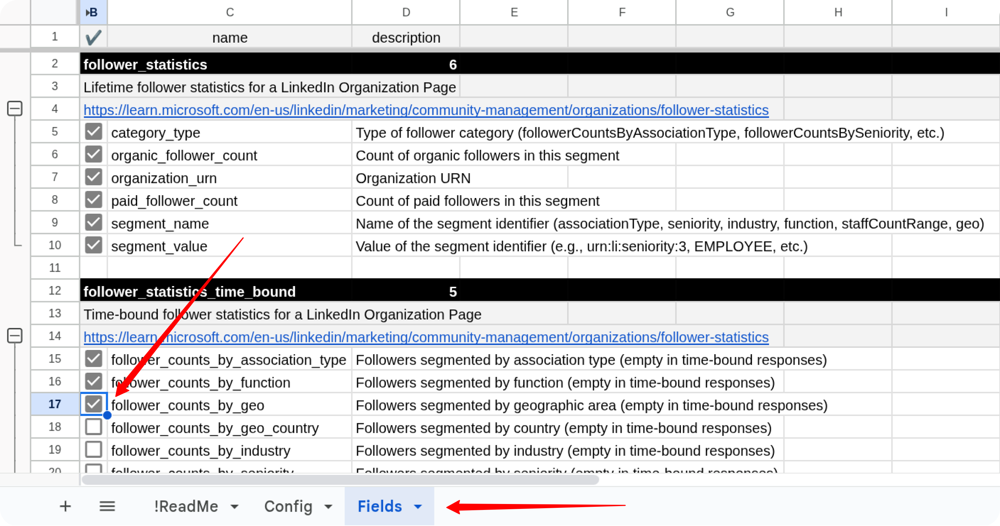
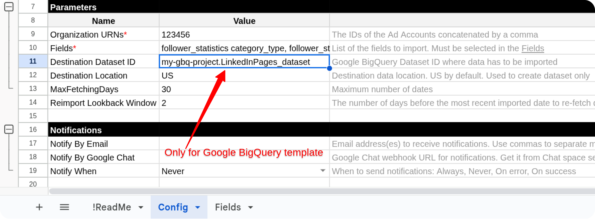
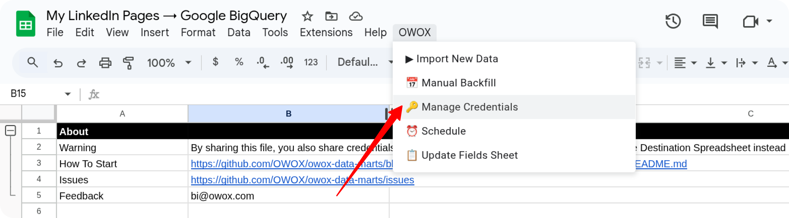
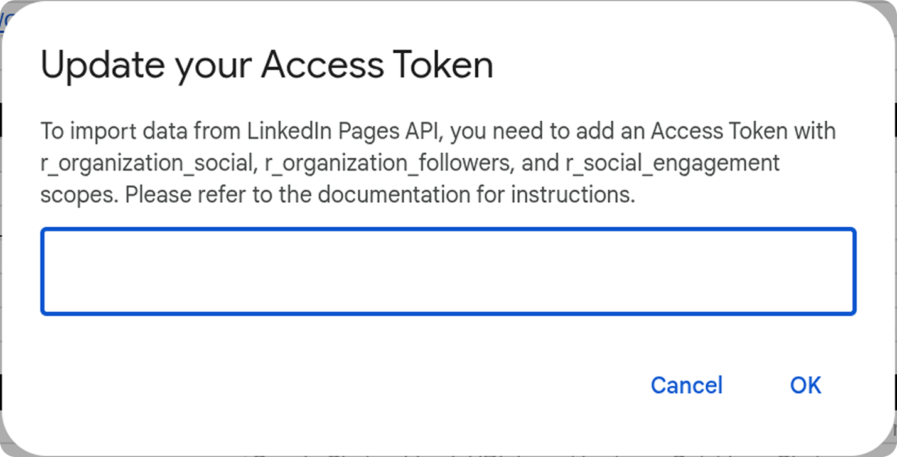

# How to Import Data from the Linkedin Pages Source

To receive data from the LinkedIn Pages source, please make a copy of the file
["LinkedIn Pages → Google Sheets. Template"](https://docs.google.com/spreadsheets/d/1KgLiUiPfswvl-ZGRJnu937mKgRiYPJlbNxpmkzXo4-Q/copy) or
["LinkedIn Pages → Google BigQuery. Template"](https://docs.google.com/spreadsheets/d/1lFqSkdHjO2jTlHoi8QtmJNMCZK1YSaMKaSYmDI7LMKQ/copy)

Fill in required information:

- **Start Date**
- **Organization URNs**
- **Fields**
- **Destination Dataset ID** (for **Google BigQuery** template)
- **Destination Location** (for **Google BigQuery** template)

The import will begin from the selected **Start Date**.  
> ⚠️ Note: Choosing a long date range may cause the import to fail due to high data volume.

To obtain **Organization URN**, go to [LinkedIn Campaign Manager](https://www.linkedin.com/campaignmanager).

Select your ad account > Assets > Company Page.

The URL may show something like:

<https://www.linkedin.com/company/123456/admin/>

Here, `123456` is the Organization URN.

To include fields, go to the **Fields** tab and check the boxes next to the fields you want to include.

If you're using the **Google BigQuery** template, also provide:

- **Destination Dataset ID** in the format: `projectid.datasetid`
- **Destination Location**

> ℹ️ If the specified dataset doesn't exist, it will be created automatically.

Go to the menu: **OWOX → Manage Credentials**

Enter your Access Token obtained by following this tutorial: [**How to obtain the credentials for the LinkedIn Pages connector**](CREDENTIALS.md).

Click **OK**. Once your credentials are saved, click: **OWOX → Import New Data**

The import process is complete when the Log data displays **"Import is finished"**.

Access Your Data:

- In the **Google Sheets** template, the data will appear in new tabs labeled with the corresponding data types (e.g., *adAccounts*, *adCampaignGroups*).  

- In the **Google BigQuery** template, the data will be written to the dataset specified earlier.

If you encounter any issues:

1. Check the "Logs" sheet for specific error messages
2. Please [visit Q&A](https://github.com/OWOX/owox-data-marts/discussions/categories/q-a) first
3. If you want to report a bug, please [open an issue](https://github.com/OWOX/owox-data-marts/issues)
4. Join the [discussion forum](https://github.com/OWOX/owox-data-marts/discussions) to ask questions or propose improvements
