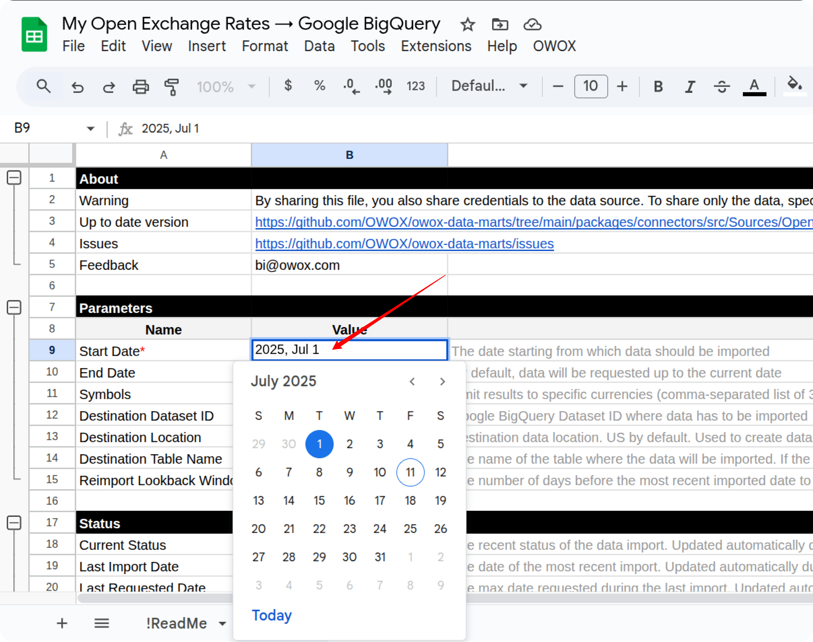
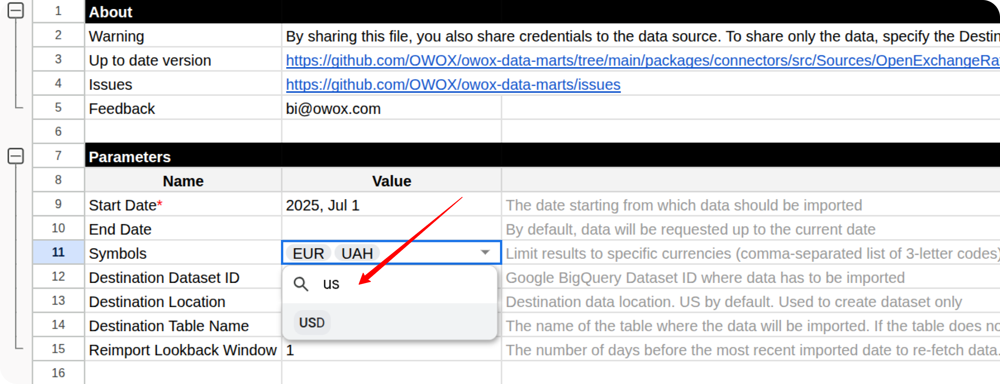
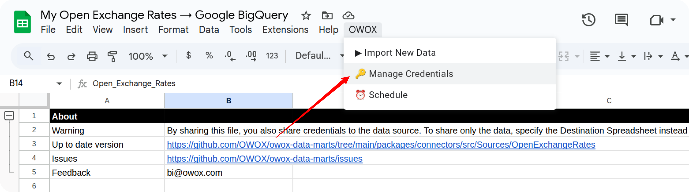
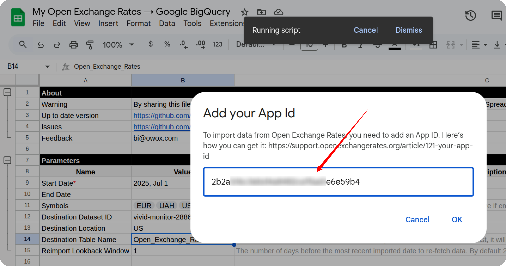
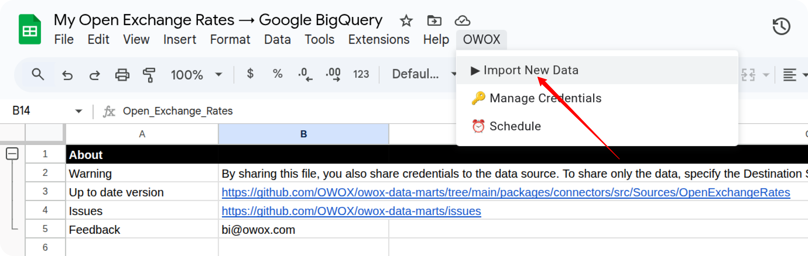
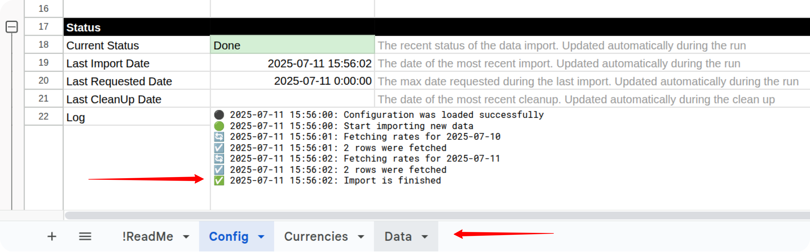

To receive data from the OpenExchangeRates source, please make a copy of the file ["Open Exchange Rates. Template"](https://docs.google.com/spreadsheets/d/1rvjCh_aGAcYgZRPzrePhkginVH6pJ5GoyN51z5HJD_I/copy). 

Fill in the required information:

- Start date
- Symbols

Data import begins on the selected start date. 

The base currency is US Dollars (USD) by default. A list of supported currency symbols and names can be found [via the provided link](https://docs.openexchangerates.org/reference/supported-currencies).

Then, press *OWOX -> Manage credentials*. 

Add your **App ID** received by this tutorial: [How to obtain the App ID for the Open Exchange Rates connector](CREDENTIALS.md)

Press OK and then, press *OWOX -> Import New Data*.

When the Log data shows "**Import is finished**", the import process is complete, and your data will be available in the **Data** tab.

