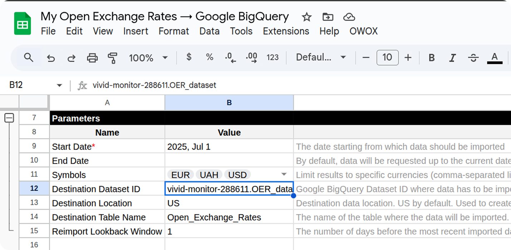
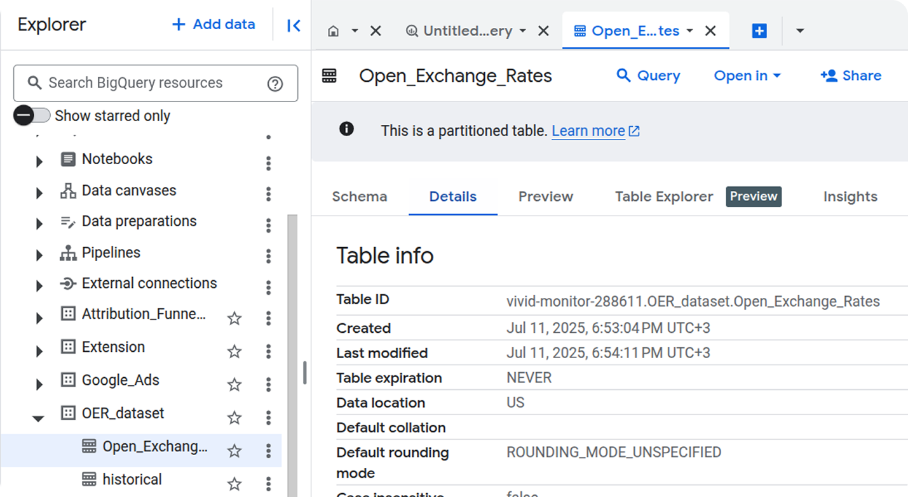

# How to Import Data from the Open Exchange Rates Source

To begin importing exchange rate data from the Open Exchange Rates source, follow the steps below.

## Step 1: Make a Copy of the Template

Choose the appropriate template depending on your data destination:

- [**Open Exchange Rates → Google Sheets Template**](https://docs.google.com/spreadsheets/d/1rvjCh_aGAcYgZRPzrePhkginVH6pJ5GoyN51z5HJD_I/copy)
- [**Open Exchange Rates → Google BigQuery Template**](https://docs.google.com/spreadsheets/d/1_SQUJgu_rr9hH8Utzpx54cin49y_w1ImX6EsaQBiFNM/copy)

## Step 2: Fill in the Required Parameters

Required Fields:

- **Start Date** — the import will begin from this date  
- **Symbols** — currency codes you want to retrieve

The default base currency is **US Dollars (USD)**.  
You can find the list of supported currency symbols [Open Exchange Rates documentation](https://docs.openexchangerates.org/reference/supported-currencies).

## Step 3: Configure BigQuery Destination (if applicable)

If you’re using the **Google BigQuery** template, also fill in:

- **Destination Dataset ID** — format: `projectid.datasetid`
- **Destination Location**

> ℹ️ If the specified dataset doesn't exist, it will be created automatically.

## Step 4: Add Your App ID

Go to **OWOX → Manage credentials** from the menu.

Enter your **App ID** obtained by following this tutorial:  [How to obtain the App ID for the Open Exchange Rates connector](CREDENTIALS.md)

## Step 5: Run the Import

Once your credentials are saved, go to **OWOX → Import New Data** to start the data import process.

The import is complete when the **Log** sheet shows the message:  
> **"Import is finished"**

## Step 6: Access Your Data

In the **Google Sheets** template:
The data will appear in a new tab called **Data**.  

In the **Google BigQuery** template:
The data will be written to the BigQuery dataset you specified earlier.  

