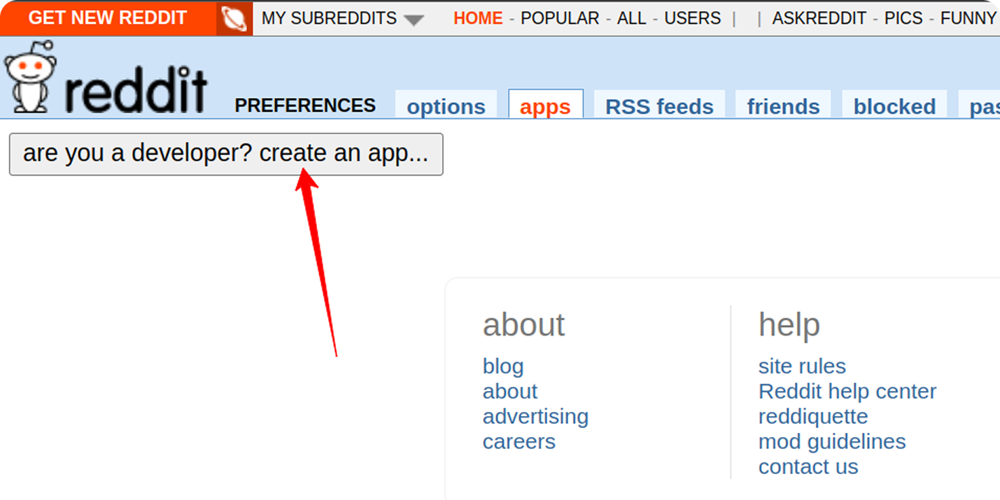
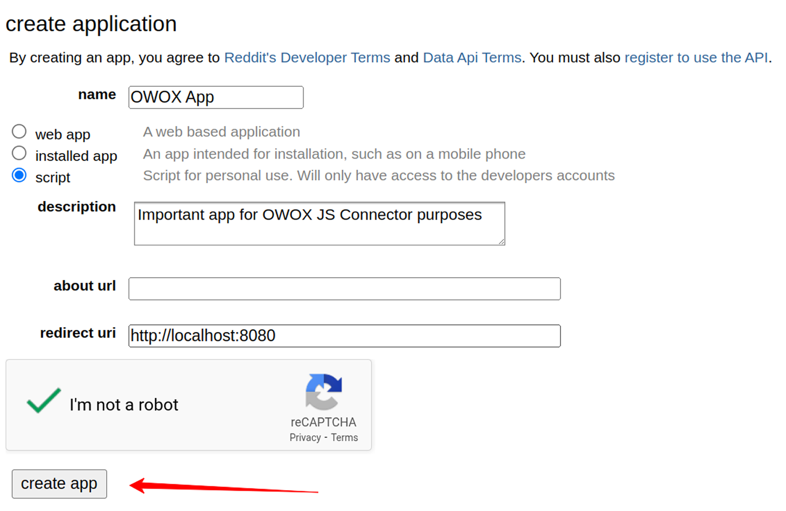
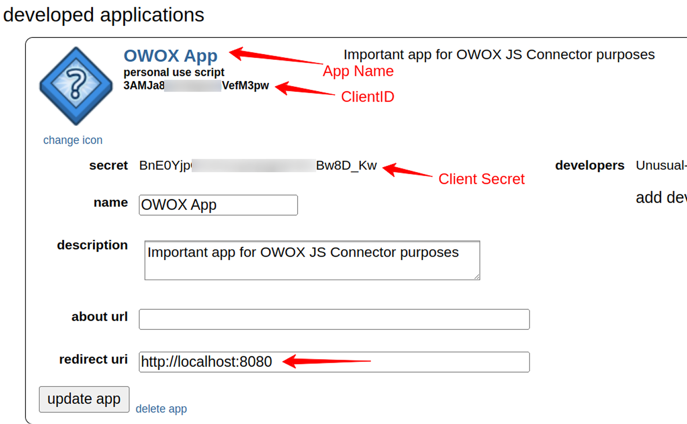
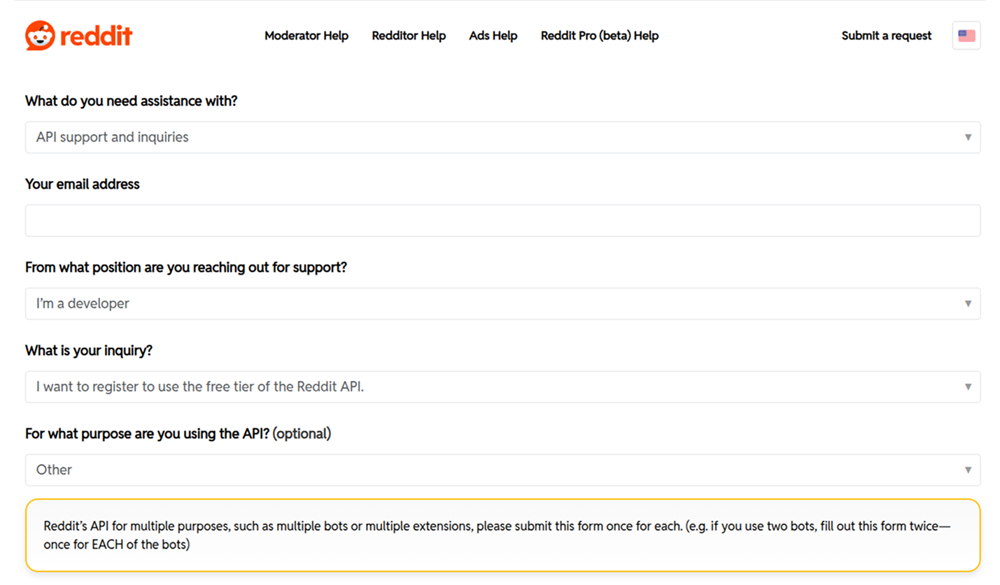
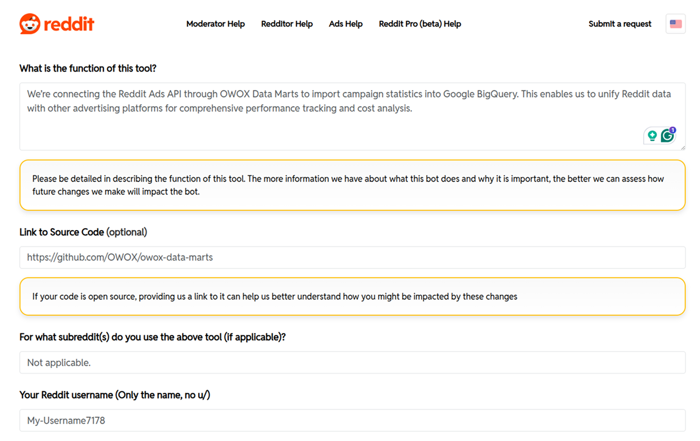
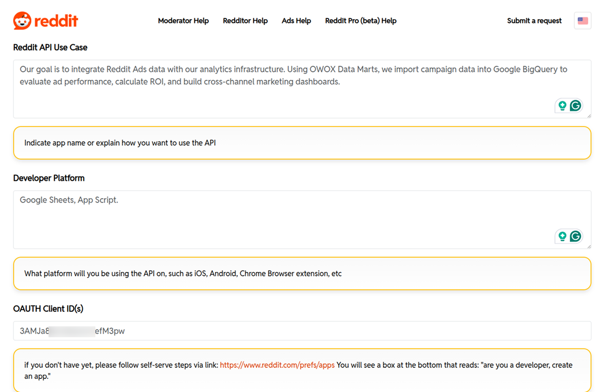
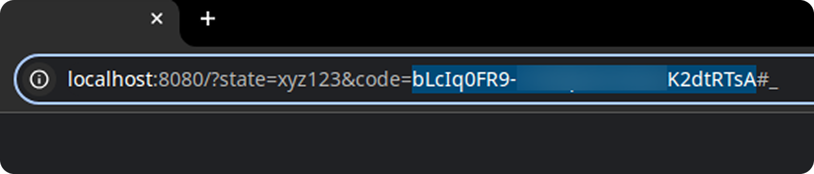
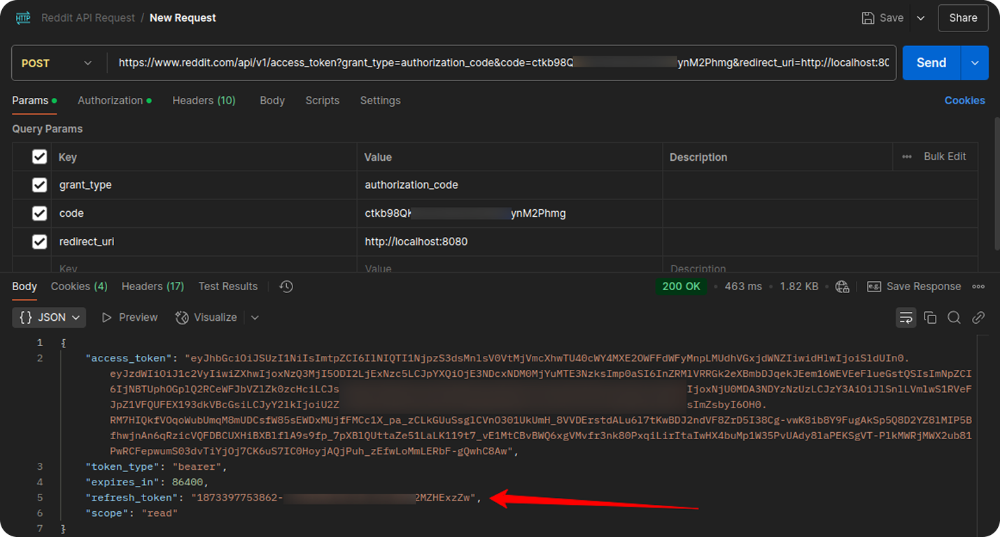

## How to obtain credentials for the Reddit Ads source

To connect to the Reddit Ads API and start importing data into Google Sheets or Google BigQuery, follow the steps below:

1. Visit the [Reddit Preferences page](https://www.reddit.com/prefs/apps) and log in with your Reddit account, or create a new one.

2. Click the **Create App** button.  



3. Fill in the form:
   - **App Name** and **Description**
   - **App type**: Select `script`
   - **Redirect URI**: `http://localhost:8080`
   - Click **Create App**



4. After creating the app, you'll see:
   - **Client ID** (just under the app name)
   - **Client Secret**
   - **Redirect URI**



5. Go to the [Reddit API Access Request Form](https://support.reddithelp.com/hc/en-us/requests/new?ticket_form_id=14868593862164)

In the form:
   - Select:
     - **"I'm a Developer"**
     - **"I want to register to use the free tier of the Reddit API"**
   - For purpose: select **Other**



Provide additional information:
   - Describe your tool’s purpose. Example:  

     _"We plan to use the Reddit Ads API to automatically extract advertising metrics and store them in Google Sheets and BigQuery. This data will be processed via OWOX Data Marts to support daily marketing reporting and optimization efforts."_

   - Add a link to the repository: `https://github.com/OWOX/owox-data-marts`
   - Include your Reddit username



Fill in the contact information and use case details:
   - **Reddit API Use Case**: Example: 

     _"The Reddit Ads API will be used to automate data collection from our ad account. We use OWOX Data Marts to transfer this data into Google Sheets and BigQuery for marketing analytics, allowing us to streamline reporting and improve media planning."_

   - **Developer Platform**: `Google Sheets, App Script`
   - **OAUTH Client ID(s)**: Paste the Client ID from your app



Finalize the request:
   - **Subject of inquiry**: _Request access to Reddit API_
   - **Details of inquiry**: Example: 

     _"Our organization intends to leverage the Reddit Ads API to access campaign-level advertising data for integration into our internal analytics workflows. Using the OWOX Data Marts platform, this data will be securely transferred to Google Sheets and Google BigQuery to support real-time performance tracking, marketing spend analysis, and strategic reporting."_

   - Leave the attachment field empty
   - Click **Submit**


6. To obtain the authorization code, use the following URL (replace `YOUR_CLIENT_ID` and `RANDOM_STRING` accordingly, for example, **abc123**):
```
https://www.reddit.com/api/v1/authorize
  ?client_id=YOUR_CLIENT_ID
  &response_type=code
  &state=RANDOM_STRING
  &redirect_uri=http://localhost:8080
  &duration=permanent
  &scope=read
  ```
Open the URL in your browser, press **Enter**, and when prompted, click **Allow** (make sure you're logged in to the Reddit account that owns the ad account).


7. You will be redirected to a URL like:
`http://localhost:8080/?state=xyz123&code=bLcIq0FR9-8hjOpklbxK2dtRTsA#_`  

Copy the value of the `code` parameter — in this example, `bLcIq0FR9-8hjOpklbxK2dtRTsA`.  



8. Use Postman to exchange the authorization code for a refresh token. 

**Parameters:**

- `grant_type=authorization_code`
- `code=YOUR_CODE` (from previous step)
- `redirect_uri=http://localhost:8080`

**Auth Type**: Basic Auth  
- **Username**: Your Client ID  
- **Password**: Your Client Secret



**User-Agent**:  
Use the following format:

`googleapps:owox-data-marts.redditads:v1.0.0 (by /u/client_reddit_username)`

Replace `client_reddit_username` with your actual Reddit username. For more info on best practices for User-Agent, see [Reddit's API Guidelines](https://github.com/reddit-archive/reddit/wiki/API).

### ✅ You're Ready!

You now have:

- **Client ID**
- **Client Secret**
- **Redirect URI**
- **Refresh Token**

You can now use these credentials as described in the [Getting Started guide](GETTING_STARTED.md).