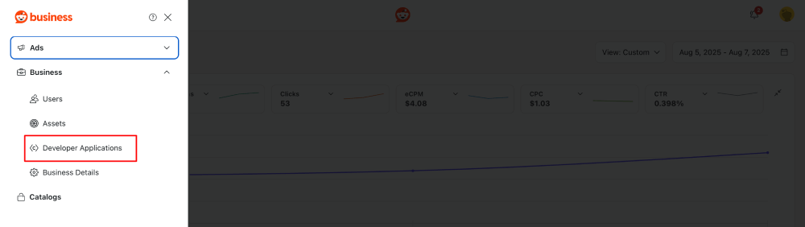
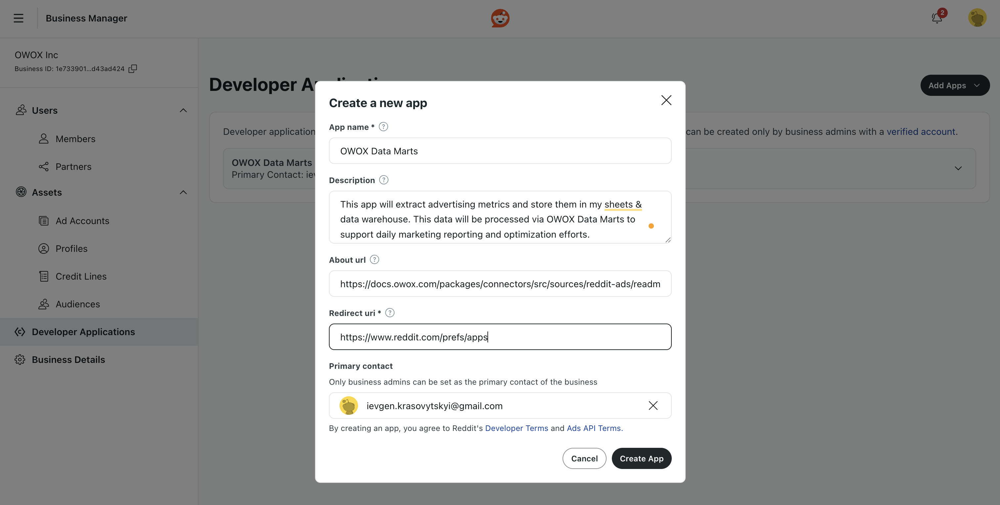
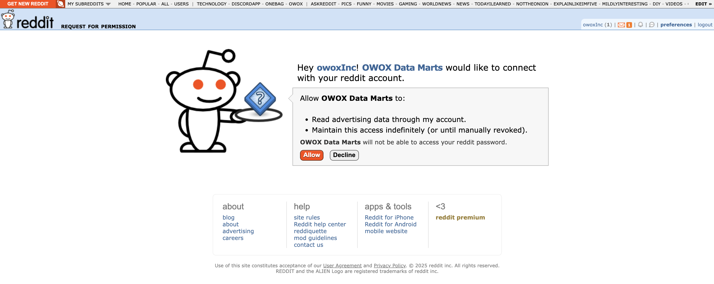
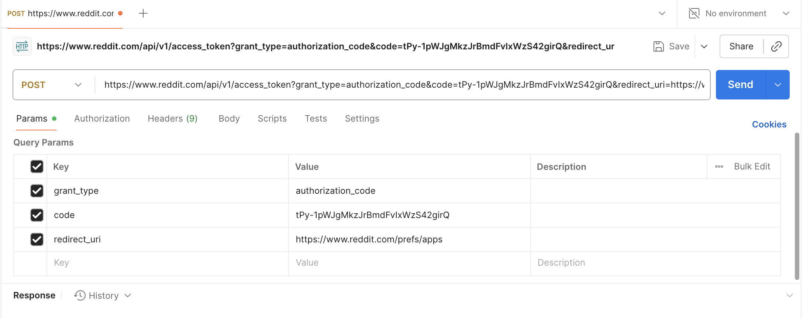
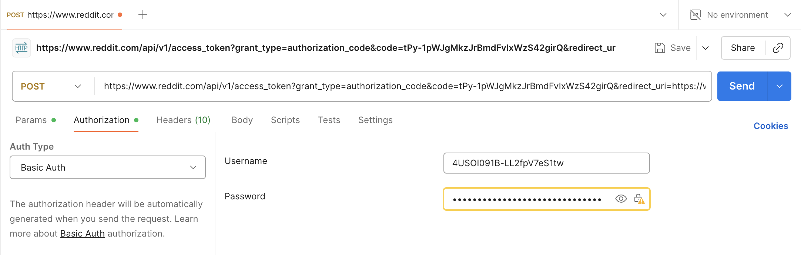
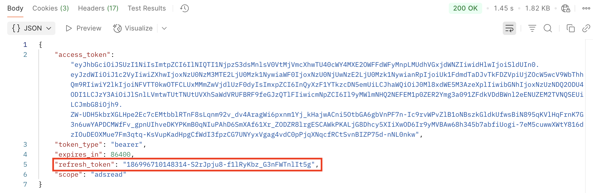

# How to obtain credentials for the Reddit Ads source

To connect to the Reddit Ads API and start importing data into Google Sheets or Google BigQuery, follow the steps below:

## Step 1: Create a Reddit App

Go to the [Reddit Ads page](https://ads.reddit.com/) and log in with your Reddit account.

In the left-handed panel - select the **Developer Applications**.



Click **Add Apps** and fill in the form with:

- **App Name** like OWOX Data Marts
- **Description** like      _"This app will extract advertising metrics and store them in my sheets & data warehouse. This data will be processed via OWOX Data Marts to support daily marketing reporting and optimization efforts."_
- **About url**: `https://docs.owox.com/packages/connectors/src/sources/reddit-ads/readme/`
- **Redirect uri**: `https://www.reddit.com/prefs/apps`
- **Primary contact**
- Click **Create App**



After creating the app, you'll see:

- **App id** (just under the app name)
- **Secret**

## Step 2: Generate the Code

To obtain the authorization code, use the following URL (replace `YOUR_APP_ID` and remove extra spaces):

```text # Reddit Authorization URL
https://www.reddit.com/api/v1/authorize
?client_id=YOUR_APP_ID
&response_type=code
&state=xyz_123
&redirect_uri=https://www.reddit.com/prefs/apps
&duration=permanent
&scope=adsread
```

Open the URL in your browser, press **Enter**, and when prompted, click **Allow** (make sure you're logged in to the Reddit account that owns the ad account).



1. You will be redirected to a URL like:
`https://www.reddit.com/prefs/apps?solution=bbc1b48823f8bc04bbc1b48823f8bc04&js_challenge=1&token=54dba411ecc9fd270bca6277dc2a436162285b3fed6dc209303bbfab9aa42307&state=xyz_123&code=tPy-1pWJgMkzJrBmdFvIxWzS42girQ`  

Copy the value of the `code` parameter — in this example, `tPy-1pWJgMkzJrBmdFvIxWzS42girQ`.  

## Step 3: Exchange Authorization Code for a Refresh Token

Use Postman / other request tools to exchange this code for a **refresh token**.

We need to make a POST Request to the following URL: `https://www.reddit.com/api/v1/access_token`.

**Params:**

- `grant_type=authorization_code`
- `code=YOUR_CODE` (from previous step)
- `redirect_uri=https://www.reddit.com/prefs/apps`



**Auth Type**: Basic Auth  

- **Username**: Your App id  
- **Password**: Your Secret



Click SEND, and your response request will contain the refresh token.



## Step 4: Set the User-Agent Header

Reddit requires a properly formatted `User-Agent` header for all API requests. Use the following format:

`googleapps:owox-data-marts.redditads:v1.0.0 (by /u/your_reddit_username)`

> Replace `your_reddit_username` with your actual Reddit username.

## ✅ You're Ready

You now have:

- **App id** (ex. Client ID) - from Step 1
- **Secret** (ex. Client Secret) - from Step 1
- **Redirect url** - `https://www.reddit.com/prefs/apps`
- **Refresh Token** - from step 3
- **User-Agent Header** - from step 4

You can now use these credentials as described in the [Getting Started guide](GETTING_STARTED.md).
