## How to Import Data from the Reddit Ads Source

To start importing data from Reddit Ads, make a copy of one of the following templates:

- [**Reddit Ads → Google Sheets. Template**](https://docs.google.com/spreadsheets/d/1lLhr5LEzQeSt6cwv07B0CKR8WgN5-_8MuL3ChkJej5w/copy)
- [**Reddit Ads → Google BigQuery. Template**](https://docs.google.com/spreadsheets/d/1LC1PRlDtK--U03pWHt_soasiKxfMwfZcY0V2Pf7roDY/copy)

Fill in required parameters:
- **Start Date**
- **Account IDs**
- **Fields**
- **Destination Dataset ID:** (Applicable only for the **Google BigQuery** template)
- **Destination Location:** (Applicable only for the **Google BigQuery** template)

The import will begin from the selected **Start Date**.  
> ⚠️ **Note:** Choosing a long date range may result in import failure due to high data volume.

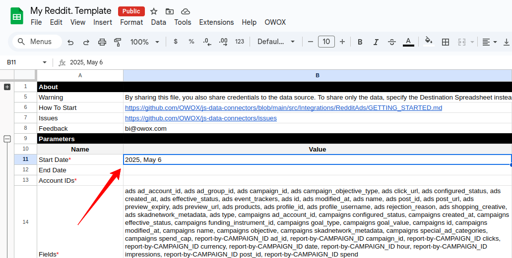

You can find your **Account ID** on the homepage of your [Reddit Ads account](https://ads.reddit.com/):

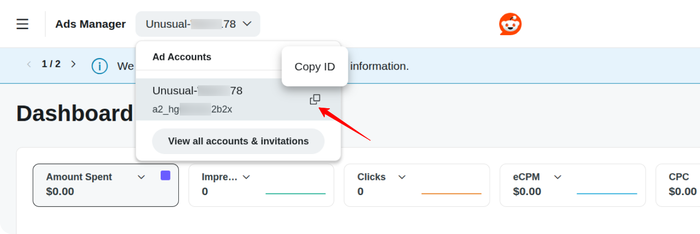

Copy and paste the ID into the appropriate field in the spreadsheet:

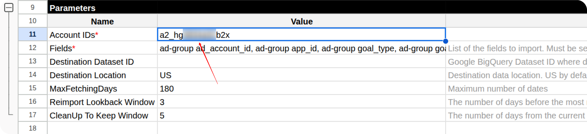

Some fields are pre-filled by default.  
To include additional fields, go to the **Fields** tab and check the boxes next to the ones you need.

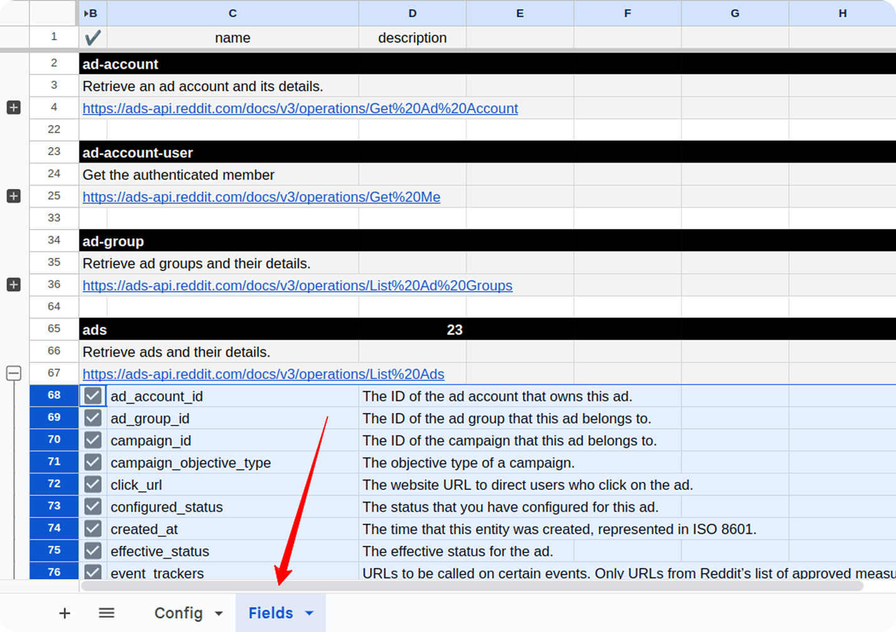

If you are using the **Google BigQuery** template, you must also specify:

* **Destination Dataset ID** in the format: `projectid.datasetid`
* **Destination Location** (e.g., `US`, `EU`)

> ℹ️ **Important:** If the specified BigQuery dataset does not already exist in your Google Cloud project, it will be automatically created during the import process.

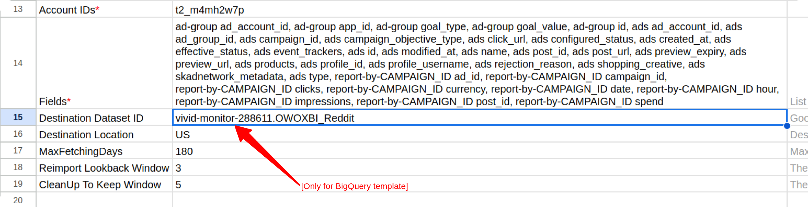

Open the menu: **OWOX → Manage Credentials**

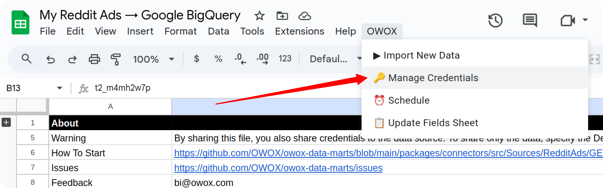

Enter your credentials as described in this guide:  
[**How to obtain the credentials for the Reddit Ads connector**](CREDENTIALS.md)

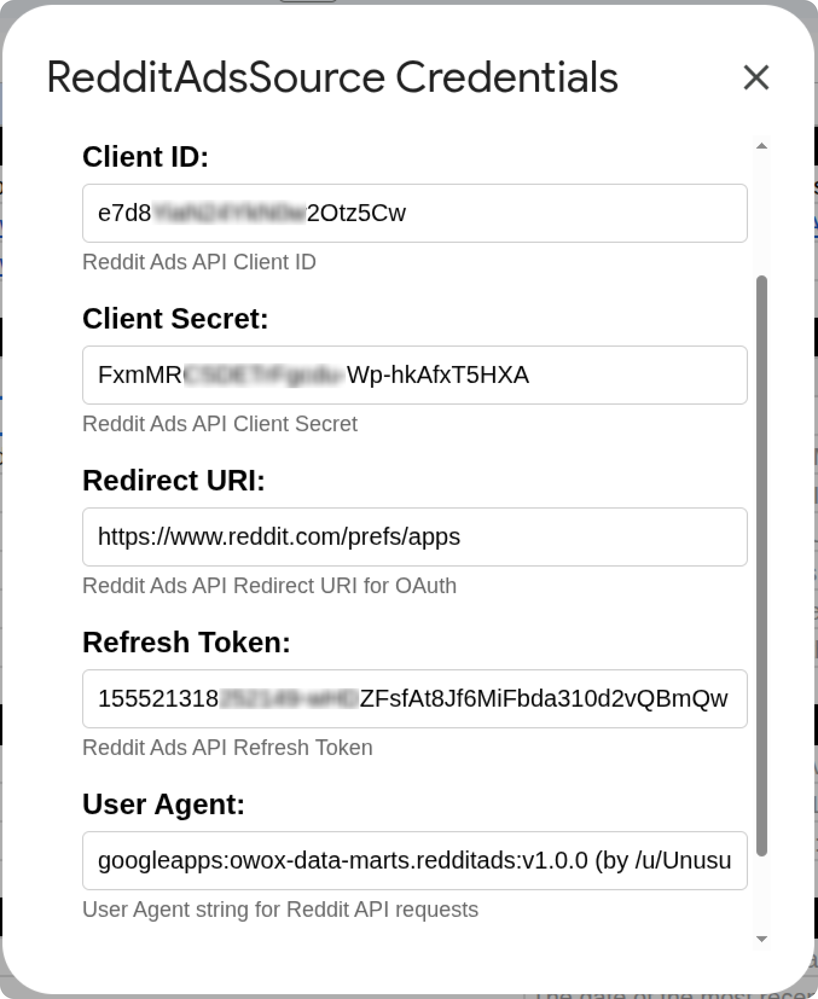

Click **Check and Save**. Once credentials are saved, go to:  
**OWOX → Import New Data**

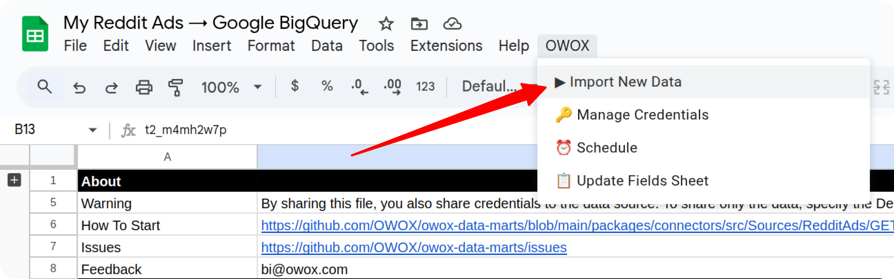

The process is complete when the **Log** sheet shows the message:  
**"Import is finished"**  

Access Your Data:

- In the **Google Sheets** template, the data will appear in new tabs labeled with the corresponding data types (e.g., *accounts*).  

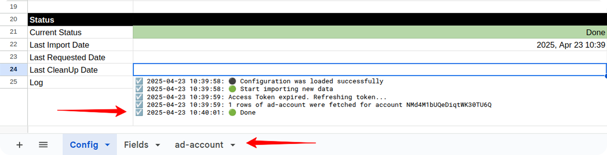

- In the **Google BigQuery** template, the data will be written to the dataset specified earlier.

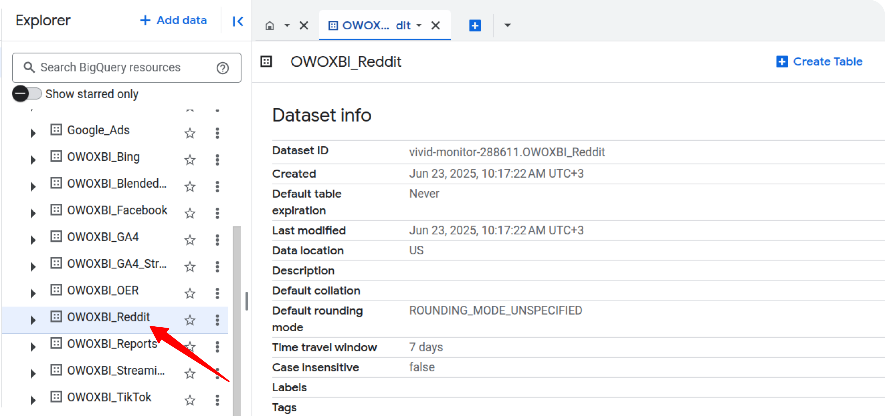

To include more fields later, check the appropriate boxes in the **Fields** tab and click:  
**OWOX → Import New Data**

> ⚠️ **Important:** To change the date range:
> 1. Clear existing data in the **Status** columns
> 2. Update the **Start Date** and/or **End Date**
> 3. Run **OWOX → Import New Data** again

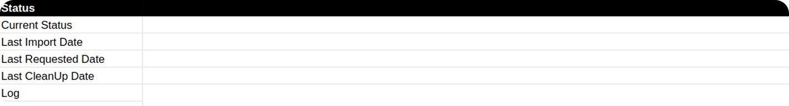

If you encounter any issues:

1. Check the "Logs" sheet for specific error messages
2. Please [visit Q&A](https://github.com/OWOX/owox-data-marts/discussions/categories/q-a) first
3. If you want to report a bug, please [open an issue](https://github.com/OWOX/owox-data-marts/issues)
4. Join the [discussion forum](https://github.com/OWOX/owox-data-marts/discussions) to ask questions or propose improvements 