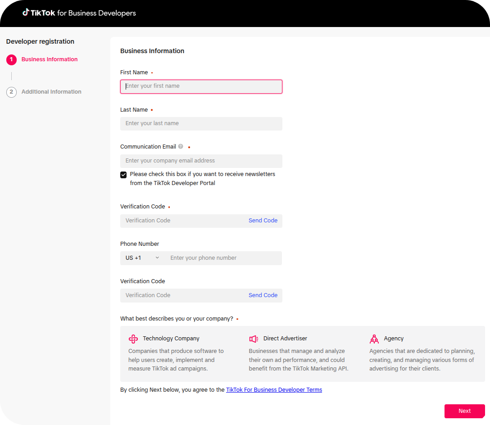
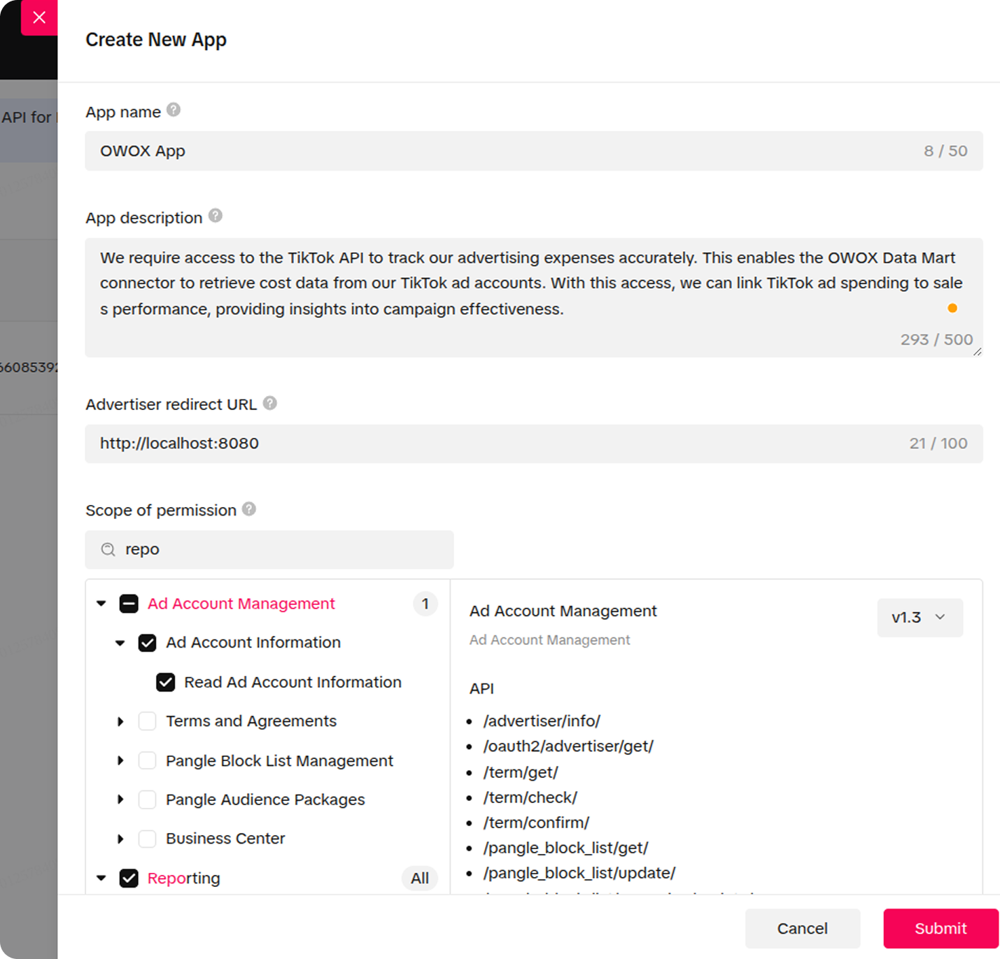
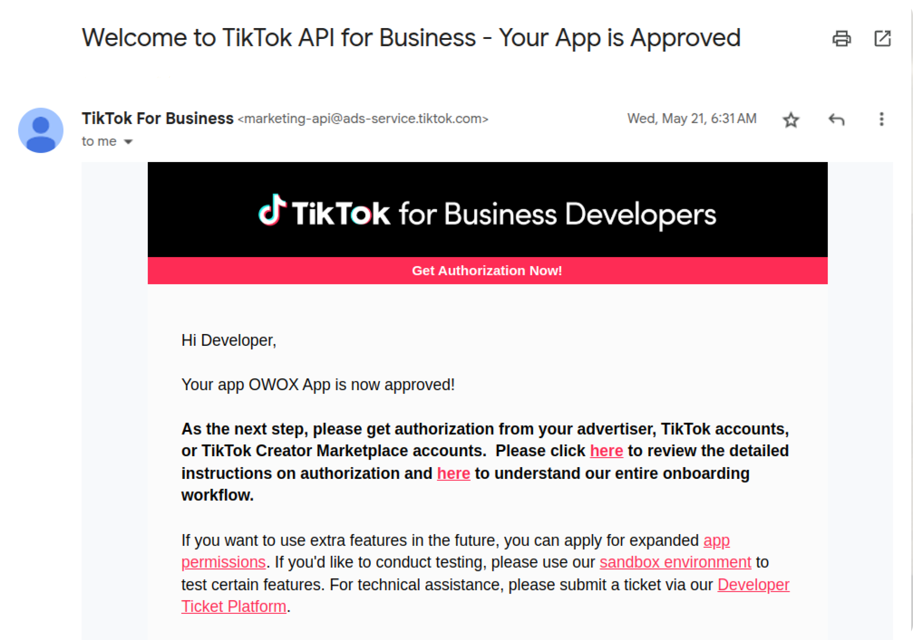
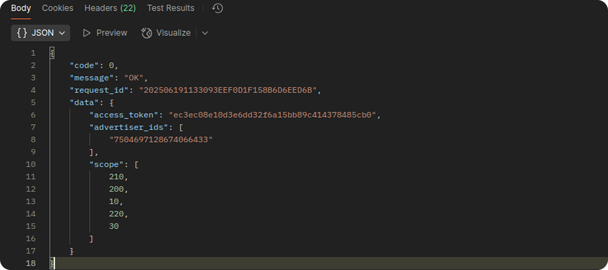

# TikTok Ads Source Authentication Guide

This guide provides a comprehensive walkthrough for obtaining an access token from the TikTok Business API, essential for integrating with the TikTok Ads source.

## Prerequisites

To successfully authenticate and retrieve data, ensure you meet the following requirements:

1.  **TikTok For Business Account:** You must have an active TikTok For Business account.
2.  **Advertiser Access:** You need advertiser-level access to the specific ad accounts from which you intend to extract data.
3.  **Developer Access:** You must have developer privileges within TikTok For Business to create and manage an application.

## Steps to Obtain Credentials

### 1. Create a Developer App

Follow these steps to register your application within the TikTok For Business developer portal:

1.  **Access the Portal:** Navigate to the [TikTok for Business Developers portal](https://business-api.tiktok.com/portal).
2.  **Log In:** Use your TikTok for Business account credentials to log in.
3.  **Become a Developer:** Click the "Become a Developer" button.
4.  **Fill in Application Details:** Provide the requested personal and company information:
    * First Name
    * Last Name
    * Communication Email
    * Type of your company
5.  **Complete Application:** Click "Next" and follow the prompts to finalize your developer application.

### 2. Configure the App

Once your developer application is approved, proceed to configure your new app:

1.  **Create an App:** Go to ["My Apps"](https://business-api.tiktok.com/portal/apps) and select "Create an App."
2.  **Provide App Information:** Fill in the essential details for your application:
    * **App Name:** A clear and descriptive name for your application.
    * **App Description:** A detailed explanation of your app's purpose and how it utilizes TikTok's API.
        * **Example Description:** *"Company Name provides financial control for e-commerce businesses by accurately tracking advertising costs across various platforms. TikTok API access is crucial for pulling detailed cost data from TikTok advertising accounts, enabling seamless integration with the OWOX Data Mart connector. This API access is fundamental for automatic correlation of TikTok ad spend with sales performance data. Without it, precise ROI analysis and ad budget optimization on TikTok are limited, necessitating manual data entry and hindering real-time financial insights."*
    * **Advertiser Redirect URL:** This URL is where TikTok will redirect users after successful authentication. For testing or token generation, a placeholder like `http://localhost:8080` can be used.

3.  **Select Scope of permissions:** Grant your app the necessary access by selecting the following scopes. Use the search bar or browse manually:
    * **Ad Account Management:**
        * `Ad Account Information -> Read Ad Account Information`
    * **Ads Management:**
        * `Campaign -> Read Campaigns`
        * `Ad -> Read Ads`
    * **Audience Management:**
        * `Read Custom Audiences`
    * **Reporting:** (Select all levels of reporting permissions)

4.  **Submit for Approval:** Click "Submit" to send your app for review.

**App Approval Process:** App approval can take up to **7 business days**. If your initial submission is not approved, consider revising your app description for clarity and resubmitting. Upon approval, you will receive an email notification similar to the one shown below:

### 3. Generate an Access Token

After your app is approved, you can generate an access token:

1.  **Obtain Authorization URL:** From your app's details page, copy the "Advertiser authorization URL" and paste it into your web browser.

2.  **Retrieve `auth_code`:** After successfully authenticating your TikTok account, you will be redirected to the specified "Advertiser redirect URL." This URL will contain an `auth_code` as a query parameter.

3.  **Exchange Code for Access Token:** Make a `POST` request to the TikTok API endpoint to exchange the `auth_code` for an `access_token`:

    * **Endpoint:** `https://business-api.tiktok.com/open_api/v1.3/oauth2/access_token/`
    * **Parameters (in the request body):**
        * `app_id`: Your unique application ID (e.g., in "APPID" format).
        * `secret`: Your application's secret key.
        * `auth_code`: The `auth_code` obtained from the redirect URL.
    * **Headers:** 
        * `Content-Type`: `application/json`
        

Once the request is successful, you’ll receive:

- An **access_token** to authorize future API calls.
- A list of available **advertiser_ids** linked to the authorized TikTok Business account.

## Token Validity and Refreshing

Understanding token validity and refresh mechanisms is crucial for continuous data access:

* **Token Expiration:** TikTok access tokens are valid for **24 hours**.
* **Production Environments:** For robust production applications, implement a token refresh mechanism using the `refresh_token` provided during the initial token generation. This ensures uninterrupted data flow without manual intervention.
* **Regular Use:** For less frequent or manual use of the source, it is recommended to regenerate a new access token daily before initiating your data imports to avoid token expiration issues.

## Security Considerations

Adhere to these security best practices to protect your credentials and data:

* **Secure Storage:** Always store your access tokens and refresh tokens in a secure, encrypted manner. Avoid hardcoding them directly into your application code.
* **Confidentiality:** Never share your app secret or access tokens with unauthorized individuals or publicly expose them.
* **Refresh Logic:** For production systems, prioritize implementing robust token refresh logic to minimize the exposure window of access tokens and enhance security.