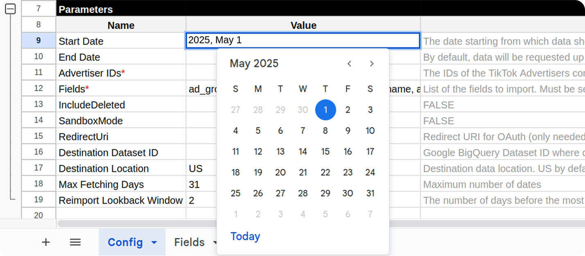
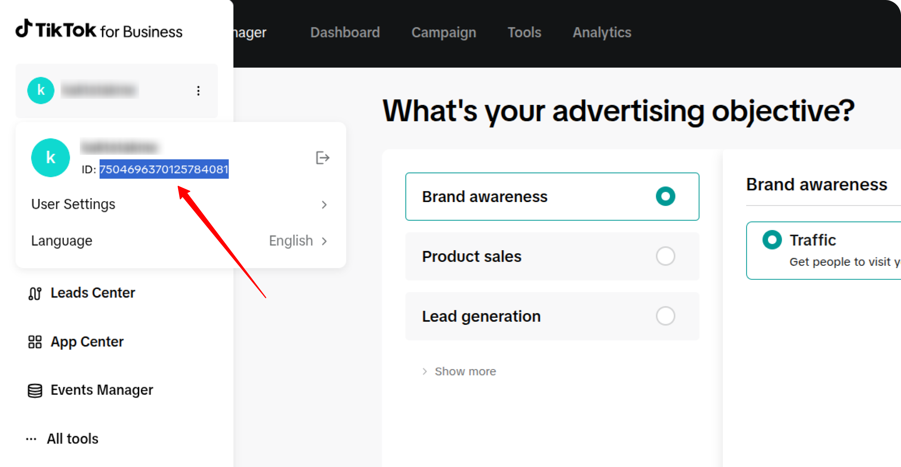
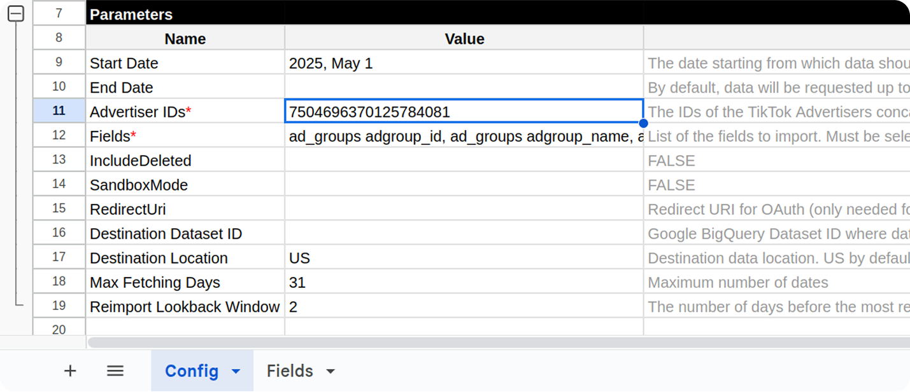
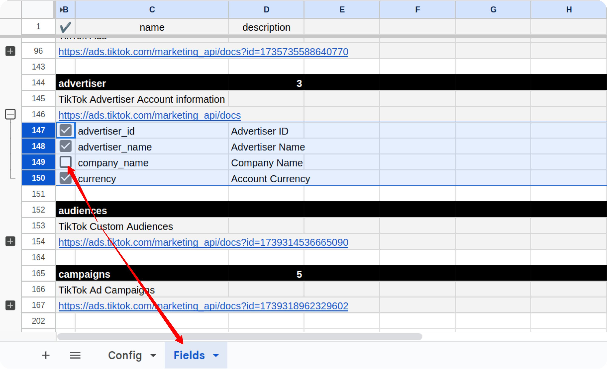
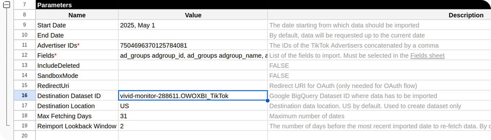
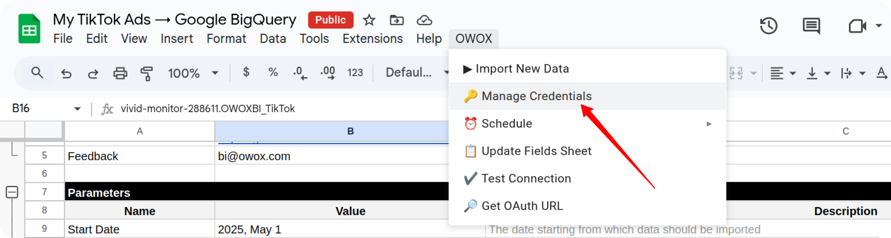
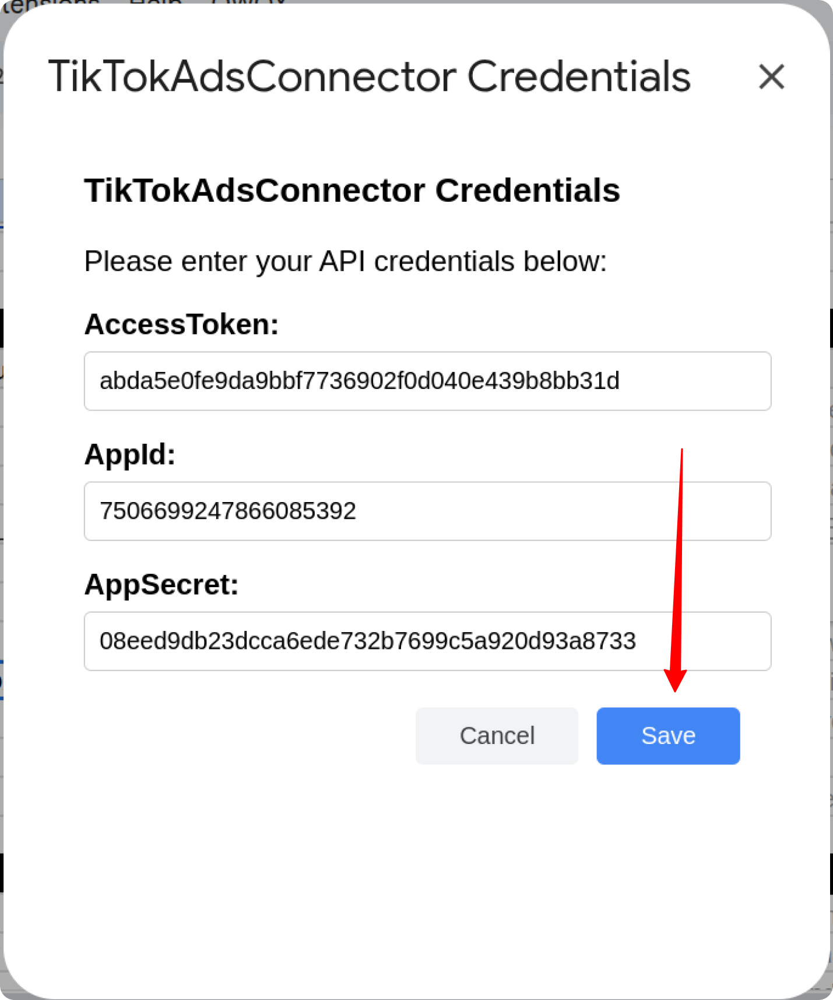
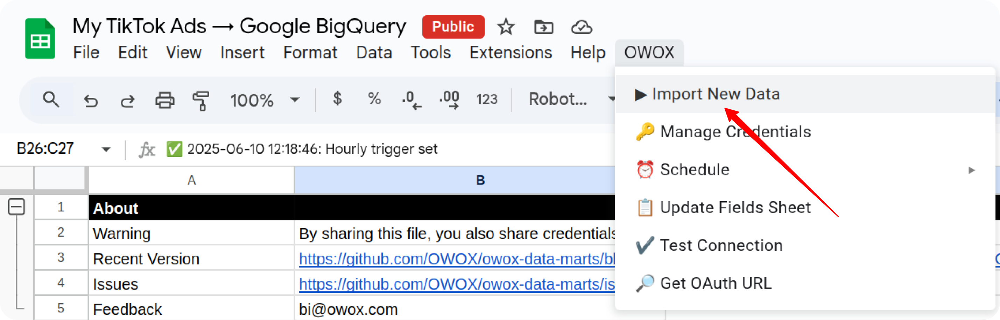

# How to Import Data from the TikTok Ads Source

This comprehensive guide will walk you through the process of setting up and utilizing the TikTok Ads Source to import your valuable advertising data directly into Google Sheets or Google BigQuery.

## Prerequisites

Before you begin the setup, ensure you have the following in place:

1. A **Google account** with active access to Google Sheets.
2. A **TikTok For Business account** with the necessary permissions to access the advertising data you intend to import.
3. **For the Google BigQuery template only:**
    * A **Google Cloud project** with BigQuery API enabled and appropriate access permissions.
4. A valid **Access Token** for the TikTok Business API.
    * Refer to the [**TikTok Ads Source Authentication Guide**](CREDENTIALS.md) for detailed, step-by-step instructions on how to obtain this token.

## Setup Instructions

### 1. Copy the Template

To initiate the data import process from TikTok Ads, begin by creating a copy of one of the following pre-configured templates:

* [**TikTok Ads → Google Sheets Template**](https://docs.google.com/spreadsheets/d/15AujaJ_x-ibEqs2u3DwvC8qV0hYC7oO1b1LGLEen1mQ/copy)
* [**TikTok Ads → Google BigQuery Template**](https://docs.google.com/spreadsheets/d/1I7cThXo24rwaQgx2H2Jsh0Z5Acv2ydh7bDtdEP8mBEQ/copy)

### 2. Configure the Source

Once you have copied the template, proceed with the configuration steps:

1. In your newly copied spreadsheet, navigate to the "Config" sheet.
2. Populate the essential configuration parameters:
    * **Start Date:** The date from which the import will begin.
        > ⚠️ **Note:** Specifying an excessively long date range may lead to import failures due to the high volume of data.
    * **Advertiser IDs:** The unique identifiers for the TikTok ad accounts you wish to pull data from.
    * **Fields:** The specific data fields you want to include in your import.
    * **Destination Dataset ID:** (Applicable only for the **Google BigQuery** template)
    * **Destination Location:** (Applicable only for the **Google BigQuery** template)

You can easily locate your **Advertiser ID** on the left-hand navigation bar within your [TikTok for Business dashboard](https://ads.tiktok.com/).

Copy the Advertiser ID and paste it into the designated field in your spreadsheet:

Several common data fields are pre-selected by default. To include additional fields in your import, go to the "Fields" tab and check the boxes next to the desired fields.

If you are using the **Google BigQuery** template, you must also specify:

* **Destination Dataset ID** in the format: `projectid.datasetid`
* **Destination Location** (e.g., `US`, `EU`)

> ℹ️ **Important:** If the specified BigQuery dataset does not already exist in your Google Cloud project, it will be automatically created during the import process.

Next, access the custom menu: **OWOX → Manage Credentials**.

Enter your TikTok Business API credentials that you obtained by following the instructions in the [**TikTok Ads Source Authentication Guide**](CREDENTIALS.md).

### 3. Run the Source

You have multiple options for executing the data import:

1. **Manual Run:**
    * From the custom menu, select "OWOX" > "Import New Data"
    * The import will commence immediately, and its progress will be displayed in the "Logs" sheet within your spreadsheet.

2. **Scheduled Run:**
    * **Daily Schedule:** To set up an automatic daily import, select "OWOX" > "Schedule" > "Set Daily Schedule"
    * **Hourly Schedule:** To configure an automatic hourly import, select "OWOX" > "Schedule" > "Set Hourly Schedule"
    * **Remove Schedules:** To disable all existing scheduled runs, select "OWOX" > "Schedule" > "Delete All Schedules"

## Getting Help

Should you encounter any issues or questions not addressed in this guide:

1. **Check Logs:** Review the "Logs" sheet in your spreadsheet for specific error messages, which can often provide clues to the problem.
2. **Visit Q&A:** Before opening a new issue, please check the existing discussions and answers in our [Q&A section](https://github.com/OWOX/owox-data-marts/discussions/categories/q-a).
3. **Report a Bug:** If you identify a bug, please [open an issue](https://github.com/OWOX/owox-data-marts/issues) on our GitHub repository.
4. **Join the Discussion:** Feel free to join our [discussion forum](https://github.com/OWOX/owox-data-marts/discussions) to ask questions, share insights, or propose improvements to the source.
