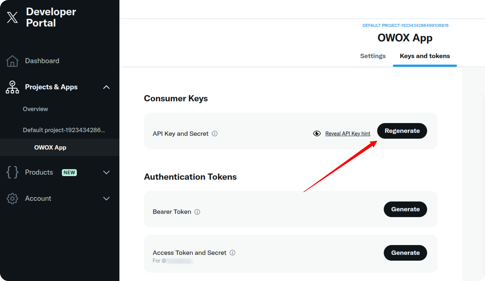

## How to obtain credentials for the X Ads source

1. Visit the [X Developer Portal](https://developer.x.com/).  
   After signing up, an app will be created for you automatically.

2. Navigate to the **Keys and Tokens** tab.

   - Click **Regenerate** in the **API Key and Secret** section.  
     Save your **API Key** and **API Key Secret**.
   
   - Then, click **Generate** in the **Access Token and Secret** section.  
     Save your **Access Token** and **Access Token Secret**.

Once you have all the credentials, you can use them as described in the [Getting Started guide](GETTING_STARTED.md).

### Troubleshooting and Support

If you encounter any issues after saving your credentials in the Google Sheet:

1. Check if there is a specific error message.
2. Browse the [Q&A section](https://github.com/OWOX/owox-data-marts/discussions/categories/q-a) — your question might already be answered.
3. To report a bug or technical issue, [open a GitHub issue](https://github.com/OWOX/owox-data-marts/issues).
4. Join the [discussion forum](https://github.com/OWOX/owox-data-marts/discussions) to ask questions, share feedback, or suggest improvements.
