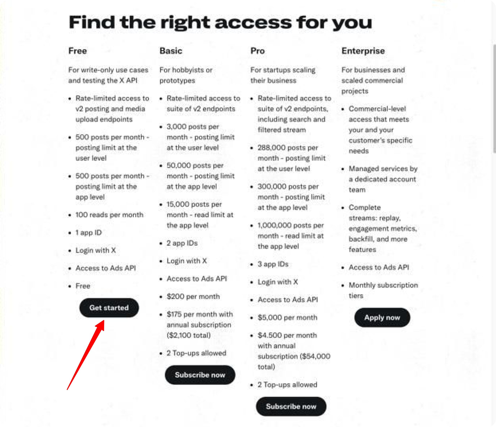
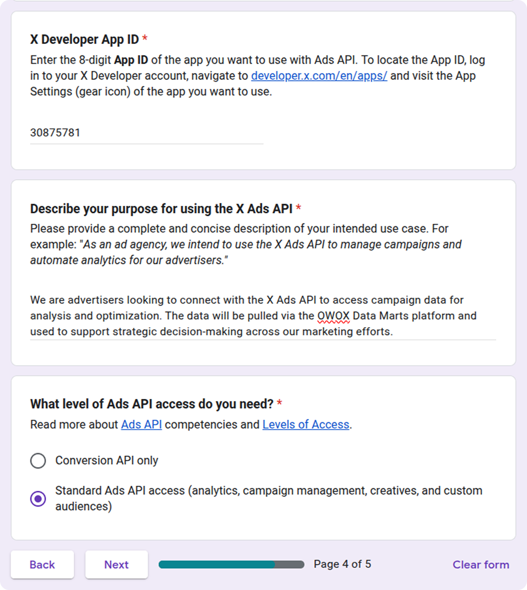
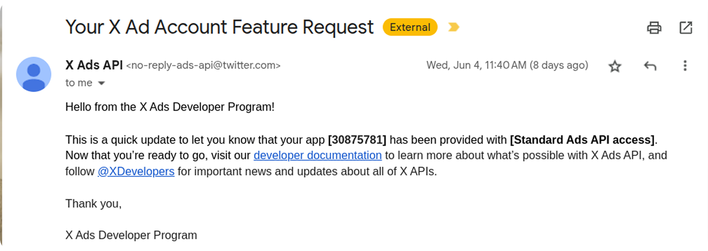
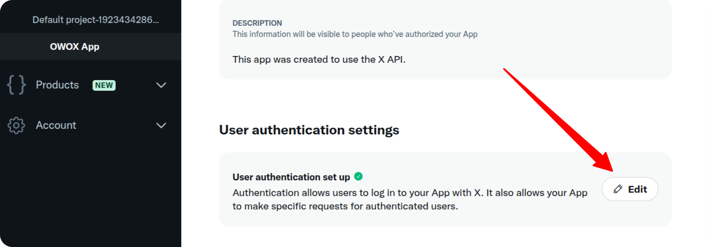
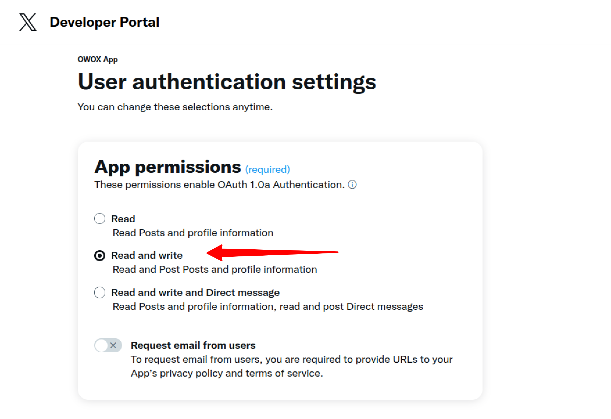
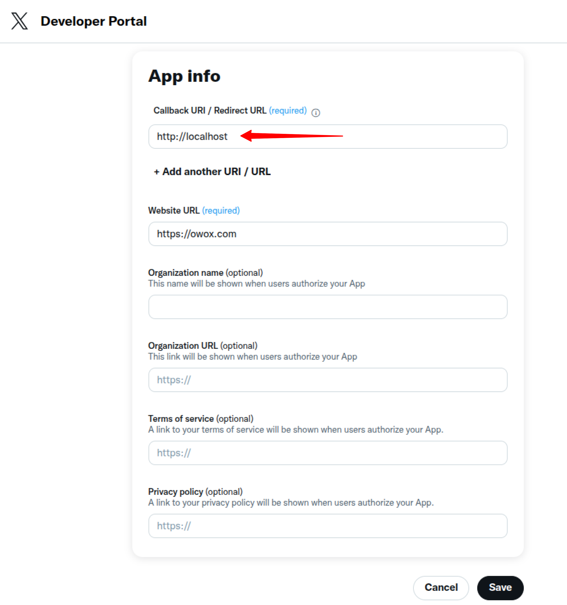
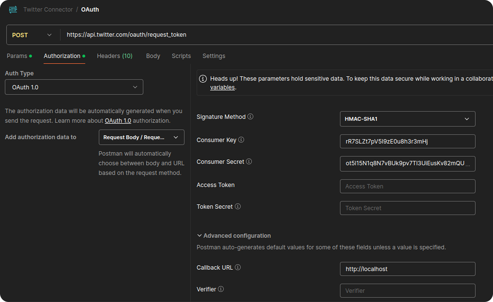
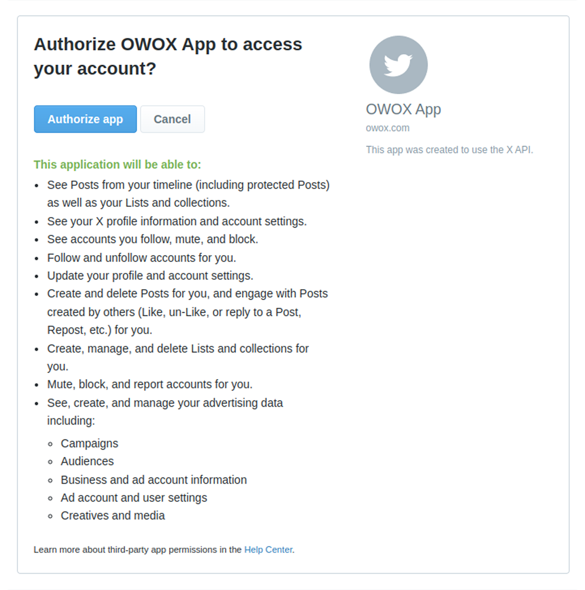
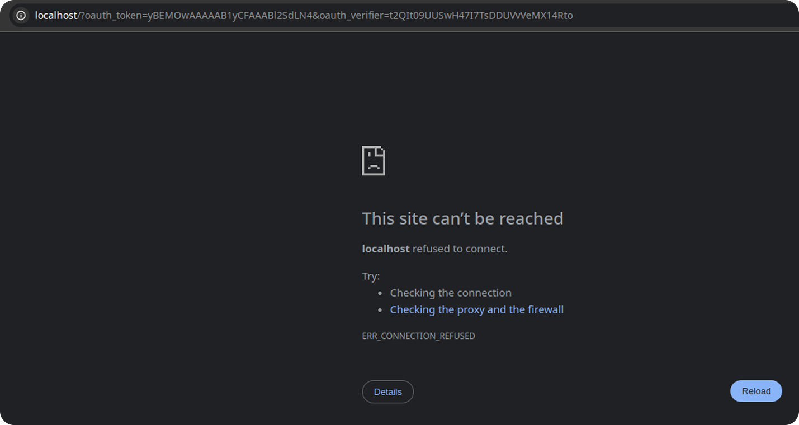
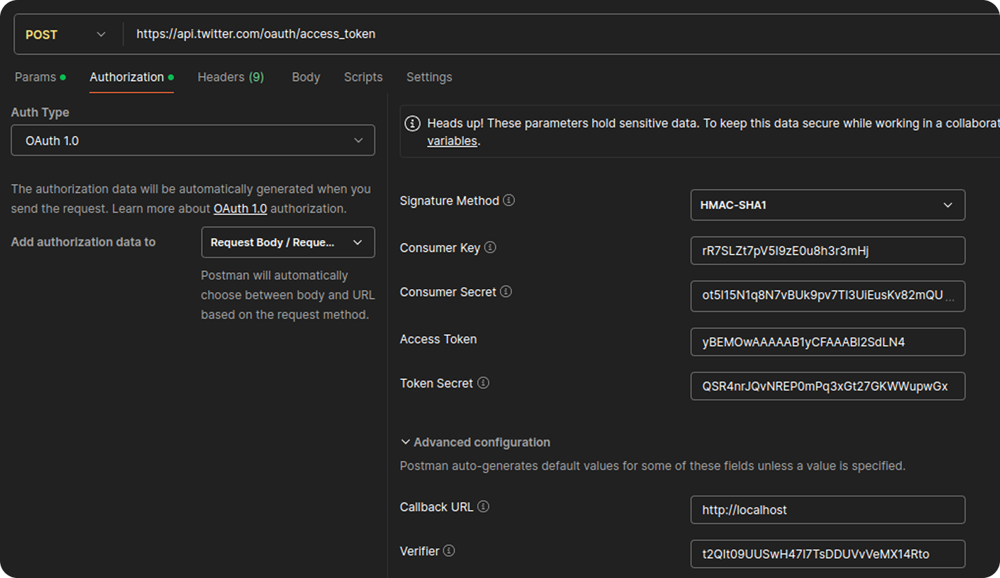

## How to obtain credentials for the X Ads source

To use the X Ads connector, you need to generate the required API credentials by registering and configuring an app in the [X Developer Portal](https://developer.x.com/). Follow the steps below to complete the setup.

1. Visit the [X Developer Portal](https://developer.x.com/) and sign in with your account.

2. After signing up, an app will be created for you automatically.

> ⚠️ **Note:** If X prompts you to upgrade your account, select the **Free tier** to continue without additional charges.

To begin using the X Ads API, you need to request access. Follow the steps below to complete the process. 

Fill out the official [X Ads API Access Request Form](https://docs.google.com/forms/d/e/1FAIpQLSftPYn1PeCkopGzlc-EW7mvwUm-S1P94RANGv6qncehoHJWKg/viewform). 

Alternatively, you can [direct message @AdsSupport](https://ads.x.com/en/help) for assistance.

You’ll need to provide your **X Developer App ID**, which can be found on your app's detail page:  

   

Describe how you intend to use the API.  

Here’s an example:

> _"We are advertisers looking to connect with the X Ads API to access campaign data for analysis and optimization. The data will be pulled via the OWOX Data Marts platform and used to support strategic decision-making across our marketing efforts."_

In the field **"What level of Ads API access do you need?"**, choose **Standard Ads API access**.

After submitting the form, wait for confirmation. Once your request is approved, you will receive an email notification.

Once approved, you'll be ready to proceed with connecting your app to the X Ads API.

3. Navigate to the **User Authentication Settings** and click the **Edit** button.  

   

Under **App Permissions**, select **Read and write**.

   

Set the **Callback URI** to: `http://localhost`

Leave other fields (including **Type of App**) as default and click **Save**.  

   

4. Navigate to the **Keys and Tokens** tab. 

In the **API Key and Secret** section:
   - Click **Regenerate**
   - Save your **API Key** and **API Secret**
   

5. Make a **POST** request to `https://api.twitter.com/oauth/request_token`.

**In the Authorization tab, use the following OAuth 1.0 settings:**

- **Signature Method**: HMAC-SHA1  
- **Consumer Key**: your **API Key** from Step 4  
- **Consumer Secret**: your **API Secret** from Step 4  
- **Callback URL**: `http://localhost` (must match the one from Step 3)  

Click **Send**. The response will look like:

`oauth_token=E4MQKQAAAAAB1yCFAAABl2OHH80&oauth_token_secret=UlDQaqOoJHj1VvLQ8fQH6Iq686rEFww2&oauth_callback_confirmed=true`

6. Copy the `oauth_token` value (`E4MQKQAAAAAB1yCFAAABl2OHH80` in the example above) and insert it into the following URL:

`https://api.twitter.com/oauth/authorize?oauth_token=YOUR_OAUTH_TOKEN`

Open the URL in your browser and click **Authorize App**.  

   

You will be redirected to a URL containing `oauth_token` and `oauth_verifier`.  

   

7. Make a **POST** request to `https://api.twitter.com/oauth/access_token`.

**In the Authorization tab, use the following OAuth 1.0 settings:**

- **Consumer Key**: your **API Key**
- **Consumer Secret**: your **API Secret**
- **Access Token**: the `oauth_token` from Step 5
- **Access Token Secret**: the `oauth_token_secret` from Step 5
- **Callback URL**: `http://localhost`
- **Verifier**: the `oauth_verifier` from the previous step

Click **Send**. The response will include your permanent tokens:

`oauth_token=1534231826281152515-kDGnM70as1fh6xoYWK9HvlwtDHHqe8&oauth_token_secret=KiXVKSyHifVoVm7vq3iC7zjclE1ocqvgpouS95RuLXM61&user_id=1534231826281152213&screen_name=examplename`

8. You now have all the credentials required to use the X Ads connector:

- **Consumer Key (API Key)** – from your X Ads App (Step 3)
- **Consumer Secret (API Secret)** – from your X Ads App (Step 3)
- **Access Token (oauth_token)** – from Step 7
- **Access Token Secret (oauth_token_secret)** – from Step 7

Refer to the [Getting Started Guide](GETTING_STARTED.md) to complete the setup.

### Troubleshooting and Support

If you encounter any issues after saving your credentials in the Google Sheet:

1. Check if there is a specific error message.
2. Browse the [Q&A section](https://github.com/OWOX/owox-data-marts/discussions/categories/q-a) — your question might already be answered.
3. To report a bug or technical issue, [open a GitHub issue](https://github.com/OWOX/owox-data-marts/issues).
4. Join the [discussion forum](https://github.com/OWOX/owox-data-marts/discussions) to ask questions, share feedback, or suggest improvements.
