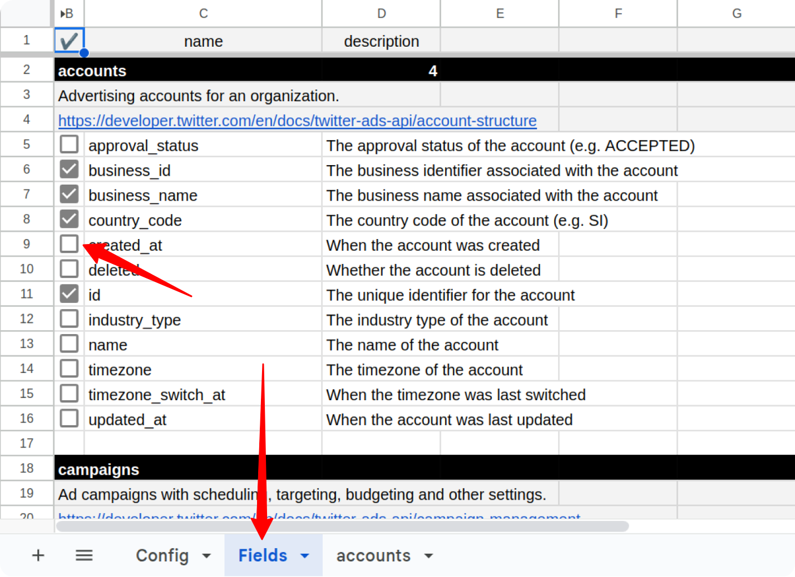
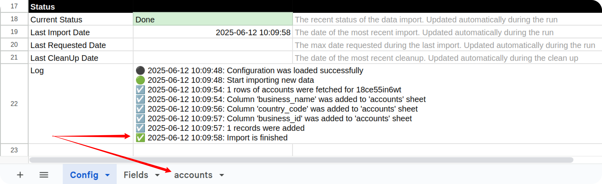
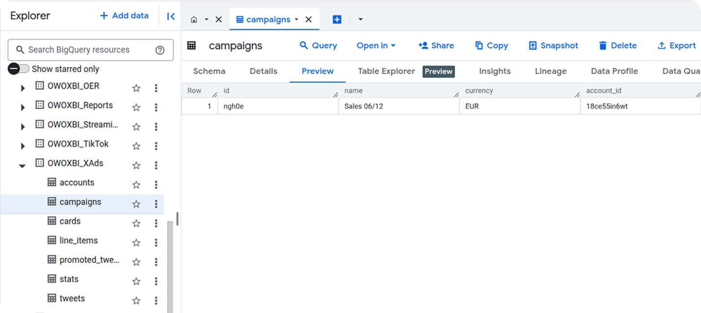

# How to Import Data from X Ads

To begin importing data from X Ads, start by making a copy of one of the following templates:

- [**X Ads → Google Sheets. Template**](https://docs.google.com/spreadsheets/d/1LM5RTill31OF_n3XPtvoSW4LquD3JbzK3lgQbzTSPlE/copy)
- [**X Ads → Google BigQuery. Template**](https://docs.google.com/spreadsheets/d/1l-zRdOkuWsD-0xEmh0BIEb8aF4k0fksk4G3xGU5W6bM/copy)

Fill in required information:

- **Start Date**
- **Account IDs**
- **Fields**

The import will begin from the selected **Start Date**.  
> ⚠️ Note: Choosing a long date range may cause the import to fail due to high data volume.

To find your **Account ID**, go to [https://ads.x.com](https://ads.x.com/) and look at the URL of your account.  
For example, in this link:  
`https://ads.x.com/campaign_form/18ce55in6wt/campaign/new`  
The **Account ID** is: `18ce55in6wt`

To include more fields, go to the **Fields** tab and check the boxes next to the fields you want to include.

If you're using the **Google BigQuery** template, also fill in:

- **Destination Dataset ID** in the format: `projectid.datasetid`
- **Destination Location** (e.g., `US`, `EU`)

> ℹ️ If the specified dataset doesn't exist, it will be created automatically.

Open the menu: **OWOX → Manage Credentials**

Enter your credentials obtained by following this guide: [**How to obtain the credentials for the X Ads connector**](CREDENTIALS.md).

Click the **Save** button.

Once your credentials are saved, click: **OWOX → Import New Data**

The process is complete when the **Log** sheet shows the message:  
**"Import is finished"**  

Access Your Data:

- In the **Google Sheets** template, the data will appear in new tabs labeled with the corresponding data types (e.g., *accounts*).  

- In the **Google BigQuery** template, the data will be written to the dataset specified earlier.

## Getting Help

Should you encounter any issues or questions not addressed in this guide:

1. **Check Logs:** Review the "Logs" sheet in your spreadsheet for specific error messages, which can often provide clues to the problem.
2. **Visit Q&A:** Before opening a new issue, please check the existing discussions and answers in our [Q&A section](https://github.com/OWOX/owox-data-marts/discussions/categories/q-a).
3. **Report a Bug:** If you identify a bug, please [open an issue](https://github.com/OWOX/owox-data-marts/issues) on our GitHub repository.
4. **Join the Discussion:** Feel free to join our [discussion forum](https://github.com/OWOX/owox-data-marts/discussions) to ask questions, share insights, or propose improvements to the source.
