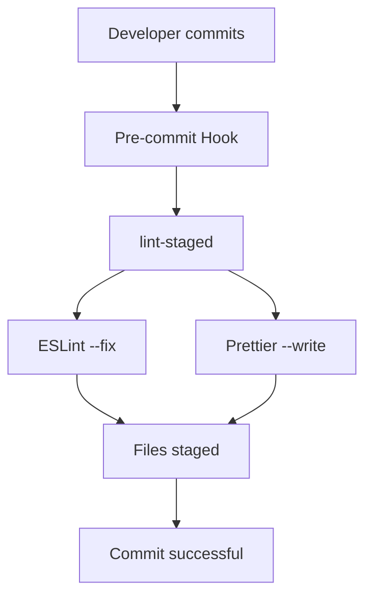

# `@owox/linter-config`

Git hooks, lint-staged validation configuration for OWOX Data Marts workspace.

## 📋 **Table of Contents**

- [Overview](#overview)
- [Architecture](#architecture)
- [Quick Setup](#quick-setup)
- [Available Configurations](#available-configurations)
- [Git Hooks](#git-hooks)
- [Integration Examples](#integration-examples)
- [Troubleshooting](#troubleshooting)
- [Open Source & Contributing](#open-source--contributing)
- [Technical Specifications](#technical-specifications)

## Overview

This package provides a comprehensive linting and git workflow setup for the OWOX Data Marts monorepo, including:

- **Husky**: Git hooks management
- **lint-staged**: Run linters on staged files only

## 🏗️ **Architecture**

### Workflow Diagram



### Package Structure

```
@owox/linter-config/
├── lint-staged.js       # 4 configurations (universal, backend, web, connectors)
├── husky.js             # Git hooks setup
└── scripts/setup.js     # Automated installation
```

### Dependencies

- **Runtime**: husky, lint-staged
- **Peer**: eslint ^9.0.0, prettier ^3.0.0
- **Node.js**: >=22.0.0 (ES Modules support)

## Quick Setup

### 1. Install dependencies

From the monorepo root:

```bash
npm install
```

### 2. Run setup script

```bash
npm run setup:linting
```

This will:

- Initialize Husky
- Create pre-commit
- Guide you through the remaining setup steps

### 3. Add scripts to root package.json

```json
{
  "scripts": {
    "lint-staged": "lint-staged",
    "setup:linting": "npm run setup --workspace=@owox/linter-config"
  }
}
```

### 4. Create configuration files

Create these files in your project root:

**lint-staged.config.js:**

```js
import { config } from '@owox/linter-config/lint-staged';

export default config;
```

## Available Configurations

### Lint-staged Configurations

- `config` - Universal configuration for all file types
- `backendConfig` - Optimized for NestJS backend projects
- `webConfig` - Optimized for React web projects
- `connectorsConfig` - Optimized for JavaScript connector projects

**Usage:**

```js
import { webConfig } from '@owox/linter-config/lint-staged';

export default webConfig;
```

## Git Hooks

### Pre-commit Hook

Runs `lint-staged` on all staged files to ensure:

- ESLint validation and auto-fixing for JS/TS files
- Prettier formatting for all supported file types
- Only changed files are processed (performance optimization)

## 🔗 **Integration Examples**

### Backend (NestJS)

```js
// apps/backend/lint-staged.config.js
import { backendConfig } from '@owox/linter-config/lint-staged';

export default backendConfig;
```

**What it does:**

- Validates TypeScript files with ESLint
- Formats JSON and Markdown files with Prettier
- Optimized for server-side development

### Web (React)

```js
// apps/web/lint-staged.config.js
import { webConfig } from '@owox/linter-config/lint-staged';

export default webConfig;
```

**What it does:**

- Handles TSX/JSX React components
- Formats CSS/SCSS style files
- Includes web-specific ESLint rules

### Connectors (JavaScript)

```js
// packages/connectors/lint-staged.config.js
import { connectorsConfig } from '@owox/linter-config/lint-staged';

export default connectorsConfig;
```

**What it does:**

- Optimized for JavaScript modules
- Handles .mjs ES modules
- Lightweight for utility packages

### Custom Configuration

```js
// Custom project lint-staged.config.js
import { config } from '@owox/linter-config/lint-staged';

// Extend base config
export default {
  ...config,
  '**/*.{py,rb}': ["echo 'Non-JS files ignored'"],
};
```

## Troubleshooting

### Hooks not running

1. Ensure Husky is properly initialized: `npx husky init`
2. Check that hook files are executable: `chmod +x .husky/*`
3. Verify git config: `git config core.hooksPath .husky`

### Lint-staged errors

1. Ensure all required tools are installed (ESLint, Prettier)
2. Check that project-specific configurations exist
3. Verify file patterns in lint-staged config

## Development

To modify or extend configurations:

1. Edit relevant config files in this package
2. Test changes in development environment
3. Update documentation accordingly
4. Consider backward compatibility for existing projects

## 📁 Configuration Files Structure

The package contains several configuration files that serve different purposes:

#### Quick Manual Disable

```bash
# Disable existing hooks by renaming
mv .husky/pre-commit .husky/pre-commit.disabled
```

### Recommendations

- **Development**: Use environment variables for temporary control
- **Production**: Configure via package.json for persistence
- **Emergency**: Use `--no-verify` flag when needed

## 🌟 **Open Source & Contributing**

### License

This project is licensed under the ELv2 license. See [LICENSE](../../LICENSE) for details.

### Contributing

1. Fork the repository
2. Create a feature branch: `git checkout -b feature/amazing-feature`
3. Make your changes and test them
4. Push and create a Pull Request

### Compatibility

- **Node.js**: >=22.0.0 (ES Modules required)
- **npm**: >=8.0.0 (workspaces support)
- **Git**: >=2.20.0 (modern hooks support)

## 🔧 **Technical Specifications**

### Metadata

```yaml
name: '@owox/linter-config'
type: 'development-tool'
category: 'code-quality'
scope: 'monorepo'
architecture: 'modular-configuration'
```

### Components Interaction

```
Root package.json scripts
    ↓
@owox/linter-config exports
    ↓
├── lint-staged configurations (4 variants)
└── husky git hooks (pre-commit)
```

### Performance Characteristics

- **Lint-staged**: Only processes changed files (~10x faster)
- **ESLint**: Auto-fix enabled for common issues
- **Prettier**: Consistent formatting across file types
