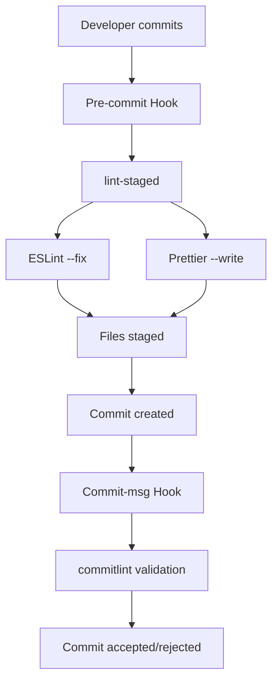

# `@owox/linter-config`

Git hooks, lint-staged, and commit validation configuration for OWOX Data Marts workspace.

## 📋 **Table of Contents**

- [Overview](#overview)
- [Architecture](#architecture)
- [Quick Setup](#quick-setup)
- [Available Configurations](#available-configurations)
- [Git Hooks](#git-hooks)
- [Integration Examples](#integration-examples)
- [Troubleshooting](#troubleshooting)
- [Open Source & Contributing](#open-source--contributing)
- [Technical Specifications](#technical-specifications)

## Overview

This package provides a comprehensive linting and git workflow setup for the OWOX Data Marts monorepo, including:

- **Husky**: Git hooks management
- **lint-staged**: Run linters on staged files only
- **commitlint**: Validate commit messages according to conventional commits

## 🏗️ **Architecture**

### Workflow Diagram



### Package Structure

```
@owox/linter-config/
├── lint-staged.js        # 4 configurations (universal, backend, web, connectors)
├── commitlint-rules.cjs  # SHARED RULES (single source of truth)
├── commitlint.js         # ES modules + interactive prompts
├── commitlint.config.cjs # CommonJS compatibility layer
├── husky.js             # Git hooks setup
└── scripts/setup.js     # Automated installation
```

### Dependencies

- **Runtime**: husky, lint-staged, @commitlint/cli
- **Peer**: eslint ^9.0.0, prettier ^3.0.0
- **Node.js**: >=22.0.0 (ES Modules support)

## Quick Setup

### 1. Install dependencies

From the monorepo root:

```bash
npm install
```

### 2. Run setup script

```bash
npm run setup:linting
```

This will:

- Initialize Husky
- Create pre-commit and commit-msg hooks
- Guide you through the remaining setup steps

### 3. Add scripts to root package.json

```json
{
  "scripts": {
    "lint-staged": "lint-staged",
    "commitlint": "commitlint",
    "setup:linting": "npm run setup --workspace=@owox/linter-config"
  }
}
```

### 4. Create configuration files

Create these files in your project root:

**lint-staged.config.js:**

```js
import { config } from '@owox/linter-config/lint-staged';

export default config;
```

**commitlint.js:**

```js
import { config } from '@owox/linter-config/commitlint';

export default config;
```

**commitlint.config.cjs:**

```js
import { config } from '@owox/linter-config/commitlint';

export default config;
```

## Available Configurations

### Lint-staged Configurations

- `config` - Universal configuration for all file types
- `backendConfig` - Optimized for NestJS backend projects
- `webConfig` - Optimized for React web projects
- `connectorsConfig` - Optimized for JavaScript connector projects

**Usage:**

```js
import { webConfig } from '@owox/linter-config/lint-staged';

export default webConfig;
```

### Commitlint Configuration

Single configuration following conventional commits standard with OWOX-specific scopes.

**Supported commit types:**

- `feat` - New features
- `fix` - Bug fixes
- `docs` - Documentation changes
- `style` - Code style changes
- `refactor` - Code refactoring
- `perf` - Performance improvements
- `test` - Tests
- `chore` - Maintenance tasks
- `ci` - CI/CD changes
- `build` - Build system changes
- `revert` - Revert commits

**Example commit messages:**

```
feat(auth): add OAuth2 integration
fix(api): resolve data validation issue
docs(readme): update installation guide
chore(deps): bump typescript to v5.8.3
```

## Git Hooks

### Pre-commit Hook

Runs `lint-staged` on all staged files to ensure:

- ESLint validation and auto-fixing for JS/TS files
- Prettier formatting for all supported file types
- Only changed files are processed (performance optimization)

### Commit-msg Hook

Validates commit messages using commitlint to ensure:

- Conventional commit format
- Allowed commit types and scopes
- Proper message length and formatting

## 🔗 **Integration Examples**

### Backend (NestJS)

```js
// apps/backend/lint-staged.config.js
import { backendConfig } from '@owox/linter-config/lint-staged';

export default backendConfig;
```

**What it does:**

- Validates TypeScript files with ESLint
- Formats JSON and Markdown files with Prettier
- Optimized for server-side development

### Web (React)

```js
// apps/web/lint-staged.config.js
import { webConfig } from '@owox/linter-config/lint-staged';

export default webConfig;
```

**What it does:**

- Handles TSX/JSX React components
- Formats CSS/SCSS style files
- Includes web-specific ESLint rules

### Connectors (JavaScript)

```js
// packages/connectors/lint-staged.config.js
import { connectorsConfig } from '@owox/linter-config/lint-staged';

export default connectorsConfig;
```

**What it does:**

- Optimized for JavaScript modules
- Handles .mjs ES modules
- Lightweight for utility packages

### Custom Configuration

```js
// Custom project lint-staged.config.js
import { config } from '@owox/linter-config/lint-staged';

// Extend base config
export default {
  ...config,
  '**/*.{py,rb}': ["echo 'Non-JS files ignored'"],
};
```

## Troubleshooting

### Hooks not running

1. Ensure Husky is properly initialized: `npx husky init`
2. Check that hook files are executable: `chmod +x .husky/*`
3. Verify git config: `git config core.hooksPath .husky`

### Lint-staged errors

1. Ensure all required tools are installed (ESLint, Prettier)
2. Check that project-specific configurations exist
3. Verify file patterns in lint-staged config

### Commitlint failures

1. Follow conventional commit format: `type(scope): description`
2. Check allowed types and scopes in commitlint config
3. Use `npm run commitlint -- --help` for CLI options

## Development

To modify or extend configurations:

1. Edit relevant config files in this package
2. Test changes in development environment
3. Update documentation accordingly
4. Consider backward compatibility for existing projects

## 📁 Configuration Files Structure

The package contains several configuration files that serve different purposes:

### Commitlint Configuration

#### `commitlint-rules.cjs` (Shared Rules)

- **Purpose**: Single source of truth for all commitlint rules
- **Format**: CommonJS (for maximum compatibility)
- **Features**:
  - All validation rules and scopes
  - Conventional commits standard
  - OWOX-specific scopes and types

#### `commitlint.js` (ES Modules)

- **Purpose**: ES modules wrapper with interactive prompts
- **Format**: ES Modules (export/import syntax)
- **Features**:
  - Imports shared rules (DRY principle)
  - Interactive prompts with emojis
  - Rich TypeScript support
  - Future-ready for ES modules environments

#### `commitlint.config.cjs` (CommonJS)

- **Purpose**: CommonJS compatibility layer
- **Format**: CommonJS (module.exports syntax)
- **Features**:
  - Imports shared rules (DRY principle)
  - Compatible with Node.js require() system
  - Used by root `commitlint.config.cjs`

> **Architecture:** This follows DRY principle - all rules are defined once in `commitlint-rules.cjs`, then imported by both ES modules and CommonJS versions. Only the prompt configuration is unique to the ES modules version.

#### Architecture Pattern

```
Root: commitlint.config.cjs
    ↓ imports from
packages/linter-config/commitlint.config.cjs
    ↓ imports from
packages/linter-config/commitlint-rules.cjs ← SINGLE SOURCE OF TRUTH
    ↑ also imported by
packages/linter-config/commitlint.js (+ prompts)
```

This follows the same pattern as other configurations in this monorepo:

- **Root files**: Entry points for tools (IDE discovery, CLI usage)
- **Package files**: Implementation and logic (reusable, versioned)

## 🎛️ Managing Git Hooks

### Disabling Commit Message Validation

By default, commit message validation is **disabled**. To enable or manage hooks:

#### Temporary Control (Environment Variable)

```bash
# Disabled (default)
npm run setup:linting

# Enabled temporarily
ENABLE_COMMITLINT=true npm run setup:linting
```

#### Persistent Control (Package Config)

Edit `packages/linter-config/package.json`:

```json
{
  "config": {
    "enableCommitlint": true // change to false to disable
  }
}
```

#### Quick Manual Disable

```bash
# Disable existing hooks by renaming
mv .husky/commit-msg .husky/commit-msg.disabled
mv .husky/pre-commit .husky/pre-commit.disabled

# Or bypass for urgent commits
git commit --no-verify -m "feat: emergency fix"
```

### Recommendations

- **Development**: Use environment variables for temporary control
- **Production**: Configure via package.json for persistence
- **Emergency**: Use `--no-verify` flag when needed

## 🌟 **Open Source & Contributing**

### License

This project is licensed under the ELv2 license. See [LICENSE](../../LICENSE) for details.

### Contributing

1. Fork the repository
2. Create a feature branch: `git checkout -b feature/amazing-feature`
3. Make your changes and test them
4. Commit with conventional format: `git commit -m "feat(linter): add new rule"`
5. Push and create a Pull Request

### Compatibility

- **Node.js**: >=22.0.0 (ES Modules required)
- **npm**: >=8.0.0 (workspaces support)
- **Git**: >=2.20.0 (modern hooks support)

## 🔧 **Technical Specifications**

### Metadata

```yaml
name: '@owox/linter-config'
type: 'development-tool'
category: 'code-quality'
scope: 'monorepo'
architecture: 'modular-configuration'
```

### Components Interaction

```
Root package.json scripts
    ↓
@owox/linter-config exports
    ↓
├── lint-staged configurations (4 variants)
├── commitlint rules (conventional + OWOX)
└── husky git hooks (pre-commit, commit-msg)
```

### Performance Characteristics

- **Lint-staged**: Only processes changed files (~10x faster)
- **ESLint**: Auto-fix enabled for common issues
- **Prettier**: Consistent formatting across file types
- **Commitlint**: < 100ms validation time
