# `@owox/linter-config`

Git hooks, lint-staged validation configuration for OWOX Data Marts workspace.

## 🚀 **Quick Demo**

```bash
# Developer tries to commit code with linting errors
git commit -m "Add new feature"

✖ eslint found issues:
  src/component.ts
    12:5  error  'unused' is defined but never used
    25:10 error  Missing return type annotation

✖ lint-staged was interrupted by ESLint errors
# Commit blocked! 🛑

# Developer fixes issues and retries
git add . && git commit -m "Add new feature"
✅ Commit successful! Code is clean and formatted
```

## 📋 **Table of Contents**

- [Overview](#overview)
- [Quick Start](#quick-start)
- [Architecture](#architecture)
- [Available Configurations](#available-configurations)
- [Integration Examples](#integration-examples)
- [Linting Workflow](#linting-workflow)
- [Troubleshooting](#troubleshooting)
- [FAQ](#faq)
- [Contributing](#contributing)
- [License](#license)

## Overview

This package provides a comprehensive linting and git workflow setup for the OWOX Data
Marts, including:

- **🪝 Husky**: Git hooks management with zero-config setup
- **⚡ lint-staged**: Run linters on staged files only (performance optimized)
- **🎯 ESLint Integration**: Code quality validation without auto-fixing
- **🎨 Prettier Integration**: Consistent code formatting
- **🔧 Multiple Configurations**: Tailored setups for different project types

### Key Features

- 🚫 **Commit blocking** when code quality issues are found
- 🎯 **Developer control** - no silent auto-fixing
- ⚡ **Performance optimized** - only processes changed files
- 🔧 **Flexible configurations** for different project types
- 📚 **Educational approach** - learn from linting errors

## 🏗️ **Architecture**

### Workflow Diagram

```mermaid
graph TD
    A["Developer commits"] --> B["Pre-commit Hook"]
    B --> C["lint-staged"]
    C --> D["ESLint validation"]
    D --> E{ESLint errors?}
    E -->|Yes| F["❌ Commit blocked"]
    E -->|No| G["Prettier --write"]
    G --> H["Files staged"]
    H --> I["✅ Commit successful"]
    F --> J["Developer fixes issues"]
    J --> K["Stage fixes"]
    K --> A
```



### Package Structure

```
@owox/linter-config/
├── lint-staged.js       # 4 configurations (base, backend, web, connectors)
├── husky.js             # Git hooks setup
└── scripts/setup.js     # Automated installation
```

### Dependencies

- **Runtime**: husky, lint-staged
- **Peer**: eslint ^9.0.0, prettier ^3.0.0
- **Node.js**: >=22.0.0 (ES Modules support)

## ⚡ **Quick Start**

### 1. Install dependencies

From the monorepo root:

```bash
npm install
```

### 2. Run setup script

```bash
npm run setup:linting
```

This will:

- Initialize Husky
- Create pre-commit
- Guide you through the remaining setup steps

### 3. Add scripts to root package.json

```json
{
  "scripts": {
    "lint:staged": "lint-staged",
    "setup:linting": "npm run setup --workspace=@owox/linter-config"
  }
}
```

### 4. Configuration

Create a minimal wrapper file in your project root:

**lint-staged.config.mjs:**

```js
import { config } from '@owox/linter-config/lint-staged';

export default config;
```

This wrapper is needed because `lint-staged` requires `export default` syntax, while the package exports using named exports.

## Available Configurations

### Lint-staged Configurations

- `config` - **🆕 Smart workspace-aware configuration** with automatic workspace detection
- `backendConfig` - Optimized for NestJS backend projects
- `webConfig` - Optimized for React web projects
- `connectorsConfig` - Optimized for JavaScript connector projects

**Usage:**

```js
import { config } from '@owox/linter-config/lint-staged';

export default config;
```

### 🎯 **Smart Workspace Detection** ⭐

The main `config` now automatically detects and handles different workspace configurations:

**How it works:**

1. **Automatic file grouping** - Files are grouped by their workspace location
2. **Workspace-specific ESLint** - Each workspace uses its own ESLint configuration
3. **Intelligent fallback** - Files outside specific workspaces use root ESLint
4. **Zero configuration** - No manual setup needed for new workspaces

**Supported workspaces:**

- `apps/backend` → Uses `eslint.config.mjs` (TypeScript)
- `apps/web` → Uses `eslint.config.js` (React)
- `packages/connector-runner` → Uses `eslint.config.mjs` (Node.js CommonJS)
- `packages/connectors` → Uses `eslint.config.js` (Node.js CommonJS)
- `packages/ui` → Uses `eslint.config.js` (TypeScript components)

**Benefits:**

- ✅ **Zero configuration overhead** - Just use `config` and it works
- ✅ **Automatic workspace detection** - No manual file patterns needed
- ✅ **Proper error context** - ESLint runs in the correct workspace directory
- ✅ **Easy to extend** - Add new workspaces by updating the WORKSPACES object
- ✅ **Best practices** - All logic contained in the linter-config package

**Adding new workspaces:**
Simply update the `WORKSPACES` object in `lint-staged.js`:

```js
const WORKSPACES = {
  'packages/new-package': {
    config: 'eslint.config.js',
    extensions: ['.js', '.ts'],
  },
};
```

## Git Hooks

### Pre-commit Hook

Runs `lint-staged` on all staged files to ensure:

- ESLint validation for JS/TS files (without auto-fixing for better developer control)
- Prettier formatting for all supported file types (only if ESLint validation passes)
- Only changed files are processed (performance optimization)
- Commit is blocked if ESLint finds any errors

## 🔗 **Integration Examples**

### Backend (NestJS)

```js
// apps/backend/lint-staged.config.js
import { backendConfig } from '@owox/linter-config/lint-staged';

export default backendConfig;
```

**What it does:**

- Validates TypeScript files with ESLint (no auto-fix)
- Formats files with Prettier only if ESLint validation passes
- Optimized for server-side development

### Web (React)

```js
// apps/web/lint-staged.config.js
import { webConfig } from '@owox/linter-config/lint-staged';

export default webConfig;
```

**What it does:**

- Validates TSX/JSX React components with ESLint (no auto-fix)
- Formats CSS/SCSS and other files with Prettier only after successful validation
- Includes web-specific ESLint rules

### Connectors (JavaScript)

```js
// packages/connectors/lint-staged.config.js
import { connectorsConfig } from '@owox/linter-config/lint-staged';

export default connectorsConfig;
```

**What it does:**

- Validates JavaScript modules with ESLint (no auto-fix)
- Handles .mjs ES modules
- Formats files with Prettier only after successful validation

### Custom Configuration

If you need to customize the lint-staged configuration, you can create a custom config file:

```js
// lint-staged.config.js (only if customization is needed)
import { config } from '@owox/linter-config/lint-staged';

// Extend base config
export default {
  ...config,
  '**/*.{py,rb}': ["echo 'Non-JS files ignored'"],
};
```

Then update your package.json to use the custom config:

```json
{
  "scripts": {
    "lint:staged": "lint-staged --config lint-staged.config.js"
  }
}
```

## 🔧 **Linting Workflow**

### How it works

1. **ESLint validation**: Runs without `--fix` flag to validate code quality
2. **Commit blocking**: If ESLint finds errors, commit is blocked
3. **Prettier formatting**: Only runs if ESLint validation passes
4. **Developer control**: You see and fix all linting issues manually

### When commit is blocked

```bash
✖ eslint found issues:
  src/component.ts
    12:5  error  'unused' is defined but never used  @typescript-eslint/no-unused-vars
    25:10 error  Missing return type annotation        @typescript-eslint/explicit-function-return-type

✖ lint-staged was interrupted by ESLint errors
```

**To fix:**

1. Review ESLint errors in your IDE or terminal
2. Fix issues manually (recommended) or run `npm run lint:fix`
3. Stage your fixes: `git add .`
4. Retry commit: `git commit`

### Quick commands

```bash
# Check what ESLint would complain about
npm run lint

# Auto-fix simple issues (when you're confident)
npm run lint:fix

# Format with Prettier after fixing ESLint issues
npm run format
```

### Best practices

✅ **Recommended workflow:**

1. Write code in your IDE with ESLint integration
2. Fix issues as you code (real-time feedback)
3. Commit - pre-commit hook validates everything is clean
4. If blocked, review and fix issues manually

✅ **For learning ESLint rules:**

1. Read error messages carefully
2. Look up rules in ESLint documentation
3. Discuss with team if rule should be modified
4. Contribute to rule improvements

❌ **Not recommended:**

- Blindly running `npm run lint:fix` without understanding changes
- Disabling ESLint rules without team discussion
- Using `--no-verify` to skip hooks

## Troubleshooting

### Hooks not running

1. Ensure Husky is properly initialized: `npx husky init`
2. Check that hook files are executable: `chmod +x .husky/*`
3. Verify git config: `git config core.hooksPath .husky`

### Lint-staged errors

1. Ensure all required tools are installed (ESLint, Prettier)
2. Check that project-specific configurations exist
3. Verify file patterns in lint-staged config
4. Check ESLint configuration if validation fails

## ❓ **FAQ**

### Why doesn't ESLint auto-fix issues?

We believe developers should understand and manually fix code quality issues. This approach:

- Improves code quality understanding
- Prevents hiding of serious issues
- Helps learn and improve ESLint rules
- Gives full control over code changes

### Can I disable the pre-commit hook temporarily?

```bash
# For a single commit
git commit --no-verify -m "Emergency fix"

# Disable permanently (not recommended)
mv .husky/pre-commit .husky/pre-commit.disabled
```

### How do I add custom ESLint rules?

Create or modify your ESLint configuration file in your project root and the lint-staged will automatically use it.

### What if I disagree with an ESLint rule?

1. Discuss with your team
2. Check if the rule can be configured differently
3. Consider disabling specific rules in your ESLint config
4. Contribute feedback to improve the shared configuration

### Performance concerns with large files?

lint-staged only processes **staged files**, making it very fast even in large projects. Typically 10x faster than linting entire codebase.

## Development

To modify or extend configurations:

1. Edit relevant config files in this package
2. Test changes in development environment
3. Update documentation accordingly
4. Consider backward compatibility for existing projects

## 📁 Configuration Files Structure

The package contains several configuration files that serve different purposes:

#### Quick Manual Disable

```bash
# Disable existing hooks by renaming
mv .husky/pre-commit .husky/pre-commit.disabled
```

### Recommendations

- **Development**: Use environment variables for temporary control
- **Production**: Configure via package.json for persistence
- **Emergency**: Use `--no-verify` flag when needed

## 🌟 **Open Source & Contributing**

### License

This project is licensed under the ELv2 license. See [LICENSE](../../LICENSE) for details.

### Contributing

1. Fork the repository
2. Create a feature branch: `git checkout -b feature/amazing-feature`
3. Make your changes and test them
4. Push and create a Pull Request

### Compatibility

- **Node.js**: >=22.0.0 (ES Modules required)
- **npm**: >=8.0.0 (workspaces support)
- **Git**: >=2.20.0 (modern hooks support)

## 🔧 **Technical Specifications**

### Metadata

```yaml
name: '@owox/linter-config'
type: 'development-tool'
category: 'code-quality'
scope: 'monorepo'
architecture: 'modular-configuration'
```

### Components Interaction

```
Root package.json scripts
    ↓
@owox/linter-config exports
    ↓
├── lint-staged configurations (4 variants)
└── husky git hooks (pre-commit)
```

### Performance Characteristics

- **Lint-staged**: Only processes changed files (~10x faster)
- **ESLint**: Validation-only mode for better developer control
- **Prettier**: Runs only after successful ESLint validation
- **Fail-fast**: Commits blocked immediately on lint errors
