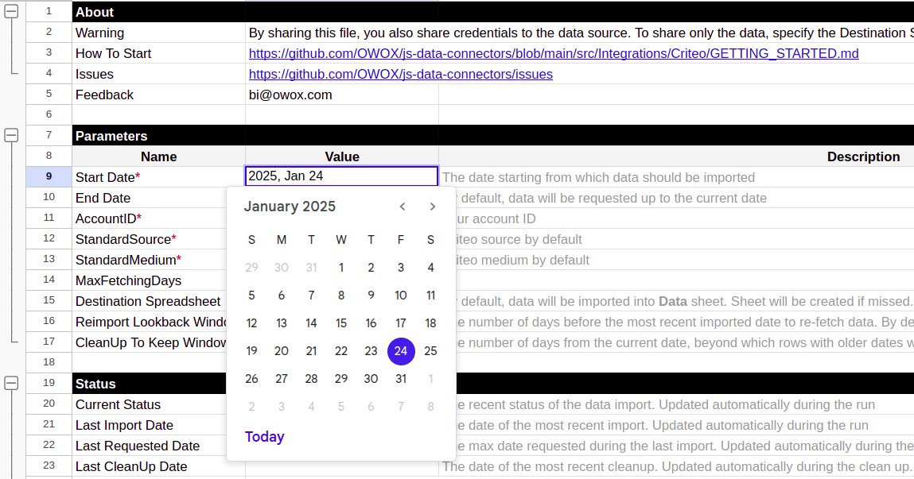
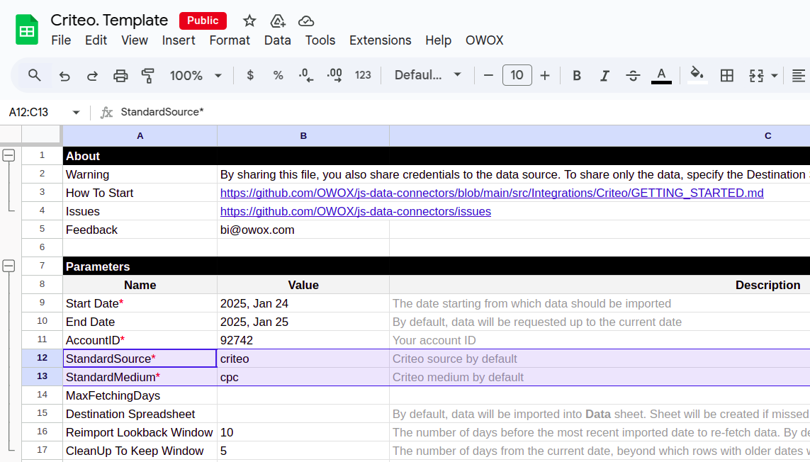
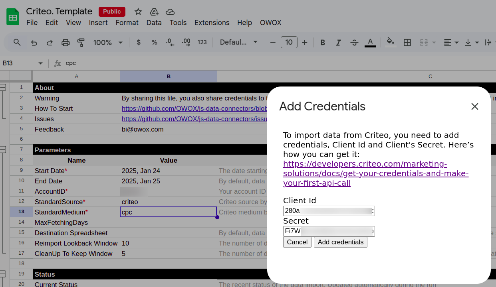

To receive data from the Criteo source, please make a copy of the file ["Criteo. Template"](https://docs.google.com/spreadsheets/d/1g_-q8sR5PsbB4-MDK9DYOn-mIXjHcR10VaYhy66kdBk/copy). 

Fill in the required information:
- Start date
- Account ID
- Standard source
- Standard Medium

Data import begins on the selected **start date**. Note that selecting a long date range may prevent data from downloading due to large data volume.

Please, fill your **Account ID**.

Add standard source and medium, or leave as default.  

Then, press *OWOX -> Manage credentials*. 

Add your Client ID and Secret received by this tutorial: [**Get Your Credentials**](https://developers.criteo.com/retail-media/docs/get-credentials)

Press *Add credentials* and then, press *OWOX -> Import New Data*.

The import process is complete when the Log data displays **"Import is finished"**. Your data will be available in new tab *Data*.

To include more data, press *OWOX -> CleanUp Expired Data*, add more days and import data again.