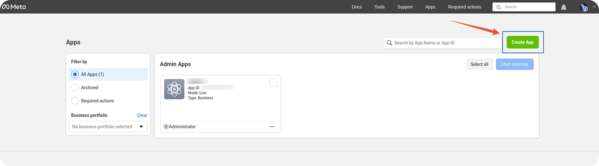
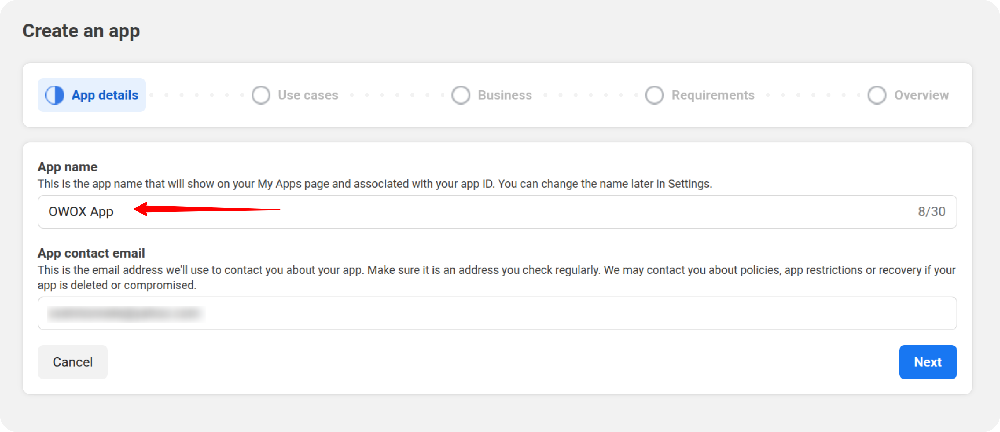
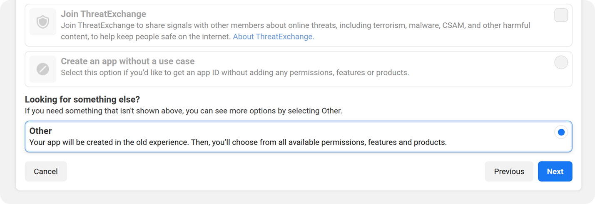
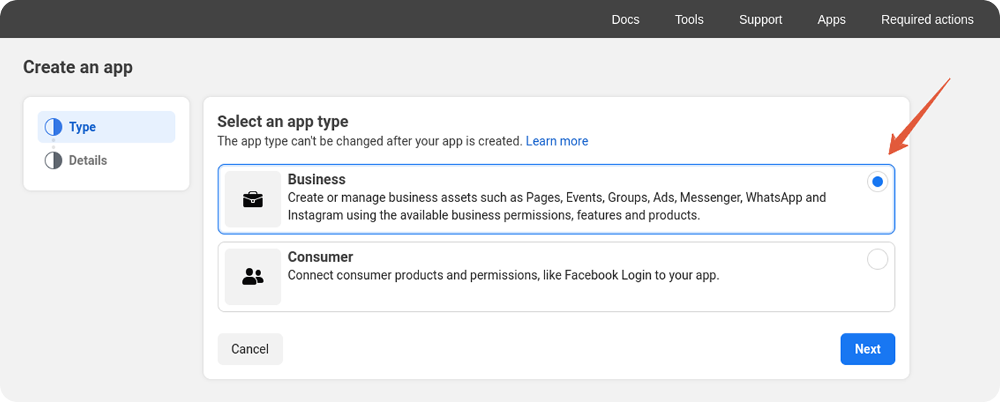
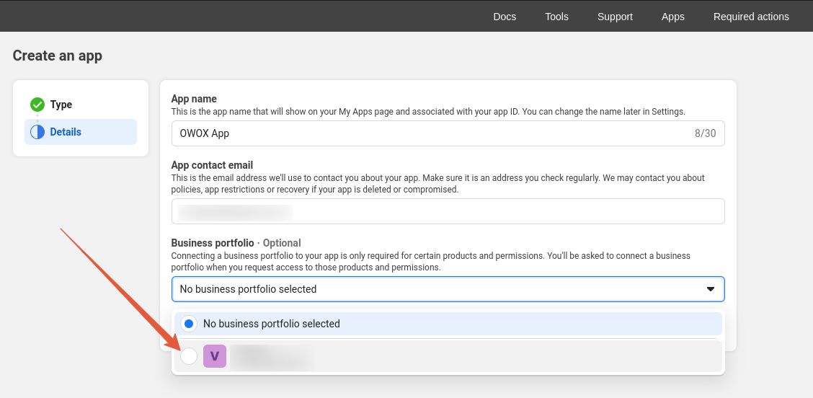
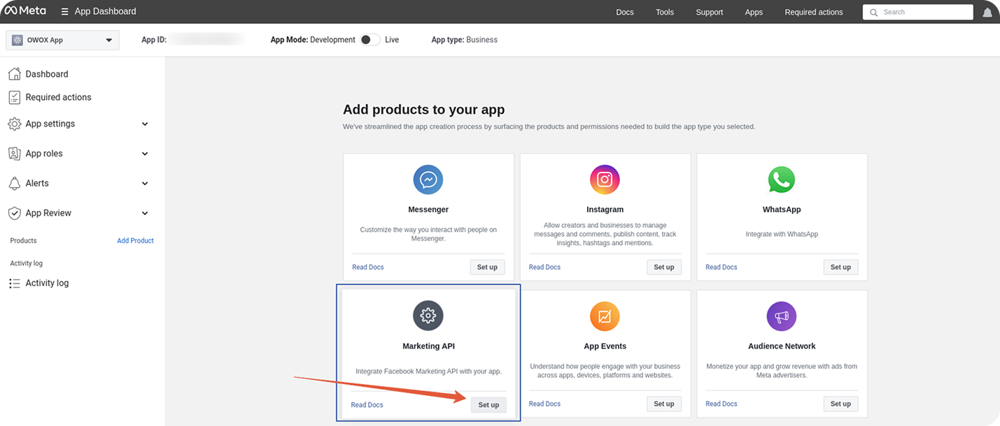
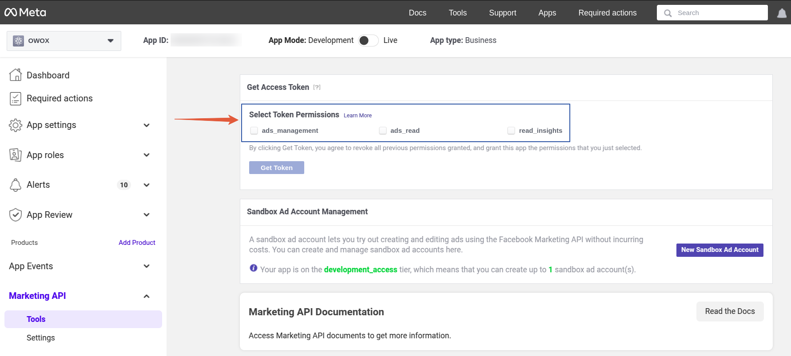
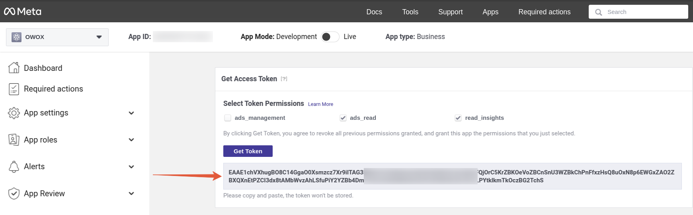

## How to obtain an App ID for the Facebook connector

1. Visit the [Meta for Developers](https://developers.facebook.com/) site and log in with your Facebook account or create a new one.

2. Navigate to **My Apps** and click the **Create App** button.

3. Enter the **App Name** and **App Contact Email** in the provided fields.

4. Select the **Other** option.

5. Choose the **Business** app type and click **Next**.

6. Select the relevant **Business Portfolio**, then click the **Create App** button.

7. On the newly opened page, locate **Marketing API** and click **Set Up**.

8. Grant all required token permissions. The API token is a unique code needed for authorization to access data from the Facebook account.

9. Click the **Get Token** button.

10. Copy and save the token. If needed, you can generate a new token later by navigating to **Marketing API > Tools**.

11. Use this token for authentication as required.
