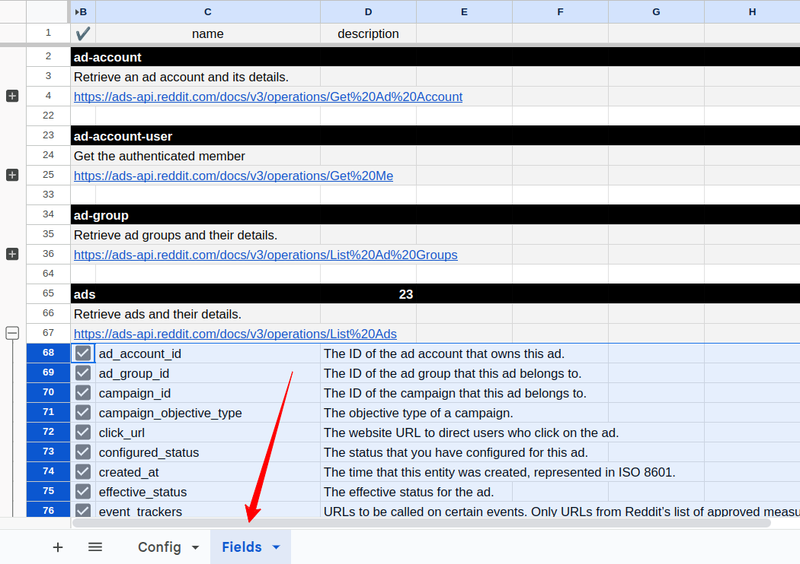
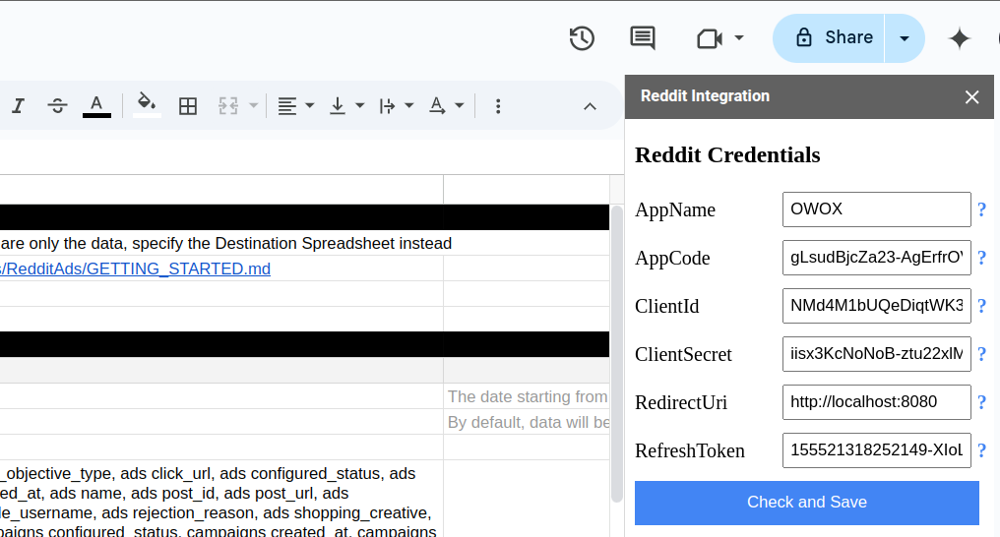
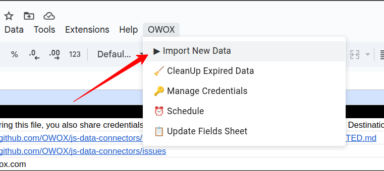
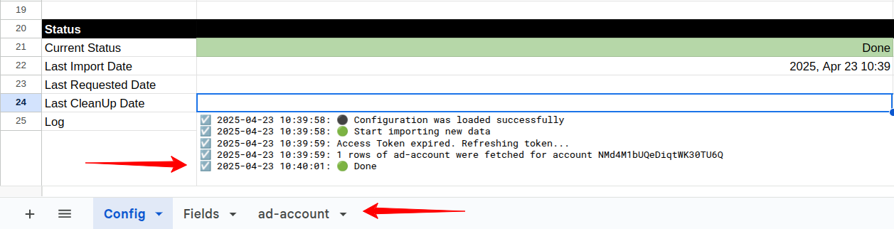
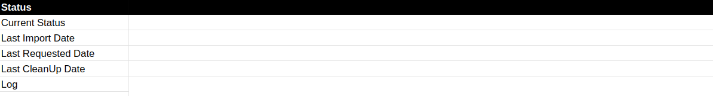

To start importing data from Reddit Ads, please make a copy of the ["Reddit. Template"](https://docs.google.com/spreadsheets/d/1QCzmcLhcGcXQ8PxU-1rfJ2kQ9wiDh-_Hf8r6EWhVTCQ/copy).

Fill in required information:
- **Start Date**
- **Account IDs**
- **Fields**

The import will begin from the selected **Start Date**.  
> ⚠️ Note: Choosing a long date range may cause the import to fail due to high data volume.

You can find your **Account ID** on the homepage of your Reddit Ads account:

Copy and paste the ID into the appropriate field in the spreadsheet:

Some fields are pre-filled by default.  
To include more fields, go to the **Fields** tab and check the boxes next to the fields you want to include.

Go to the menu: **OWOX → Manage Credentials**

Enter your credentials obtained by following this tutorial: [**How to obtain the credentials for the Reddit Ads connector**](CREDENTIALS.md).

Click **Check and Save**. Once your credentials are saved, click: **OWOX → Import New Data**

The process is complete when the **Log** sheet shows the message:  
**"Import is finished"**  
Your data will appear in new tabs, named after the corresponding data types (e.g., *ad-account*, *ad-campaign*).

To add more fields, check the boxes in the **Fields** tab and click:  
**OWOX → Import New Data**

> ⚠️ **Important:** If you want to change the date range:
> 1. First, clear the existing data in the **Status** columns.
> 2. Update the **Start Date** and/or **End Date**.
> 3. Click **OWOX → Import New Data** again.

